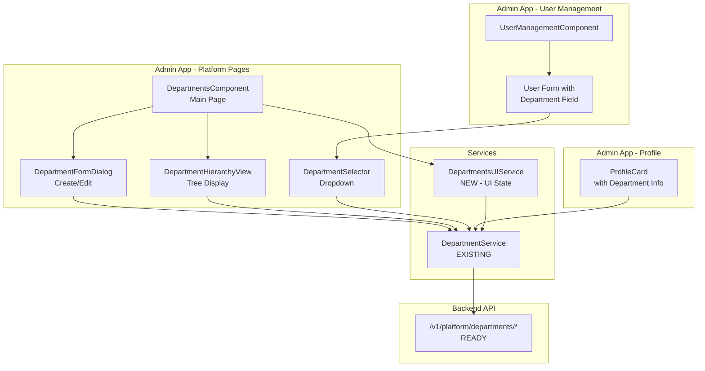

# Design Document: Department Management UI

## Overview

This design implements a comprehensive department management interface for the AegisX admin panel, integrating with the existing `/v1/platform/departments` API. The solution follows established Angular + Material UI patterns found in the codebase (particularly the user-management component) while leveraging AegisX UI components where appropriate.

**Key Design Goals:**

- Reuse existing service layer (`DepartmentService`) - no duplicate HTTP calls
- Follow admin panel conventions (pages structure, Material UI components)
- Support hierarchical department organization with visual tree representation
- Seamless integration with user management for department assignment
- Profile page enhancement to display department affiliations

## Steering Document Alignment

### Technical Standards (tech.md)

**Frontend Stack:**

- **Angular 17+** with standalone components
- **Angular Material UI** for data tables, dialogs, forms
- **AegisX UI** for custom components (badges, cards when appropriate)
- **TailwindCSS** for layout utilities
- **Signals** for reactive state management
- **TypeScript strict mode** for type safety

**Backend Integration:**

- **Existing API**: `/v1/platform/departments` (fully implemented)
- **Permission-based access**: RBAC with `departments:*` permissions
- **Service layer pattern**: Reuse `DepartmentService`

### Project Structure (structure.md)

```
apps/admin/src/app/
├── pages/
│   ├── platform/                    # NEW: Platform management pages
│   │   └── departments/             # NEW: Department management feature
│   │       ├── departments.component.ts
│   │       ├── departments.component.html
│   │       ├── departments.component.scss
│   │       ├── components/
│   │       │   ├── department-form-dialog/      # Create/Edit dialog
│   │       │   ├── department-hierarchy-view/   # Tree view component
│   │       │   └── department-selector/         # Reusable dropdown selector
│   │       ├── services/
│   │       │   └── departments-ui.service.ts    # UI state management
│   │       └── types/
│   │           └── departments-ui.types.ts
│   └── playground/
│       └── pages/
│           └── user-management/
│               └── user-management.component.ts  # MODIFY: Add department field
└── shared/
    └── components/
        └── profile-card/             # MODIFY: Add department display
            └── profile-card.component.ts
```

**Service Reuse:**

- Existing: `apps/web/src/app/features/inventory/modules/departments/services/departments.service.ts`
- Will be imported and reused (no duplication)

## Code Reuse Analysis

### Existing Components to Leverage

**1. DepartmentService (Existing)**

- **Location**: `apps/web/src/app/features/inventory/modules/departments/services/departments.service.ts`
- **Usage**: Import and inject directly - handles all API calls
- **Methods Available**:
  - `loadDepartmentList(params)` - GET /v1/platform/departments
  - `getDepartmentById(id)` - GET /v1/platform/departments/:id
  - `createDepartment(data)` - POST /v1/platform/departments
  - `updateDepartment(id, data)` - PUT /v1/platform/departments/:id
  - `deleteDepartment(id)` - DELETE /v1/platform/departments/:id

**2. User Management Component Pattern (Existing)**

- **Location**: `apps/admin/src/app/pages/playground/pages/user-management/user-management.component.ts`
- **Patterns to Reuse**:
  - MatTableDataSource with pagination
  - MatDialog for create/edit forms
  - SelectionModel for bulk actions
  - Signal-based state management
  - Search/filter implementation

**3. Material UI Components (Existing)**

- **MatTable** with sorting and pagination
- **MatDialog** for modals
- **MatFormField + MatInput** for forms
- **MatSelect** for dropdowns (hierarchical department selector)
- **MatTree** for hierarchy view (NEW usage in this feature)

### Integration Points

**1. Backend API (Ready)**

- `/v1/platform/departments/*` - All CRUD endpoints exist
- Permission system: `departments:read`, `departments:create`, `departments:update`, `departments:delete`

**2. Database Schema (Existing)**

- Table: `public.departments` (NOT inventory.departments)
- Fields: `id`, `dept_code`, `dept_name`, `parent_id`, `is_active`, `hospital_id`, `created_at`, `updated_at`
- Hierarchical: `parent_id` references `id` (self-referencing FK)

**3. User Management Integration**

- Add `department_id` field to user forms (nullable)
- Display department name in user list table
- Filter users by department

**4. Profile Integration**

- Add department display section to profile card
- Show hierarchy breadcrumb (e.g., "Engineering > Backend Team")

## Architecture

### Modular Design Principles

**Single File Responsibility:**

- `departments.component.ts` - Main page orchestration and layout
- `department-form-dialog.component.ts` - Create/edit form logic
- `department-hierarchy-view.component.ts` - Tree view rendering
- `department-selector.component.ts` - Reusable dropdown (used in user forms)
- `departments-ui.service.ts` - UI state, filters, pagination state

**Component Isolation:**

- Form dialog is standalone - can be used anywhere
- Selector component is reusable across user management and other features
- Hierarchy view is independent - can be embedded in dashboards

**Service Layer Separation:**

- **Data Access**: `DepartmentService` (existing) - HTTP calls
- **Business Logic**: `DepartmentService` - data transformation
- **UI State**: `DepartmentsUIService` (new) - filters, pagination, selection state
- **Presentation**: Components - rendering and user interaction



## Components and Interfaces

### Component 1: DepartmentsComponent (Main Page)

**Purpose:** Main department management page with list, search, filter, and actions

**File:** `apps/admin/src/app/pages/platform/departments/departments.component.ts`

**Interfaces:**

```typescript
export class DepartmentsComponent implements OnInit, AfterViewInit {
  // Signals for reactive state
  departments = signal<Department[]>([]);
  isLoading = signal<boolean>(false);
  totalCount = signal<number>(0);

  // Material Table
  displayedColumns = ['dept_code', 'dept_name', 'parent', 'is_active', 'actions'];
  dataSource: MatTableDataSource<Department>;
  @ViewChild(MatPaginator) paginator!: MatPaginator;
  @ViewChild(MatSort) sort!: MatSort;

  // Methods
  ngOnInit(): void;
  loadDepartments(): Promise<void>;
  openCreateDialog(): void;
  openEditDialog(department: Department): void;
  deleteDepartment(id: number): void;
  toggleActive(department: Department): void;
  applyFilter(filterValue: string): void;
}
```

**Dependencies:**

- `DepartmentService` (existing)
- `DepartmentsUIService` (new)
- `MatDialog`

**Reuses:**

- User management component table pattern
- Material UI data table components
- Signal-based state management pattern

**Template Features:**

- Search bar (debounced)
- Filter by active status
- Filter by parent department
- "Add Department" button (opens dialog)
- Table with actions (edit, delete, toggle active)
- Pagination (10/25/50/100 per page)
- "View Hierarchy" button (shows tree view)

### Component 2: DepartmentFormDialogComponent

**Purpose:** Modal dialog for creating and editing departments

**File:** `apps/admin/src/app/pages/platform/departments/components/department-form-dialog/department-form-dialog.component.ts`

**Interfaces:**

```typescript
export interface DepartmentFormData {
  dept_code: string;
  dept_name: string;
  parent_id: number | null;
  is_active: boolean;
}

export interface DepartmentFormDialogData {
  mode: 'create' | 'edit';
  department?: Department;
}

export class DepartmentFormDialogComponent implements OnInit {
  form: FormGroup;
  mode: 'create' | 'edit';
  parentDepartments = signal<Department[]>([]);

  constructor(
    @Inject(MAT_DIALOG_DATA) public data: DepartmentFormDialogData,
    private dialogRef: MatDialogRef<DepartmentFormDialogComponent>,
    private fb: FormBuilder,
    private departmentService: DepartmentService,
  ) {}

  ngOnInit(): void;
  loadParentDepartments(): void;
  save(): void;
  cancel(): void;
  validateCircularReference(): ValidatorFn;
}
```

**Dependencies:**

- `DepartmentService`
- `MatDialogRef`, `MAT_DIALOG_DATA`
- `FormBuilder`, `Validators`

**Reuses:**

- Material dialog pattern from existing components
- Reactive forms validation pattern
- Hierarchical parent selector pattern

**Form Fields:**

- dept_code (required, unique)
- dept_name (required)
- parent_id (optional, mat-select with hierarchy)
- is_active (boolean, mat-slide-toggle)

**Validation:**

- dept*code: required, minLength(2), maxLength(20), pattern(/^[A-Z0-9*-]+$/)
- dept_name: required, minLength(2), maxLength(200)
- parent_id: validateCircularReference (prevent dept being its own parent/ancestor)

### Component 3: DepartmentHierarchyViewComponent

**Purpose:** Display department hierarchy as expandable tree

**File:** `apps/admin/src/app/pages/platform/departments/components/department-hierarchy-view/department-hierarchy-view.component.ts`

**Interfaces:**

```typescript
export interface DepartmentTreeNode {
  id: number;
  dept_code: string;
  dept_name: string;
  parent_id: number | null;
  is_active: boolean;
  children: DepartmentTreeNode[];
  level: number;
}

export class DepartmentHierarchyViewComponent implements OnInit {
  treeControl: FlatTreeControl<DepartmentTreeNode>;
  dataSource: MatTreeFlatDataSource<DepartmentTreeNode, DepartmentTreeNode>;
  hierarchyData = signal<DepartmentTreeNode[]>([]);

  ngOnInit(): void;
  loadHierarchy(): void;
  hasChild(node: DepartmentTreeNode): boolean;
  getLevel(node: DepartmentTreeNode): number;
}
```

**Dependencies:**

- `DepartmentService`
- `MatTree`, `FlatTreeControl`

**Reuses:**

- Material tree component (NEW usage - not used elsewhere yet)

**Features:**

- Expand/collapse tree nodes
- Show department count per branch
- Highlight inactive departments (grayed out)
- Click to select/edit department
- Drag-and-drop to move (optional - Phase 2)

### Component 4: DepartmentSelectorComponent (Reusable)

**Purpose:** Standalone dropdown selector for department selection (used in user forms, filters, etc.)

**File:** `apps/admin/src/app/pages/platform/departments/components/department-selector/department-selector.component.ts`

**Interfaces:**

```typescript
@Component({
  selector: 'app-department-selector',
  standalone: true,
  ...
})
export class DepartmentSelectorComponent implements OnInit, ControlValueAccessor {
  @Input() label = 'Department';
  @Input() placeholder = 'Select department';
  @Input() required = false;
  @Input() showInactive = false;
  @Output() departmentSelected = new EventEmitter<Department | null>();

  departments = signal<Department[]>([]);

  // ControlValueAccessor implementation
  writeValue(value: number | null): void;
  registerOnChange(fn: any): void;
  registerOnTouched(fn: any): void;
  setDisabledState(isDisabled: boolean): void;

  ngOnInit(): void;
  loadDepartments(): void;
  onDepartmentChange(departmentId: number | null): void;
}
```

**Dependencies:**

- `DepartmentService`
- `ControlValueAccessor` (for reactive forms integration)

**Reuses:**

- FormControl integration pattern
- Material select component

**Features:**

- Works with reactive forms (ControlValueAccessor)
- Hierarchical display (indented child departments)
- Filter active/inactive
- Search within dropdown

**Usage Example:**

```html
<!-- In User Management Form -->
<app-department-selector formControlName="department_id" label="Department" [required]="false" />
```

### Component 5: User Management Integration

**File (MODIFY):** `apps/admin/src/app/pages/playground/pages/user-management/user-management.component.ts`

**Changes:**

- Add `department_id` field to User interface
- Add `DepartmentSelectorComponent` to user create/edit forms
- Add "Department" column to user list table
- Add department filter to search controls
- Load department name on user list (join data or fetch separately)

**Modified User Interface:**

```typescript
export interface User {
  id: number;
  name: string;
  email: string;
  role: 'admin' | 'user' | 'manager';
  status: 'active' | 'inactive';
  department_id?: number; // NEW
  department?: DepartmentSummary; // NEW - for display
  createdAt: Date;
  lastLogin?: Date;
}

export interface DepartmentSummary {
  id: number;
  dept_code: string;
  dept_name: string;
}
```

### Component 6: Profile Card Integration

**File (MODIFY):** `apps/admin/src/app/shared/components/profile-card/profile-card.component.ts` (or equivalent)

**Changes:**

- Add department display section
- Fetch department details if user has department_id
- Display hierarchy breadcrumb
- Show warning if department is inactive

**New Section in Profile:**

```html
<mat-card class="department-info">
  <mat-card-header>
    <mat-card-title>Department Affiliation</mat-card-title>
  </mat-card-header>
  <mat-card-content>
    @if (userDepartment()) {
    <div class="department-details">
      <div class="hierarchy-path">
        <!-- e.g., Engineering > Backend Team -->
        {{ departmentPath() }}
      </div>
      <div class="department-meta">
        <span class="dept-code">{{ userDepartment()?.dept_code }}</span>
        @if (!userDepartment()?.is_active) {
        <mat-chip class="inactive-warning">Inactive</mat-chip>
        }
      </div>
    </div>
    } @else {
    <p class="no-department">No department assigned</p>
    }
  </mat-card-content>
</mat-card>
```

## Data Models

### Department (Existing from API)

```typescript
export interface Department {
  id: number;
  dept_code: string;
  dept_name: string;
  parent_id: number | null;
  hospital_id: number | null;
  is_active: boolean;
  created_at: string;
  updated_at: string;
  deleted_at?: string | null;

  // Computed/joined fields
  parent_dept_name?: string; // For display in table
  children?: Department[]; // For hierarchy view
}
```

### DepartmentFormData (New)

```typescript
export interface DepartmentFormData {
  dept_code: string;
  dept_name: string;
  parent_id: number | null;
  is_active: boolean;
}
```

### DepartmentHierarchyNode (New)

```typescript
export interface DepartmentHierarchyNode {
  id: number;
  dept_code: string;
  dept_name: string;
  parent_id: number | null;
  is_active: boolean;
  children: DepartmentHierarchyNode[];
  level: number;
  expandable: boolean;
}
```

### DepartmentFilterState (UI Service)

```typescript
export interface DepartmentFilterState {
  searchTerm: string;
  isActive: boolean | null; // null = all, true = active only, false = inactive only
  parentId: number | null; // Filter by parent department
  page: number;
  pageSize: number;
  sortBy: string;
  sortOrder: 'asc' | 'desc';
}
```

## Error Handling

### Error Scenarios

**1. Department Not Found (404)**

- **Scenario:** User tries to edit/delete department that no longer exists
- **Handling:**
  - Catch 404 error from API
  - Show MatSnackBar: "Department not found. It may have been deleted."
  - Refresh department list
- **User Impact:** Toast notification, list refreshes

**2. Duplicate Department Code (409 Conflict)**

- **Scenario:** Admin creates department with existing dept_code
- **Handling:**
  - Catch 409 error
  - Display inline error on dept_code form field: "Department code already exists"
  - Keep dialog open for correction
- **User Impact:** Form validation error, user can fix without losing data

**3. Circular Reference (422 Unprocessable Entity)**

- **Scenario:** Admin tries to set department as its own parent or ancestor
- **Handling:**
  - Frontend validation: check before submission
  - If backend returns 422, show error: "Cannot create circular reference in hierarchy"
- **User Impact:** Form validation error

**4. Department Has Users (422 on Delete)**

- **Scenario:** Admin tries to delete department that has users assigned
- **Handling:**
  - Show confirmation dialog: "This department has X users assigned. Please reassign users before deleting."
  - Prevent deletion
  - Suggest reassigning users first
- **User Impact:** Informative error, clear next steps

**5. Permission Denied (403)**

- **Scenario:** User without `departments:delete` permission tries to delete
- **Handling:**
  - Hide delete button if permission not granted (frontend)
  - If 403 occurs: "You don't have permission to delete departments"
- **User Impact:** Button not visible, or clear error message

**6. Network/Server Error (500)**

- **Scenario:** API server error or network failure
- **Handling:**
  - Show MatSnackBar: "Unable to load departments. Please try again."
  - Retry button
  - Fallback: show cached data if available
- **User Impact:** Error toast with retry option

**7. Invalid Parent Department (404 on Parent ID)**

- **Scenario:** Parent department was deleted while user was editing
- **Handling:**
  - Refresh parent department list
  - Clear invalid parent_id selection
  - Show warning: "Selected parent department no longer exists"
- **User Impact:** Form field cleared, list refreshed

## Testing Strategy

### Unit Testing

**Components to Test:**

1. **DepartmentsComponent**
   - Load departments on init
   - Filter application (search term)
   - Pagination changes
   - Open create/edit dialogs
   - Delete confirmation

2. **DepartmentFormDialogComponent**
   - Form validation (required fields, patterns)
   - Circular reference validation
   - Save creates/updates correctly
   - Cancel closes dialog without saving

3. **DepartmentHierarchyViewComponent**
   - Load hierarchy data
   - Tree expand/collapse
   - Display correct levels

4. **DepartmentSelectorComponent**
   - Load department options
   - ControlValueAccessor implementation
   - Filter active/inactive
   - Emit selection event

**Services to Test:**

1. **DepartmentsUIService**
   - Filter state management
   - Pagination state
   - Selection tracking

### Integration Testing

**Key Flows:**

1. **Create Department Flow**
   - Click "Add Department" → Dialog opens
   - Fill form → Submit → API call → Success toast → List refresh
   - Verify new department appears in list

2. **Edit Department Flow**
   - Click edit → Dialog opens with pre-filled data
   - Modify fields → Submit → API call → Success toast → List refresh
   - Verify changes reflected in list

3. **Delete Department Flow**
   - Click delete → Confirmation dialog
   - Confirm → API call → Success toast → List refresh
   - Verify department removed from list

4. **Hierarchy View Flow**
   - Click "View Hierarchy" → Load tree
   - Expand nodes → Children loaded
   - Verify nested structure

5. **User Department Assignment Flow**
   - Open user form → Department selector appears
   - Select department → Save user
   - Verify user list shows department name

6. **Profile Department Display**
   - User with department → Profile shows dept info
   - User without department → "No department assigned"

### End-to-End Testing

**User Scenarios:**

1. **Admin manages organizational structure**
   - Create root department (Engineering)
   - Create child department (Backend Team)
   - Create nested child (Backend - API Team)
   - View hierarchy tree
   - Verify 3-level structure

2. **Admin assigns user to department**
   - Create new user
   - Select "Backend Team" department
   - Save user
   - View user list → Department column shows "Backend Team"
   - View user profile → Department section shows "Engineering > Backend Team"

3. **Admin handles errors**
   - Try to create department with duplicate code → See error
   - Fix code → Save successfully
   - Try to delete department with users → Prevented
   - Try to set circular reference → Validation error

4. **User views their department**
   - Login as regular user
   - Navigate to profile
   - See department affiliation
   - Department shows full path

**Accessibility Testing:**

- Keyboard navigation (Tab through all controls)
- Screen reader support (ARIA labels)
- Focus indicators
- Error announcements

**Performance Testing:**

- Load 100 departments → Render in <200ms
- Filter departments → Update in <100ms
- Hierarchy tree with 50 nodes → Expand in <300ms

## Implementation Notes

### Phase 1: Core Department Management

- Create `platform/departments` page structure
- Implement main list view with table
- Create form dialog (create/edit)
- Implement CRUD operations
- Add search and filter

### Phase 2: Hierarchy Support

- Implement hierarchy tree view component
- Add parent department selector to form
- Circular reference validation
- Drag-and-drop (optional)

### Phase 3: User Management Integration

- Add department field to user forms
- Create reusable department selector component
- Add department column to user list
- Add department filter

### Phase 4: Profile Integration

- Add department section to profile card
- Display hierarchy breadcrumb
- Handle inactive departments

### Deployment Considerations

- Feature flag: Enable department management for admins only initially
- Migration: No database changes needed (departments table exists)
- Permissions: Ensure RBAC permissions exist for `departments:*`
- Documentation: Update admin user guide
