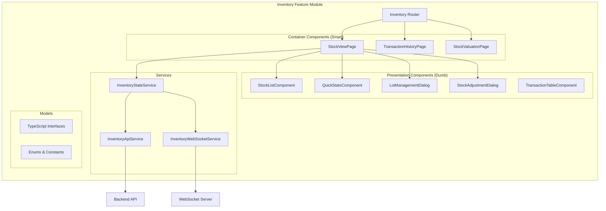

# Design Document - Inventory Frontend UI

## Architecture Overview

The Inventory Frontend UI follows Angular 17+ standalone component architecture with Signals-based reactive state management. The design implements a feature module with lazy loading, smart/dumb component pattern, and comprehensive error handling.

### High-Level Architecture



### Technology Stack

- **Framework**: Angular 17+ (standalone components)
- **State Management**: Angular Signals + RxJS (for async operations)
- **UI Library**: AegisX UI + Angular Material
- **Styling**: TailwindCSS with custom design tokens
- **Forms**: Angular Reactive Forms
- **HTTP**: HttpClient with interceptors
- **WebSocket**: Custom service with auto-reconnect
- **Routing**: Feature-based lazy loading
- **Date**: date-fns for formatting and calculations
- **Charts**: Chart.js (if needed for visualizations)

---

## Component Specifications

### 1. StockViewPage (Container Component)

**Path**: `apps/admin/src/app/pages/inventory/stock-view/stock-view.page.ts`

**Responsibility**: Main container for stock monitoring, manages state and coordinates child components.

**TypeScript Interface**:

```typescript
@Component({
  selector: 'inv-stock-view-page',
  standalone: true,
  imports: [CommonModule, StockListComponent, QuickStatsComponent, LotManagementDialog, StockAdjustmentDialog, AxDrawer, AxSelect, AxButton],
  templateUrl: './stock-view.page.html',
})
export class StockViewPage implements OnInit, OnDestroy {
  // Signals
  stockItems = signal<StockItem[]>([]);
  quickStats = computed(() => this.calculateStats(this.stockItems()));
  selectedLocation = signal<number | null>(null);
  searchTerm = signal<string>('');
  isLoading = signal<boolean>(false);

  // Filters
  filteredStockItems = computed(() => {
    let items = this.stockItems();
    const location = this.selectedLocation();
    const search = this.searchTerm().toLowerCase();

    if (location) {
      items = items.filter((item) => item.location_id === location);
    }

    if (search) {
      items = items.filter((item) => item.drug_name.toLowerCase().includes(search));
    }

    return items;
  });

  constructor(
    private inventoryState: InventoryStateService,
    private dialog: MatDialog,
  ) {}

  ngOnInit(): void {
    this.loadStockData();
    this.subscribeToRealtimeUpdates();
  }

  loadStockData(): void {
    this.isLoading.set(true);
    this.inventoryState.fetchStockLevels(this.selectedLocation()).subscribe({
      next: (data) => {
        this.stockItems.set(data);
        this.isLoading.set(false);
      },
      error: (err) => {
        this.isLoading.set(false);
        this.handleError(err);
      },
    });
  }

  subscribeToRealtimeUpdates(): void {
    this.inventoryState.stockUpdates$.pipe(takeUntilDestroyed(this.destroyRef)).subscribe((update) => {
      this.handleStockUpdate(update);
    });
  }

  onLocationChange(locationId: number): void {
    this.selectedLocation.set(locationId);
    this.loadStockData();
  }

  onSearchChange(term: string): void {
    this.searchTerm.set(term);
  }

  onViewLots(stockItem: StockItem): void {
    this.dialog.open(LotManagementDialog, {
      width: '800px',
      data: { drugId: stockItem.drug_id, locationId: stockItem.location_id },
    });
  }

  onAdjustStock(stockItem: StockItem): void {
    const dialogRef = this.dialog.open(StockAdjustmentDialog, {
      width: '600px',
      data: { stockItem },
    });

    dialogRef.afterClosed().subscribe((result) => {
      if (result?.success) {
        this.loadStockData(); // Refresh data
      }
    });
  }

  onExportReport(): void {
    this.inventoryState.exportStockReport(this.filteredStockItems());
  }

  private calculateStats(items: StockItem[]): QuickStats {
    return {
      totalItems: items.length,
      lowStock: items.filter((i) => i.stock_status === 'LOW').length,
      expired: items.filter((i) => i.has_expired_lots).length,
      nearExpiry: items.filter((i) => i.has_expiring_lots).length,
    };
  }

  private handleStockUpdate(update: StockUpdateEvent): void {
    // Update specific item in signal array
    this.stockItems.update((items) => items.map((item) => (item.id === update.inventoryId ? { ...item, ...update.changes } : item)));
  }
}
```

**Template Structure**:

```html
<div class="stock-view-container">
  <!-- Header -->
  <div class="header-section">
    <h1>Current Stock - {{ currentLocationName() }}</h1>
    <ax-select [(ngModel)]="selectedLocation" (ngModelChange)="onLocationChange($event)" placeholder="Select Location">
      @for (loc of locations(); track loc.id) {
      <ax-option [value]="loc.id">{{ loc.name }}</ax-option>
      }
    </ax-select>
  </div>

  <!-- Quick Stats -->
  <inv-quick-stats [stats]="quickStats()" (statClick)="onStatCardClick($event)"> </inv-quick-stats>

  <!-- Filters -->
  <div class="filter-section">
    <ax-input [(ngModel)]="searchTerm" (ngModelChange)="onSearchChange($event)" placeholder="Search drugs..." [prefixIcon]="'search'"> </ax-input>
  </div>

  <!-- Stock List -->
  @if (isLoading()) {
  <ax-skeleton [rows]="10"></ax-skeleton>
  } @else {
  <inv-stock-list [stockItems]="filteredStockItems()" (viewLots)="onViewLots($event)" (adjustStock)="onAdjustStock($event)"> </inv-stock-list>
  }

  <!-- Actions -->
  <div class="actions-section">
    <ax-button (click)="onExportReport()">
      <mat-icon>download</mat-icon>
      Export Report
    </ax-button>
  </div>
</div>
```

---

### 2. QuickStatsComponent (Presentation Component)

**Path**: `apps/admin/src/app/pages/inventory/components/quick-stats/quick-stats.component.ts`

**Responsibility**: Display summary statistics with click handling.

**TypeScript Interface**:

```typescript
@Component({
  selector: 'inv-quick-stats',
  standalone: true,
  imports: [CommonModule, AxKpiCard],
  template: `
    <div class="stats-grid grid grid-cols-1 md:grid-cols-4 gap-4">
      <ax-kpi-card [title]="'Total Items'" [value]="stats().totalItems" [icon]="'inventory_2'" [color]="'primary'" (click)="statClick.emit('total')"> </ax-kpi-card>

      <ax-kpi-card [title]="'Low Stock'" [value]="stats().lowStock" [icon]="'warning'" [color]="'warning'" (click)="statClick.emit('low')"> </ax-kpi-card>

      <ax-kpi-card [title]="'Expired'" [value]="stats().expired" [icon]="'error'" [color]="'danger'" (click)="statClick.emit('expired')"> </ax-kpi-card>

      <ax-kpi-card [title]="'Near Expiry'" [value]="stats().nearExpiry" [icon]="'schedule'" [color]="'info'" (click)="statClick.emit('expiring')"> </ax-kpi-card>
    </div>
  `,
})
export class QuickStatsComponent {
  @Input({ required: true }) stats!: Signal<QuickStats>;
  @Output() statClick = new EventEmitter<StatType>();
}
```

---

### 3. StockListComponent (Presentation Component)

**Path**: `apps/admin/src/app/pages/inventory/components/stock-list/stock-list.component.ts`

**Responsibility**: Display stock items in table format with action buttons.

**TypeScript Interface**:

```typescript
@Component({
  selector: 'inv-stock-list',
  standalone: true,
  imports: [CommonModule, MatTableModule, MatSortModule, MatPaginatorModule, AxBadge, AxButton],
  templateUrl: './stock-list.component.html',
})
export class StockListComponent {
  @Input({ required: true }) stockItems!: Signal<StockItem[]>;
  @Output() viewLots = new EventEmitter<StockItem>();
  @Output() adjustStock = new EventEmitter<StockItem>();

  displayedColumns = ['drug_name', 'location_name', 'quantity_on_hand', 'min_level', 'stock_status', 'oldest_expiry', 'actions'];

  dataSource = computed(() => new MatTableDataSource(this.stockItems()));

  getStatusColor(status: StockStatus): string {
    const colors: Record<StockStatus, string> = {
      SUFFICIENT: 'success',
      LOW: 'warning',
      REORDER: 'danger',
      OVERSTOCK: 'info',
    };
    return colors[status] || 'default';
  }

  getStatusIcon(status: StockStatus): string {
    const icons: Record<StockStatus, string> = {
      SUFFICIENT: 'check_circle',
      LOW: 'warning',
      REORDER: 'error',
      OVERSTOCK: 'trending_up',
    };
    return icons[status] || 'info';
  }
}
```

**Template**:

```html
<div class="stock-table-container">
  <table mat-table [dataSource]="dataSource()" matSort>
    <!-- Drug Name Column -->
    <ng-container matColumnDef="drug_name">
      <th mat-header-cell *matHeaderCellDef mat-sort-header>Drug</th>
      <td mat-cell *matCellDef="let item">
        <div class="drug-cell">
          <span class="drug-name">{{ item.drug_name }}</span>
          <span class="drug-generic text-sm text-gray-500">{{ item.generic_name }}</span>
        </div>
      </td>
    </ng-container>

    <!-- Location Column -->
    <ng-container matColumnDef="location_name">
      <th mat-header-cell *matHeaderCellDef mat-sort-header>Location</th>
      <td mat-cell *matCellDef="let item">{{ item.location_name }}</td>
    </ng-container>

    <!-- Stock Column -->
    <ng-container matColumnDef="quantity_on_hand">
      <th mat-header-cell *matHeaderCellDef mat-sort-header>Stock</th>
      <td mat-cell *matCellDef="let item">{{ item.quantity_on_hand | number }} {{ item.unit }}</td>
    </ng-container>

    <!-- Min Level Column -->
    <ng-container matColumnDef="min_level">
      <th mat-header-cell *matHeaderCellDef>Min</th>
      <td mat-cell *matCellDef="let item">{{ item.min_level | number }}</td>
    </ng-container>

    <!-- Status Column -->
    <ng-container matColumnDef="stock_status">
      <th mat-header-cell *matHeaderCellDef>Status</th>
      <td mat-cell *matCellDef="let item">
        <ax-badge [variant]="getStatusColor(item.stock_status)" [icon]="getStatusIcon(item.stock_status)"> {{ item.stock_status }} </ax-badge>
      </td>
    </ng-container>

    <!-- Expiry Column -->
    <ng-container matColumnDef="oldest_expiry">
      <th mat-header-cell *matHeaderCellDef>Oldest Exp</th>
      <td mat-cell *matCellDef="let item">
        @if (item.oldest_expiry_date) {
        <span [class.text-danger]="item.days_until_expiry < 90"> {{ item.oldest_expiry_date | date:'yyyy-MM' }} </span>
        } @else {
        <span class="text-gray-400">-</span>
        }
      </td>
    </ng-container>

    <!-- Actions Column -->
    <ng-container matColumnDef="actions">
      <th mat-header-cell *matHeaderCellDef>Actions</th>
      <td mat-cell *matCellDef="let item">
        <ax-button variant="ghost" size="sm" (click)="viewLots.emit(item)"> View Lots </ax-button>
        <ax-button variant="ghost" size="sm" (click)="adjustStock.emit(item)"> Adjust </ax-button>
      </td>
    </ng-container>

    <tr mat-header-row *matHeaderRowDef="displayedColumns"></tr>
    <tr mat-row *matRowDef="let row; columns: displayedColumns;"></tr>
  </table>

  <mat-paginator [pageSizeOptions]="[20, 50, 100]" showFirstLastButtons> </mat-paginator>
</div>
```

---

### 4. LotManagementDialog (Smart Component)

**Path**: `apps/admin/src/app/pages/inventory/dialogs/lot-management/lot-management.dialog.ts`

**Responsibility**: Display and manage drug lots with FIFO/FEFO ordering.

**TypeScript Interface**:

```typescript
@Component({
  selector: 'inv-lot-management-dialog',
  standalone: true,
  imports: [CommonModule, MatDialogModule, MatTableModule, MatRadioModule, AxBadge, AxButton],
  templateUrl: './lot-management.dialog.html',
})
export class LotManagementDialog implements OnInit {
  drugId = signal<number>(0);
  locationId = signal<number>(0);
  lots = signal<DrugLot[]>([]);
  orderBy = signal<'FIFO' | 'FEFO'>('FEFO');
  isLoading = signal<boolean>(false);

  sortedLots = computed(() => {
    const lots = [...this.lots()];
    const order = this.orderBy();

    if (order === 'FIFO') {
      return lots.sort((a, b) => new Date(a.received_date).getTime() - new Date(b.received_date).getTime());
    } else {
      return lots.sort((a, b) => new Date(a.expiry_date).getTime() - new Date(b.expiry_date).getTime());
    }
  });

  nextToDispense = computed(() => this.sortedLots()[0] || null);

  displayedColumns = ['lot_number', 'quantity_available', 'unit_cost', 'expiry_date', 'days_until_expiry', 'fifo_order', 'fefo_order'];

  constructor(
    @Inject(MAT_DIALOG_DATA) public data: { drugId: number; locationId: number },
    private inventoryApi: InventoryApiService,
    private dialogRef: MatDialogRef<LotManagementDialog>,
  ) {
    this.drugId.set(data.drugId);
    this.locationId.set(data.locationId);
  }

  ngOnInit(): void {
    this.loadLots();
  }

  loadLots(): void {
    this.isLoading.set(true);
    this.inventoryApi.getDrugLots(this.drugId(), this.locationId(), this.orderBy()).subscribe({
      next: (lots) => {
        this.lots.set(lots);
        this.isLoading.set(false);
      },
      error: (err) => {
        this.isLoading.set(false);
        // Handle error
      },
    });
  }

  onOrderByChange(order: 'FIFO' | 'FEFO'): void {
    this.orderBy.set(order);
  }

  getExpiryStatusColor(daysUntilExpiry: number): string {
    if (daysUntilExpiry < 30) return 'danger';
    if (daysUntilExpiry < 90) return 'warning';
    if (daysUntilExpiry < 180) return 'info';
    return 'success';
  }

  close(): void {
    this.dialogRef.close();
  }
}
```

---

### 5. StockAdjustmentDialog (Smart Component)

**Path**: `apps/admin/src/app/pages/inventory/dialogs/stock-adjustment/stock-adjustment.dialog.ts`

**Responsibility**: Handle stock adjustments with validation and API submission.

**TypeScript Interface**:

```typescript
@Component({
  selector: 'inv-stock-adjustment-dialog',
  standalone: true,
  imports: [CommonModule, ReactiveFormsModule, MatDialogModule, AxSelect, AxInput, AxTextarea, AxButton, AxAlert],
  templateUrl: './stock-adjustment.dialog.html',
})
export class StockAdjustmentDialog implements OnInit {
  stockItem = signal<StockItem | null>(null);
  adjustmentForm!: FormGroup;
  isSubmitting = signal<boolean>(false);
  errorMessage = signal<string>('');

  adjustmentResult = computed(() => {
    if (!this.stockItem()) return null;

    const type = this.adjustmentForm.get('adjustment_type')?.value;
    const quantity = this.adjustmentForm.get('quantity')?.value || 0;
    const current = this.stockItem()!.quantity_on_hand;

    switch (type) {
      case 'ADD':
        return current + quantity;
      case 'SUBTRACT':
        return current - quantity;
      case 'SET':
        return quantity;
      default:
        return current;
    }
  });

  constructor(
    @Inject(MAT_DIALOG_DATA) public data: { stockItem: StockItem },
    private fb: FormBuilder,
    private inventoryApi: InventoryApiService,
    private dialogRef: MatDialogRef<StockAdjustmentDialog>,
    private toastService: ToastService,
  ) {
    this.stockItem.set(data.stockItem);
  }

  ngOnInit(): void {
    this.initForm();
  }

  initForm(): void {
    const item = this.stockItem()!;

    this.adjustmentForm = this.fb.group(
      {
        drug_id: [item.drug_id, Validators.required],
        location_id: [item.location_id, Validators.required],
        adjustment_type: ['SUBTRACT', Validators.required],
        quantity: [0, [Validators.required, Validators.min(1)]],
        adjustment_reason_id: [null, Validators.required],
        lot_id: [null],
        notes: [''],
      },
      {
        validators: this.adjustmentValidator.bind(this),
      },
    );
  }

  adjustmentValidator(group: AbstractControl): ValidationErrors | null {
    const type = group.get('adjustment_type')?.value;
    const quantity = group.get('quantity')?.value;
    const current = this.stockItem()?.quantity_on_hand || 0;

    if (type === 'SUBTRACT' && quantity > current) {
      return {
        insufficientStock: {
          current,
          requested: quantity,
          shortage: quantity - current,
        },
      };
    }

    return null;
  }

  onSubmit(): void {
    if (this.adjustmentForm.invalid) {
      this.adjustmentForm.markAllAsTouched();
      return;
    }

    this.isSubmitting.set(true);
    this.errorMessage.set('');

    const adjustment: CreateAdjustment = this.adjustmentForm.value;

    this.inventoryApi.createAdjustment(adjustment).subscribe({
      next: (result) => {
        this.toastService.success(`Stock adjusted successfully. New quantity: ${result.new_quantity}`);
        this.dialogRef.close({ success: true, result });
      },
      error: (err) => {
        this.isSubmitting.set(false);
        this.errorMessage.set(err.error?.message || 'Adjustment failed');
      },
    });
  }

  cancel(): void {
    this.dialogRef.close({ success: false });
  }
}
```

---

## State Management with Angular Signals

### InventoryStateService

**Path**: `apps/admin/src/app/pages/inventory/services/inventory-state.service.ts`

**Responsibility**: Centralized state management using Angular Signals.

```typescript
@Injectable()
export class InventoryStateService {
  // Signals for state
  private stockItemsSignal = signal<StockItem[]>([]);
  private selectedLocationSignal = signal<number | null>(null);
  private loadingSignal = signal<boolean>(false);

  // Public readonly signals
  readonly stockItems = this.stockItemsSignal.asReadonly();
  readonly selectedLocation = this.selectedLocationSignal.asReadonly();
  readonly isLoading = this.loadingSignal.asReadonly();

  // Computed signals
  readonly lowStockItems = computed(() => this.stockItems().filter((item) => item.stock_status === 'LOW' || item.stock_status === 'REORDER'));

  readonly expiringItems = computed(() => this.stockItems().filter((item) => item.has_expiring_lots));

  // Observable for async operations
  stockUpdates$ = new Subject<StockUpdateEvent>();

  constructor(
    private inventoryApi: InventoryApiService,
    private inventoryWs: InventoryWebSocketService,
  ) {
    this.initWebSocketSubscriptions();
  }

  fetchStockLevels(locationId: number | null): Observable<StockItem[]> {
    this.loadingSignal.set(true);

    return this.inventoryApi.getStockLevels({ locationId }).pipe(
      tap((items) => {
        this.stockItemsSignal.set(items);
        this.loadingSignal.set(false);
      }),
      catchError((err) => {
        this.loadingSignal.set(false);
        return throwError(() => err);
      }),
    );
  }

  updateStockItem(inventoryId: number, changes: Partial<StockItem>): void {
    this.stockItemsSignal.update((items) => items.map((item) => (item.id === inventoryId ? { ...item, ...changes } : item)));
  }

  setSelectedLocation(locationId: number): void {
    this.selectedLocationSignal.set(locationId);
  }

  private initWebSocketSubscriptions(): void {
    this.inventoryWs.onAdjustmentCreated$.subscribe((event) => {
      this.updateStockItem(event.inventoryId, {
        quantity_on_hand: event.new_quantity,
        stock_status: event.new_status,
      });

      this.stockUpdates$.next(event);
    });

    this.inventoryWs.onReceiptPosted$.subscribe((event) => {
      // Handle receipt posted event
      this.stockUpdates$.next(event);
    });
  }

  exportStockReport(items: StockItem[]): void {
    // Convert to CSV and trigger download
    const csv = this.convertToCSV(items);
    const blob = new Blob([csv], { type: 'text/csv' });
    const url = window.URL.createObjectURL(blob);
    const a = document.createElement('a');
    a.href = url;
    a.download = `stock-report-${new Date().toISOString()}.csv`;
    a.click();
  }

  private convertToCSV(items: StockItem[]): string {
    const headers = ['Drug', 'Location', 'Stock', 'Min', 'Max', 'Status'];
    const rows = items.map((item) => [item.drug_name, item.location_name, item.quantity_on_hand, item.min_level, item.max_level, item.stock_status]);

    return [headers, ...rows].map((row) => row.join(',')).join('\n');
  }
}
```

---

## Service Layer

### InventoryApiService

**Path**: `apps/admin/src/app/pages/inventory/services/inventory-api.service.ts`

**Responsibility**: HTTP communication with backend API.

```typescript
@Injectable()
export class InventoryApiService {
  private readonly apiUrl = '/api/inventory/operations';

  constructor(private http: HttpClient) {}

  // Stock endpoints
  getStockLevels(params: StockQueryParams): Observable<StockItem[]> {
    return this.http.get<ApiResponse<StockItem[]>>(`${this.apiUrl}/inventory/stock`, { params: params as any }).pipe(map((response) => response.data));
  }

  getStockByDrugLocation(drugId: number, locationId: number): Observable<StockItem> {
    return this.http.get<ApiResponse<StockItem>>(`${this.apiUrl}/inventory/stock/${drugId}/${locationId}`).pipe(map((response) => response.data));
  }

  // Lot endpoints
  getDrugLots(drugId: number, locationId: number, orderBy: 'FIFO' | 'FEFO'): Observable<DrugLot[]> {
    return this.http.get<ApiResponse<DrugLot[]>>(`${this.apiUrl}/drug-lots`, { params: { drugId, locationId, orderBy } }).pipe(map((response) => response.data));
  }

  getExpiringLots(params: ExpiringLotsParams): Observable<ExpiringLotsResponse> {
    return this.http.get<ApiResponse<ExpiringLotsResponse>>(`${this.apiUrl}/drug-lots/expiring`, { params: params as any }).pipe(map((response) => response.data));
  }

  // Adjustment endpoints
  createAdjustment(adjustment: CreateAdjustment): Observable<AdjustmentResult> {
    return this.http.post<ApiResponse<AdjustmentResult>>(`${this.apiUrl}/inventory-adjustments`, adjustment).pipe(map((response) => response.data));
  }

  getAdjustmentHistory(params: AdjustmentQueryParams): Observable<PaginatedResponse<Adjustment>> {
    return this.http.get<PaginatedResponse<Adjustment>>(`${this.apiUrl}/inventory-adjustments`, { params: params as any });
  }

  // Transaction endpoints
  getTransactionHistory(params: TransactionQueryParams): Observable<PaginatedResponse<Transaction>> {
    return this.http.get<PaginatedResponse<Transaction>>(`${this.apiUrl}/inventory-transactions`, { params: params as any });
  }

  // Valuation endpoint
  getStockValuation(params: ValuationQueryParams): Observable<ValuationReport> {
    return this.http.get<ApiResponse<ValuationReport>>(`${this.apiUrl}/inventory/valuation`, { params: params as any }).pipe(map((response) => response.data));
  }

  // Low stock endpoint
  getLowStockItems(params: LowStockParams): Observable<LowStockItem[]> {
    return this.http.get<ApiResponse<LowStockItem[]>>(`${this.apiUrl}/inventory/low-stock`, { params: params as any }).pipe(map((response) => response.data));
  }
}
```

---

### InventoryWebSocketService

**Path**: `apps/admin/src/app/pages/inventory/services/inventory-websocket.service.ts`

**Responsibility**: WebSocket connection management and event handling.

```typescript
@Injectable()
export class InventoryWebSocketService implements OnDestroy {
  private socket: WebSocket | null = null;
  private reconnectAttempts = 0;
  private maxReconnectAttempts = 5;
  private reconnectDelay = 1000; // Start with 1 second

  // Event streams
  onAdjustmentCreated$ = new Subject<AdjustmentCreatedEvent>();
  onReceiptPosted$ = new Subject<ReceiptPostedEvent>();
  onTransferCompleted$ = new Subject<TransferCompletedEvent>();
  onConnectionStatus$ = new BehaviorSubject<'connected' | 'disconnected' | 'reconnecting'>('disconnected');

  constructor(private authService: AuthService) {
    this.connect();
  }

  private connect(): void {
    const wsUrl = environment.wsUrl;
    const token = this.authService.getToken();

    this.socket = new WebSocket(`${wsUrl}?token=${token}`);

    this.socket.onopen = () => {
      console.log('[WS] Connected');
      this.onConnectionStatus$.next('connected');
      this.reconnectAttempts = 0;
      this.reconnectDelay = 1000;

      // Subscribe to inventory events
      this.send({ type: 'subscribe', channel: 'inventory' });
    };

    this.socket.onmessage = (event) => {
      const message = JSON.parse(event.data);
      this.handleMessage(message);
    };

    this.socket.onerror = (error) => {
      console.error('[WS] Error:', error);
    };

    this.socket.onclose = () => {
      console.log('[WS] Disconnected');
      this.onConnectionStatus$.next('disconnected');
      this.attemptReconnect();
    };
  }

  private handleMessage(message: WebSocketMessage): void {
    switch (message.event) {
      case 'inventory:adjustment_created':
        this.onAdjustmentCreated$.next(message.data);
        break;
      case 'inventory:receipt_posted':
        this.onReceiptPosted$.next(message.data);
        break;
      case 'inventory:transfer_completed':
        this.onTransferCompleted$.next(message.data);
        break;
    }
  }

  private attemptReconnect(): void {
    if (this.reconnectAttempts >= this.maxReconnectAttempts) {
      console.error('[WS] Max reconnect attempts reached');
      return;
    }

    this.reconnectAttempts++;
    this.onConnectionStatus$.next('reconnecting');

    console.log(`[WS] Reconnecting in ${this.reconnectDelay}ms (attempt ${this.reconnectAttempts})`);

    setTimeout(() => {
      this.connect();
      this.reconnectDelay *= 2; // Exponential backoff
    }, this.reconnectDelay);
  }

  private send(message: any): void {
    if (this.socket?.readyState === WebSocket.OPEN) {
      this.socket.send(JSON.stringify(message));
    }
  }

  disconnect(): void {
    if (this.socket) {
      this.socket.close();
      this.socket = null;
    }
  }

  ngOnDestroy(): void {
    this.disconnect();
  }
}
```

---

## Data Models (TypeScript Interfaces)

**Path**: `apps/admin/src/app/pages/inventory/models/inventory.models.ts`

```typescript
// Stock Item
export interface StockItem {
  id: number;
  drug_id: number;
  drug_name: string;
  generic_name: string;
  location_id: number;
  location_name: string;
  quantity_on_hand: number;
  unit: string;
  min_level: number;
  max_level: number;
  reorder_point: number;
  average_cost: number;
  stock_status: StockStatus;
  stock_value: number;
  days_of_supply: number | null;
  oldest_expiry_date: string | null;
  has_expired_lots: boolean;
  has_expiring_lots: boolean;
  days_until_expiry: number | null;
}

export type StockStatus = 'SUFFICIENT' | 'LOW' | 'REORDER' | 'OVERSTOCK';

// Drug Lot
export interface DrugLot {
  id: number;
  lot_number: string;
  drug_id: number;
  location_id: number;
  quantity_received: number;
  quantity_available: number;
  unit_cost: number;
  expiry_date: string;
  received_date: string;
  is_active: boolean;
  days_until_expiry: number;
  expiry_status: ExpiryStatus;
  utilization_percent: number;
  fifo_order: number;
  fefo_order: number;
}

export type ExpiryStatus = 'OK' | 'WARN' | 'CRITICAL' | 'EXPIRED';

// Adjustment
export interface CreateAdjustment {
  drug_id: number;
  location_id: number;
  adjustment_type: 'ADD' | 'SUBTRACT' | 'SET';
  quantity: number;
  adjustment_reason_id: number;
  lot_id?: number;
  notes?: string;
}

export interface AdjustmentResult {
  id: number;
  previous_quantity: number;
  new_quantity: number;
  variance: number;
  created_at: string;
  created_by: string;
}

// Transaction
export interface Transaction {
  id: number;
  inventory_id: number;
  drug_name: string;
  location_name: string;
  transaction_type: TransactionType;
  quantity: number;
  unit_cost: number;
  reference_type: string | null;
  reference_id: number | null;
  created_by: string;
  created_at: string;
}

export type TransactionType = 'RECEIVE' | 'ISSUE' | 'TRANSFER' | 'ADJUST' | 'RETURN';

// Quick Stats
export interface QuickStats {
  totalItems: number;
  lowStock: number;
  expired: number;
  nearExpiry: number;
}

// WebSocket Events
export interface AdjustmentCreatedEvent {
  inventoryId: number;
  drugId: number;
  locationId: number;
  new_quantity: number;
  new_status: StockStatus;
  adjustmentId: number;
}

export interface ReceiptPostedEvent {
  receiptId: number;
  affectedInventoryIds: number[];
}

export interface TransferCompletedEvent {
  transferId: number;
  sourceInventoryId: number;
  destinationInventoryId: number;
}

// API Response Types
export interface ApiResponse<T> {
  success: boolean;
  data: T;
  message?: string;
}

export interface PaginatedResponse<T> {
  success: boolean;
  data: T[];
  pagination: {
    page: number;
    limit: number;
    total: number;
    totalPages: number;
  };
}
```

---

## Routing Structure

**Path**: `apps/admin/src/app/pages/inventory/inventory.routes.ts`

```typescript
import { Routes } from '@angular/router';
import { authGuard } from '@app/core/guards/auth.guard';
import { permissionGuard } from '@app/core/guards/permission.guard';

export const INVENTORY_ROUTES: Routes = [
  {
    path: '',
    redirectTo: 'stock',
    pathMatch: 'full',
  },
  {
    path: 'stock',
    loadComponent: () => import('./stock-view/stock-view.page').then((m) => m.StockViewPage),
    canActivate: [authGuard, permissionGuard],
    data: {
      permission: { resource: 'inventory', action: 'read' },
      breadcrumb: 'Current Stock',
    },
  },
  {
    path: 'low-stock',
    loadComponent: () => import('./low-stock/low-stock.page').then((m) => m.LowStockPage),
    canActivate: [authGuard, permissionGuard],
    data: {
      permission: { resource: 'inventory', action: 'read' },
      breadcrumb: 'Low Stock Alert',
    },
  },
  {
    path: 'expiring',
    loadComponent: () => import('./expiring-drugs/expiring-drugs.page').then((m) => m.ExpiringDrugsPage),
    canActivate: [authGuard, permissionGuard],
    data: {
      permission: { resource: 'inventory', action: 'read' },
      breadcrumb: 'Expiring Drugs',
    },
  },
  {
    path: 'transactions',
    loadComponent: () => import('./transaction-history/transaction-history.page').then((m) => m.TransactionHistoryPage),
    canActivate: [authGuard, permissionGuard],
    data: {
      permission: { resource: 'inventory_transactions', action: 'read' },
      breadcrumb: 'Transaction History',
    },
  },
  {
    path: 'valuation',
    loadComponent: () => import('./stock-valuation/stock-valuation.page').then((m) => m.StockValuationPage),
    canActivate: [authGuard, permissionGuard],
    data: {
      permission: { resource: 'inventory_valuation', action: 'read' },
      breadcrumb: 'Stock Valuation',
    },
  },
];
```

---

## Error Handling Strategy

### Global HTTP Interceptor

**Path**: `apps/admin/src/app/core/interceptors/error.interceptor.ts`

```typescript
@Injectable()
export class ErrorInterceptor implements HttpInterceptor {
  constructor(private toastService: ToastService) {}

  intercept(req: HttpRequest<any>, next: HttpHandler): Observable<HttpEvent<any>> {
    return next.handle(req).pipe(
      catchError((error: HttpErrorResponse) => {
        let errorMessage = 'An error occurred';

        if (error.error instanceof ErrorEvent) {
          // Client-side error
          errorMessage = `Error: ${error.error.message}`;
        } else {
          // Server-side error
          switch (error.status) {
            case 400:
              errorMessage = error.error?.message || 'Invalid request';
              break;
            case 401:
              errorMessage = 'Unauthorized. Please log in again.';
              // Redirect to login
              break;
            case 403:
              errorMessage = "You don't have permission for this action";
              break;
            case 404:
              errorMessage = 'Resource not found';
              break;
            case 422:
              errorMessage = error.error?.message || 'Validation failed';
              break;
            case 500:
              errorMessage = 'Server error. Please try again or contact support.';
              break;
            default:
              errorMessage = error.error?.message || 'An unexpected error occurred';
          }
        }

        this.toastService.error(errorMessage);

        return throwError(() => error);
      }),
    );
  }
}
```

---

## Testing Strategy

### Component Testing

**Unit Tests**: Test component logic in isolation with mocked dependencies.

```typescript
describe('StockViewPage', () => {
  let component: StockViewPage;
  let fixture: ComponentFixture<StockViewPage>;
  let inventoryStateMock: jasmine.SpyObj<InventoryStateService>;

  beforeEach(async () => {
    inventoryStateMock = jasmine.createSpyObj('InventoryStateService', ['fetchStockLevels']);

    await TestBed.configureTestingModule({
      imports: [StockViewPage],
      providers: [{ provide: InventoryStateService, useValue: inventoryStateMock }],
    }).compileComponents();

    fixture = TestBed.createComponent(StockViewPage);
    component = fixture.componentInstance;
  });

  it('should load stock data on init', () => {
    inventoryStateMock.fetchStockLevels.and.returnValue(of(mockStockItems));

    component.ngOnInit();

    expect(inventoryStateMock.fetchStockLevels).toHaveBeenCalled();
    expect(component.stockItems().length).toBe(mockStockItems.length);
  });

  it('should filter items by location', () => {
    component.stockItems.set(mockStockItems);
    component.selectedLocation.set(1);

    const filtered = component.filteredStockItems();

    expect(filtered.every((item) => item.location_id === 1)).toBe(true);
  });

  it('should calculate quick stats correctly', () => {
    component.stockItems.set(mockStockItems);

    const stats = component.quickStats();

    expect(stats.totalItems).toBe(mockStockItems.length);
    expect(stats.lowStock).toBe(mockStockItems.filter((i) => i.stock_status === 'LOW').length);
  });
});
```

### Service Testing

```typescript
describe('InventoryApiService', () => {
  let service: InventoryApiService;
  let httpMock: HttpTestingController;

  beforeEach(() => {
    TestBed.configureTestingModule({
      imports: [HttpClientTestingModule],
      providers: [InventoryApiService],
    });

    service = TestBed.inject(InventoryApiService);
    httpMock = TestBed.inject(HttpTestingController);
  });

  afterEach(() => {
    httpMock.verify();
  });

  it('should fetch stock levels', () => {
    const mockResponse: ApiResponse<StockItem[]> = {
      success: true,
      data: mockStockItems,
    };

    service.getStockLevels({ locationId: 1 }).subscribe((items) => {
      expect(items.length).toBe(mockStockItems.length);
    });

    const req = httpMock.expectOne((req) => req.url.includes('/api/inventory/operations/inventory/stock'));
    expect(req.request.method).toBe('GET');
    req.flush(mockResponse);
  });

  it('should create adjustment', () => {
    const adjustment: CreateAdjustment = {
      drug_id: 1,
      location_id: 1,
      adjustment_type: 'SUBTRACT',
      quantity: 500,
      adjustment_reason_id: 1,
    };

    const mockResult: AdjustmentResult = {
      id: 1,
      previous_quantity: 15000,
      new_quantity: 14500,
      variance: -500,
      created_at: new Date().toISOString(),
      created_by: 'user@example.com',
    };

    service.createAdjustment(adjustment).subscribe((result) => {
      expect(result.new_quantity).toBe(14500);
    });

    const req = httpMock.expectOne('/api/inventory/operations/inventory-adjustments');
    expect(req.request.method).toBe('POST');
    expect(req.request.body).toEqual(adjustment);
    req.flush({ success: true, data: mockResult });
  });
});
```

### E2E Testing (Playwright)

```typescript
import { test, expect } from '@playwright/test';

test.describe('Stock View Page', () => {
  test.beforeEach(async ({ page }) => {
    await page.goto('/inventory/stock');
    await page.waitForSelector('[data-testid="stock-table"]');
  });

  test('should display stock items', async ({ page }) => {
    const rows = await page.locator('[data-testid="stock-row"]').count();
    expect(rows).toBeGreaterThan(0);
  });

  test('should filter by location', async ({ page }) => {
    await page.selectOption('[data-testid="location-select"]', '1');
    await page.waitForTimeout(500); // Wait for filter

    const rows = await page.locator('[data-testid="stock-row"]').all();
    for (const row of rows) {
      const location = await row.locator('[data-testid="location-cell"]').textContent();
      expect(location).toBe('Central Pharmacy');
    }
  });

  test('should open lot management dialog', async ({ page }) => {
    await page.locator('[data-testid="view-lots-btn"]').first().click();
    await expect(page.locator('[data-testid="lot-management-dialog"]')).toBeVisible();

    const lots = await page.locator('[data-testid="lot-row"]').count();
    expect(lots).toBeGreaterThan(0);
  });

  test('should create stock adjustment', async ({ page }) => {
    await page.locator('[data-testid="adjust-stock-btn"]').first().click();
    await expect(page.locator('[data-testid="adjustment-dialog"]')).toBeVisible();

    // Fill form
    await page.selectOption('[data-testid="adjustment-type"]', 'SUBTRACT');
    await page.fill('[data-testid="quantity-input"]', '500');
    await page.selectOption('[data-testid="reason-select"]', '1');

    // Submit
    await page.click('[data-testid="submit-btn"]');

    // Verify success
    await expect(page.locator('.toast-success')).toBeVisible();
  });
});
```

---

## Performance Optimization

### 1. Virtual Scrolling for Large Tables

```typescript
import { CdkVirtualScrollViewport } from '@angular/cdk/scrolling';

@Component({
  template: `
    <cdk-virtual-scroll-viewport itemSize="50" class="viewport">
      <table>
        <tr *cdkVirtualFor="let item of stockItems()">
          <td>{{ item.drug_name }}</td>
          <td>{{ item.quantity_on_hand }}</td>
        </tr>
      </table>
    </cdk-virtual-scroll-viewport>
  `
})
```

### 2. Lazy Loading Images

```html

```

### 3. OnPush Change Detection

```typescript
@Component({
  changeDetection: ChangeDetectionStrategy.OnPush
})
```

### 4. Memoization with Signals

```typescript
// Signals automatically memoize computed values
readonly filteredItems = computed(() => {
  // Only recalculates when dependencies change
  return this.items().filter(item => item.status === this.filter());
});
```

---

## Deployment Considerations

### Environment Configuration

**Path**: `apps/admin/src/environments/environment.ts`

```typescript
export const environment = {
  production: false,
  apiUrl: 'http://localhost:3000',
  wsUrl: 'ws://localhost:3000',
};
```

### Build Configuration

```bash
# Development build
nx build admin

# Production build
nx build admin --configuration=production

# Build with source maps
nx build admin --source-map
```

---

## Summary

This design provides:

1. **Scalable Architecture**: Feature module with lazy loading
2. **Modern State Management**: Angular Signals for reactive UI
3. **Type Safety**: Comprehensive TypeScript interfaces
4. **Real-Time Updates**: WebSocket integration with auto-reconnect
5. **User-Friendly UI**: AegisX UI + Angular Material components
6. **Accessibility**: WCAG 2.1 AA compliance
7. **Performance**: Virtual scrolling, memoization, lazy loading
8. **Testing**: Unit, integration, and E2E test coverage
9. **Error Handling**: Global interceptor with user-friendly messages
10. **Maintainability**: Smart/dumb component pattern, service layer separation

The frontend architecture integrates seamlessly with the inventory-backend-api and follows Angular best practices for enterprise applications.
