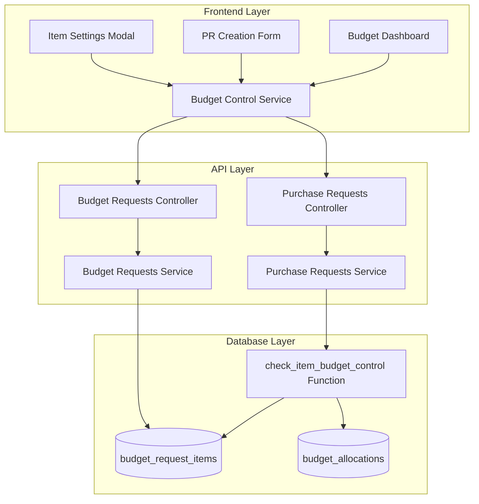

# Design Document - Item-Level Budget Control

## Overview

The Item-Level Budget Control feature implements a three-tier budget enforcement system (NONE/SOFT/HARD) with independent quantity and price controls for each drug item in budget requests. The system validates Purchase Requests against configured tolerances, displays color-coded alerts in the UI, and provides a dashboard for monitoring budget status across all items.

This feature extends the existing budget management system by adding granular per-item controls while maintaining the current quarterly tracking and approval workflow. The design follows a layered architecture with PostgreSQL functions for validation logic, Fastify service integration for PR validation, and Angular components for configuration and visualization.

## Steering Document Alignment

### Technical Standards (tech.md)

**Database-First Design:**

- Schema changes in migrations-inventory with CHECK constraints for data integrity
- PostgreSQL function `check_item_budget_control()` encapsulates validation logic
- Returns structured JSONB for detailed validation results

**API-First Development:**

- Validation occurs in service layer before PR creation
- TypeBox schema updates for control type fields
- Error responses distinguish HARD blocks vs SOFT warnings

**TypeScript Patterns:**

- Strict typing for control types: 'NONE' | 'SOFT' | 'HARD'
- Interface definitions for validation results
- Null safety with optional chaining for variance percentages

### Project Structure (structure.md)

**Backend Organization:**

```
apps/api/src/
├── database/migrations-inventory/
│   ├── 20251219000002_add_item_budget_control.ts    # Schema changes
│   └── 20251219000003_create_item_budget_control_function.ts  # PG function
├── layers/domains/inventory/
│   ├── budget/budgetRequests/
│   │   └── budget-requests.schemas.ts                # Add control type schemas
│   └── procurement/purchaseRequests/
│       └── purchase-requests.service.ts              # Add validation
```

**Frontend Organization:**

```
apps/admin/src/app/
└── modules/inventory/budget/
    ├── components/
    │   ├── item-settings-modal/                      # Control configuration
    │   ├── pr-validation-alerts/                     # Error/warning display
    │   └── budget-dashboard/                         # Status overview
    └── services/
        └── budget-control.service.ts                 # API integration
```

## Code Reuse Analysis

### Existing Components to Leverage

- **BaseRepository**: Extend for budget control CRUD operations
- **TypeBox Validation**: Reuse schema patterns for control type validation
- **AegisX UI Components**:
  - `ax-drawer` for item settings modal
  - `ax-alert` for validation error/warning boxes
  - `ax-progress` for budget usage progress bars
  - `ax-badge` for status indicators
  - `ax-table` for dashboard item list

### Integration Points

- **Existing Budget Request Flow**: Hook into existing `budget_request_items` table without breaking current functionality
- **Purchase Request Service**: Extend `validateCreate()` method to call budget control validation
- **Quarterly Tracking**: Integrate with existing `q1_purchased_qty`, `q2_purchased_qty`, etc. fields
- **Approval Workflow**: No changes to approval flow; validation happens before PR submission

## Architecture

### Layered Architecture



### Modular Design Principles

- **Single File Responsibility**: Each UI component (settings modal, alerts, dashboard) in separate files
- **Component Isolation**: Budget control logic isolated in PostgreSQL function; UI components don't duplicate validation
- **Service Layer Separation**:
  - Database function handles validation logic
  - Service layer orchestrates validation calls
  - Frontend components only display results
- **Utility Modularity**: Shared functions for control type display, color mapping, variance calculation

## Components and Interfaces

### Component 1: Database Schema Enhancement

**Purpose:** Store control settings per budget request item

**Schema Changes:**

```sql
-- File: 20251219000002_add_item_budget_control.ts
ALTER TABLE inventory.budget_request_items
ADD COLUMN quantity_control_type VARCHAR(10) DEFAULT 'SOFT'
  CHECK (quantity_control_type IN ('NONE', 'SOFT', 'HARD')),
ADD COLUMN price_control_type VARCHAR(10) DEFAULT 'SOFT'
  CHECK (price_control_type IN ('NONE', 'SOFT', 'HARD')),
ADD COLUMN quantity_variance_percent INTEGER DEFAULT 10
  CHECK (quantity_variance_percent >= 0 AND quantity_variance_percent <= 100),
ADD COLUMN price_variance_percent INTEGER DEFAULT 15
  CHECK (price_variance_percent >= 0 AND price_variance_percent <= 100);
```

**Interface:**

- Columns: quantity_control_type, price_control_type, quantity_variance_percent, price_variance_percent
- Constraints: CHECK constraints ensure valid values
- Defaults: SOFT control with 10% quantity, 15% price tolerance

**Dependencies:** Existing budget_request_items table

**Reuses:** Current quarterly tracking columns (q1_qty, q1_purchased_qty, etc.)

### Component 2: Budget Control Validation Function

**Purpose:** Validate PR item against configured budget controls

**PostgreSQL Function:**

```sql
-- File: 20251219000003_create_item_budget_control_function.ts
CREATE FUNCTION inventory.check_item_budget_control(
  p_budget_request_item_id BIGINT,
  p_pr_quantity NUMERIC,
  p_pr_unit_price NUMERIC,
  p_quarter INTEGER
)
RETURNS TABLE(
  allowed BOOLEAN,
  quantity_status VARCHAR(10),  -- 'OK', 'WARNING', 'BLOCKED'
  price_status VARCHAR(10),
  message JSONB
)
```

**Validation Logic:**

1. Fetch item configuration and quarterly budget data
2. Calculate remaining quantity: `planned_qty - purchased_qty`
3. Calculate variance percentages: `((requested - remaining) / remaining) * 100`
4. Check quantity control:
   - NONE → return 'OK'
   - Within tolerance → return 'OK'
   - SOFT + exceeds → return 'WARNING'
   - HARD + exceeds → return 'BLOCKED'
5. Check price control (same logic)
6. Overall allowed: `quantity_status != 'BLOCKED' AND price_status != 'BLOCKED'`

**Interface:**

- Input: item ID, requested quantity, unit price, quarter
- Output: allowed flag, statuses, detailed message JSONB

**Dependencies:** budget_request_items table

**Reuses:** Quarterly purchased tracking columns

### Component 3: Purchase Request Service Enhancement

**Purpose:** Integrate budget control validation into PR creation workflow

**File:** `apps/api/src/layers/domains/inventory/procurement/purchaseRequests/purchase-requests.service.ts`

**Method Addition:**

```typescript
async validateCreate(data: CreatePurchaseRequests, userId: string): Promise<void> {
  // ... existing validations ...

  // Budget control validation
  const budgetValidations = await Promise.all(
    data.items.map(async (item) => {
      const result = await this.knex.raw(`
        SELECT * FROM inventory.check_item_budget_control(?, ?, ?, ?)
      `, [
        item.budget_request_item_id,
        item.quantity,
        item.unit_price,
        this.getCurrentQuarter()
      ]);

      return {
        item_id: item.budget_request_item_id,
        drug_name: item.drug_name,
        ...result.rows[0]
      };
    })
  );

  // Separate HARD blocks and SOFT warnings
  const hardBlocks = budgetValidations.filter(v => !v.allowed);
  const softWarnings = budgetValidations.filter(v =>
    v.allowed && (v.quantity_status === 'WARNING' || v.price_status === 'WARNING')
  );

  // Error handling (see Error Handling section)
}
```

**Interface:**

- Input: PR data with items array
- Output: void (throws errors if validation fails)
- Errors: BUDGET_CONTROL_BLOCKED, BUDGET_EXCEED_REASON_REQUIRED

**Dependencies:** check_item_budget_control() function, knex instance

**Reuses:** Existing validateCreate() framework

### Component 4: Item Settings Modal (Frontend)

**Purpose:** Configure control types and variance tolerances per item

**File:** `apps/admin/src/app/modules/inventory/budget/components/item-settings-modal/item-settings-modal.component.ts`

**UI Structure:**

```typescript
@Component({
  selector: 'app-item-settings-modal',
  standalone: true,
  imports: [AxDrawerComponent, ReactiveFormsModule, AxBadgeComponent],
})
export class ItemSettingsModalComponent {
  form = this.fb.group({
    quantity_control_type: ['SOFT'],
    quantity_variance_percent: [10],
    price_control_type: ['SOFT'],
    price_variance_percent: [15],
  });

  impactPreview = computed(() => this.calculateImpact(this.form.value));

  saveSettings() {
    // PATCH /api/inventory/budget/budget-requests/:id/items/:itemId
  }
}
```

**Interface:**

- Input: item data (drug name, budget, purchased quantities)
- Output: Updated control settings
- Events: save, cancel

**Dependencies:** Budget control service, AegisX drawer component

**Reuses:**

- Reactive forms patterns from existing components
- AegisX UI components (ax-drawer, ax-badge, ax-select)

### Component 5: PR Validation Alerts (Frontend)

**Purpose:** Display budget validation errors and warnings during PR creation

**File:** `apps/admin/src/app/modules/inventory/budget/components/pr-validation-alerts/pr-validation-alerts.component.ts`

**UI Structure:**

```typescript
@Component({
  selector: 'app-pr-validation-alerts',
  standalone: true,
  imports: [AxAlertComponent, AxAccordionComponent],
})
export class PrValidationAlertsComponent {
  @Input() hardBlocks: ValidationResult[] = [];
  @Input() softWarnings: ValidationResult[] = [];
  @Output() reasonChange = new EventEmitter<string>();

  hardBlocksExpanded = signal(true);
  softWarningsExpanded = signal(true);
}
```

**Display Logic:**

- Red alert box for HARD blocks (always visible, blocks submit)
- Yellow alert box for SOFT warnings (expandable, requires reason)
- Accordion for item-level details
- Textarea for exceed reason (required for SOFT)

**Interface:**

- Inputs: validation results (hard blocks, soft warnings)
- Outputs: reason text for SOFT warnings
- UI States: expanded/collapsed per alert type

**Dependencies:** Validation results from PR service

**Reuses:** AegisX alert and accordion components

### Component 6: Budget Dashboard (Frontend)

**Purpose:** Overview of budget status across all items with filtering

**File:** `apps/admin/src/app/modules/inventory/budget/components/budget-dashboard/budget-dashboard.component.ts`

**UI Structure:**

```typescript
@Component({
  selector: 'app-budget-dashboard',
  standalone: true,
  imports: [AxTableComponent, AxProgressComponent, AxBadgeComponent],
})
export class BudgetDashboardComponent {
  items = signal<BudgetItemStatus[]>([]);
  filters = signal({ controlType: 'ALL', status: 'ALL' });

  summaryCards = computed(() => this.calculateSummary(this.items()));
  filteredItems = computed(() => this.applyFilters(this.items(), this.filters()));

  loadData() {
    // GET /api/inventory/budget/budget-requests/:id/items-status
  }
}
```

**Display Features:**

- Summary cards: Total budget, used, remaining
- Control type breakdown: HARD/SOFT/NONE counts
- Item table with dual progress bars (quantity + amount)
- Color-coded status badges
- Filters: by control type, by status

**Interface:**

- Input: Budget request ID
- Output: Dashboard view with item statuses
- Actions: Filter, view item details, view related PRs

**Dependencies:** Budget control service for data fetching

**Reuses:**

- AegisX table component with virtual scrolling
- AegisX progress bars
- Existing badge and filter patterns

## Data Models

### BudgetRequestItem (Extended)

```typescript
interface BudgetRequestItem {
  // Existing fields
  id: number;
  budget_request_id: number;
  item_id: number;
  requested_qty: number;
  unit_price: number;
  q1_qty: number;
  q2_qty: number;
  q3_qty: number;
  q4_qty: number;
  q1_purchased_qty: number;
  q2_purchased_qty: number;
  q3_purchased_qty: number;
  q4_purchased_qty: number;

  // NEW: Control settings
  quantity_control_type: 'NONE' | 'SOFT' | 'HARD';
  price_control_type: 'NONE' | 'SOFT' | 'HARD';
  quantity_variance_percent: number; // 0-100
  price_variance_percent: number; // 0-100
}
```

### ValidationResult

```typescript
interface ValidationResult {
  item_id: number;
  drug_name: string;
  allowed: boolean;
  quantity_status: 'OK' | 'WARNING' | 'BLOCKED';
  price_status: 'OK' | 'WARNING' | 'BLOCKED';
  message: {
    quantity: {
      planned: number;
      purchased: number;
      remaining: number;
      requested: number;
      diff_percent: number;
      tolerance: number;
      control_type: string;
    };
    price: {
      planned: number;
      requested: number;
      diff_percent: number;
      tolerance: number;
      control_type: string;
    };
  };
}
```

### BudgetItemStatus (Dashboard)

```typescript
interface BudgetItemStatus {
  item_id: number;
  drug_code: string;
  drug_name: string;
  quantity_control_type: string;
  price_control_type: string;
  planned_qty: number;
  purchased_qty: number;
  remaining_qty: number;
  usage_percent: number;
  status: 'normal' | 'warning' | 'exceeded';
  related_prs: number[]; // PR IDs that consumed this item's budget
}
```

## Error Handling

### Error Scenarios

#### 1. HARD Control Exceeded

**Description:** PR item quantity or price exceeds tolerance with HARD control

**Handling:**

```typescript
if (hardBlocks.length > 0) {
  throw new AppError({
    code: 'BUDGET_CONTROL_BLOCKED',
    message: 'Some items exceed budget limits (HARD control)',
    statusCode: 400,
    details: {
      hard_blocks: hardBlocks,
      soft_warnings: softWarnings,
    },
  });
}
```

**User Impact:**

- Red alert box displays at top of PR form
- Submit button disabled with lock icon (🔒)
- Per-item details show exceeded amounts and percentages
- User must adjust quantities/prices or request budget amendment

#### 2. SOFT Warning Without Reason

**Description:** PR has items with SOFT warnings but user hasn't provided justification

**Handling:**

```typescript
if (softWarnings.length > 0 && !data.budget_exceed_reason) {
  throw new AppError({
    code: 'BUDGET_EXCEED_REASON_REQUIRED',
    message: 'Budget exceed reason is required for items with warnings',
    statusCode: 400,
    details: {
      soft_warnings: softWarnings,
    },
  });
}
```

**User Impact:**

- Yellow alert box displays below HARD errors (if any)
- Textarea appears requiring user to enter reason
- Submit button enabled only after reason is provided
- Reason saved with PR for audit trail

#### 3. Validation Function Failure

**Description:** check_item_budget_control() function returns error (e.g., item not found)

**Handling:**

```typescript
if (result.rows[0].quantity_status === 'BLOCKED' && result.rows[0].message.error) {
  // Log error but don't block PR creation entirely
  this.logger.error(
    {
      item_id,
      error: result.rows[0].message.error,
    },
    'Budget validation function error',
  );

  // Treat as SOFT warning
  return { ...result.rows[0], quantity_status: 'WARNING', allowed: true };
}
```

**User Impact:**

- Yellow warning displayed instead of red error
- User can proceed but should investigate
- Error logged for admin review

## Testing Strategy

### Unit Testing

**Database Function Tests:**

```typescript
describe('check_item_budget_control()', () => {
  it('should return OK when within tolerance', async () => {
    // Setup: item with SOFT ±10%, remaining 1000, request 1050 (5% over)
    const result = await knex.raw('SELECT * FROM check_item_budget_control(?, ?, ?, ?)', [itemId, 1050, 2.5, 2]);
    expect(result.rows[0].quantity_status).toBe('OK');
    expect(result.rows[0].allowed).toBe(true);
  });

  it('should return WARNING for SOFT control exceeded', async () => {
    // Setup: item with SOFT ±10%, remaining 1000, request 1200 (20% over)
    const result = await knex.raw('SELECT * FROM check_item_budget_control(?, ?, ?, ?)', [itemId, 1200, 2.5, 2]);
    expect(result.rows[0].quantity_status).toBe('WARNING');
    expect(result.rows[0].allowed).toBe(true);
  });

  it('should return BLOCKED for HARD control exceeded', async () => {
    // Setup: item with HARD ±10%, remaining 1000, request 1200 (20% over)
    const result = await knex.raw('SELECT * FROM check_item_budget_control(?, ?, ?, ?)', [itemId, 1200, 2.5, 2]);
    expect(result.rows[0].quantity_status).toBe('BLOCKED');
    expect(result.rows[0].allowed).toBe(false);
  });
});
```

**Service Layer Tests:**

```typescript
describe('PurchaseRequestsService.validateCreate()', () => {
  it('should throw BUDGET_CONTROL_BLOCKED for HARD errors', async () => {
    await expect(service.validateCreate(prData, userId)).rejects.toThrow('BUDGET_CONTROL_BLOCKED');
  });

  it('should throw BUDGET_EXCEED_REASON_REQUIRED for SOFT without reason', async () => {
    await expect(service.validateCreate(prDataNoReason, userId)).rejects.toThrow('BUDGET_EXCEED_REASON_REQUIRED');
  });

  it('should allow PR with SOFT warnings and reason', async () => {
    await expect(service.validateCreate(prDataWithReason, userId)).resolves.not.toThrow();
  });
});
```

### Integration Testing

**Full Workflow Tests:**

1. **Configure Control → Create PR → Validation**
   - Create budget request with items
   - Set control types via PATCH endpoint
   - Create PR that exceeds HARD limit
   - Verify error response with details
   - Adjust PR quantities
   - Verify successful creation

2. **Dashboard Data Accuracy**
   - Create budget request with multiple items
   - Create several PRs consuming budget
   - Fetch dashboard data
   - Verify usage percentages match expected calculations
   - Verify status badges (normal/warning/exceeded) are correct

3. **Concurrent PR Creation**
   - Create two PRs simultaneously for same item
   - Verify both check against same remaining budget
   - Verify proper error handling if both would exceed

### End-to-End Testing

**User Scenarios:**

1. **Finance Manager Configures Controls**
   - Login as Finance Manager
   - Navigate to budget request
   - Click item settings icon
   - Change Paracetamol to HARD ±5%
   - Save settings
   - Verify UI shows red HARD badge
   - Verify preview updates with examples

2. **Procurement Officer Creates PR with HARD Error**
   - Login as Procurement Officer
   - Create new PR
   - Add item that exceeds HARD limit
   - Click validate/submit
   - Verify red alert box appears
   - Verify submit button is disabled
   - Verify detailed breakdown shows exceeded amount

3. **Procurement Officer Creates PR with SOFT Warning**
   - Add item that exceeds SOFT limit
   - Verify yellow warning box appears
   - Verify textarea for reason appears
   - Enter reason: "Seasonal demand increase"
   - Verify submit button enables
   - Submit PR
   - Verify PR created successfully with reason logged

4. **Finance Views Dashboard**
   - Login as Finance Manager
   - Navigate to budget dashboard
   - Verify summary cards show correct totals
   - Filter by "HARD" control type
   - Verify only HARD-controlled items appear
   - Filter by "exceeded" status
   - Verify red progress bars appear
   - Click item row
   - Verify related PRs list appears
