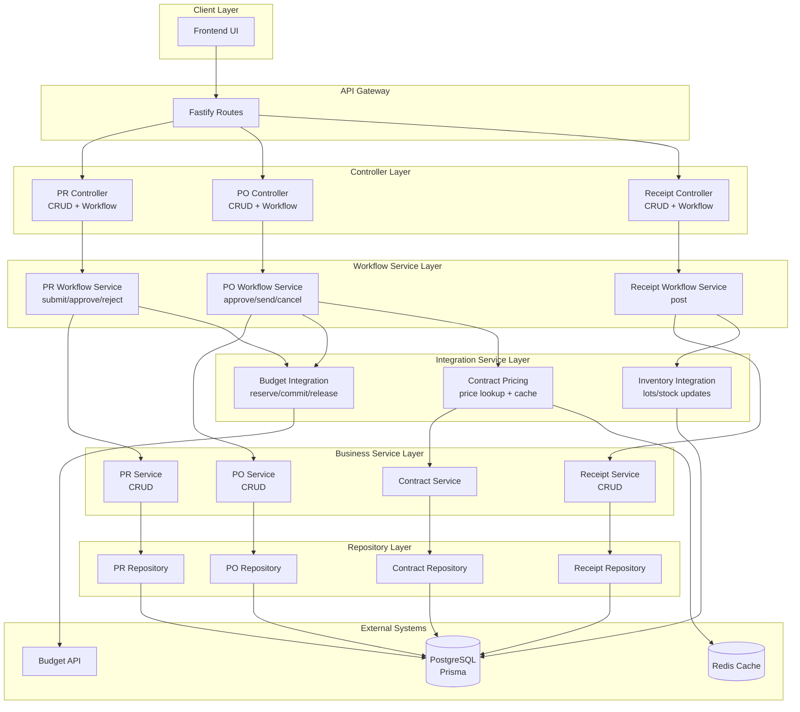

# Design Document - Procurement API

## Overview

The Procurement API extends the existing CRUD-based procurement modules with comprehensive **workflow orchestration** and **cross-system integration**. This design leverages the foundational 8 procurement modules already implemented (Purchase Requests, Purchase Orders, Receipts, Contracts, etc.) and adds workflow services to enable the complete procurement cycle with budget control and inventory integration.

**Architecture Approach:**

- **Reuse Existing**: 8 CRUD modules provide solid foundation (controllers, services, repositories, routes)
- **Add Workflow Services**: New service layer for workflow orchestration (submit, approve, send, post)
- **External Integration**: Budget API client for financial controls, Inventory updates for stock management
- **Transaction Management**: Prisma transactions ensure atomic multi-step operations
- **Event-Driven**: Optional WebSocket events for real-time UI updates

**System Position:**
The Procurement API acts as the **orchestration layer** between:

- **Upstream**: Budget Management (budget checking, reservations, commitments)
- **Downstream**: Inventory Management (lot creation, stock updates)
- **Core**: Procurement workflow state machine (PR → PO → Receipt → Payment)

## Steering Document Alignment

### Technical Standards (tech.md)

**AegisX Platform Standards:**

1. **Service Layer Pattern**: Extends `BaseService<T, CreateDto, UpdateDto>` for standard CRUD, adds workflow services for business logic
2. **TypeBox Schema Validation**: All request/response validated with TypeBox schemas before processing
3. **Repository Pattern**: Data access through repositories, never direct Prisma calls in controllers
4. **Fastify Plugins**: Each workflow service registered as Fastify decorator for dependency injection
5. **Error Handling**: Custom error classes with proper HTTP status codes and i18n messages
6. **Logging**: Structured logging with `request.log` including correlation IDs
7. **Transaction Management**: All multi-step operations wrapped in `prisma.$transaction()`

**TypeScript Standards:**

- Strict mode enabled, no `any` types
- Interface-first design for all service contracts
- Type exports from `.types.ts` files
- Generic types for reusable patterns

**Testing Standards:**

- Unit tests for all service methods (target: 80% coverage)
- Integration tests for workflow endpoints
- Mock external dependencies (Budget API, Inventory API)

### Project Structure (structure.md)

**Module Organization:**

```
apps/api/src/modules/inventory/procurement/
├── purchaseRequests/
│   ├── purchase-requests.controller.ts      # Existing CRUD controller
│   ├── purchase-requests.service.ts         # Existing CRUD service
│   ├── purchase-requests.repository.ts      # Existing repository
│   ├── purchase-requests.routes.ts          # Extended with workflow routes
│   ├── purchase-requests.schemas.ts         # Extended with workflow schemas
│   ├── purchase-requests.types.ts           # Existing types
│   └── purchase-requests-workflow.service.ts # NEW - Workflow orchestration
├── purchaseOrders/
│   ├── purchase-orders.controller.ts        # Existing CRUD controller
│   ├── purchase-orders.service.ts           # Existing CRUD service
│   ├── purchase-orders.repository.ts        # Existing repository
│   ├── purchase-orders.routes.ts            # Extended with workflow routes
│   ├── purchase-orders.schemas.ts           # Extended with workflow schemas
│   ├── purchase-orders.types.ts             # Existing types
│   └── purchase-orders-workflow.service.ts  # NEW - Workflow orchestration
├── receipts/
│   ├── receipts.controller.ts               # Existing CRUD controller
│   ├── receipts.service.ts                  # Existing CRUD service
│   ├── receipts.repository.ts               # Existing repository
│   ├── receipts.routes.ts                   # Extended with workflow routes
│   ├── receipts.schemas.ts                  # Extended with workflow schemas
│   ├── receipts.types.ts                    # Existing types
│   └── receipts-workflow.service.ts         # NEW - Workflow orchestration
└── shared/
    ├── budget-integration.service.ts        # NEW - Budget API client
    ├── inventory-integration.service.ts     # NEW - Inventory API client
    ├── contract-pricing.service.ts          # NEW - Contract price lookup
    └── procurement.types.ts                 # NEW - Shared types
```

**Shared Services Location:**

```
apps/api/src/shared/services/
├── base.service.ts                          # Existing - Extended
└── http-client.service.ts                   # NEW - For external API calls
```

## Code Reuse Analysis

### Existing Components to Leverage

1. **BaseService<T, CreateDto, UpdateDto>**
   - Location: `apps/api/src/shared/services/base.service.ts`
   - Usage: All 8 existing procurement services extend this for standard CRUD
   - Hooks Used: `validateCreate`, `beforeCreate`, `afterCreate`, `validateUpdate`, `beforeUpdate`, `afterUpdate`
   - **Our Approach**: Workflow services will **use existing services** but won't extend BaseService (composition over inheritance)

2. **BaseRepository<T, CreateDto, UpdateDto>**
   - Location: `apps/api/src/shared/repositories/base.repository.ts`
   - Usage: All repositories extend for database operations
   - Methods: `findById`, `list`, `create`, `update`, `delete`
   - **Our Approach**: Workflow services use existing repositories through existing services

3. **TypeBox Schema Validation**
   - Pattern: All routes use TypeBox schemas for validation
   - Location: `*.schemas.ts` files in each module
   - **Our Approach**: Create new workflow schemas (SubmitPRSchema, ApprovePRSchema, SendPOSchema, PostReceiptSchema)

4. **Fastify Plugin Architecture**
   - Pattern: Each module is a Fastify plugin with dependency injection
   - Registration: Via `fastify.register()` in main app
   - **Our Approach**: Register workflow services as Fastify decorators (`fastify.decorate('prWorkflowService', ...)`)

5. **Reply Helper Extensions**
   - Methods: `reply.success()`, `reply.error()`, `reply.notFound()`, `reply.unauthorized()`, `reply.forbidden()`
   - Location: `apps/api/src/plugins/response-handler.plugin.ts`
   - **Our Approach**: Use existing reply helpers for consistent responses

6. **Prisma Client**
   - Location: `apps/api/src/database/prisma.client.ts`
   - Transaction Support: `prisma.$transaction(async (tx) => {...})`
   - **Our Approach**: Use Prisma transactions for all workflow operations

7. **Logger**
   - Fastify's built-in logger: `request.log.info()`, `request.log.error()`
   - **Our Approach**: Structured logging with context (userId, prId, action)

### Existing Components to Extend

1. **Purchase Requests Service**
   - Location: `apps/api/src/modules/inventory/procurement/purchaseRequests/purchase-requests.service.ts`
   - Current: CRUD operations only
   - Extension: Keep CRUD, add separate `PurchaseRequestWorkflowService` for submit/approve/reject

2. **Purchase Requests Routes**
   - Location: `apps/api/src/modules/inventory/procurement/purchaseRequests/purchase-requests.routes.ts`
   - Current: CRUD routes (GET, POST, PUT, DELETE /purchase-requests)
   - Extension: Add workflow routes:
     - `POST /purchase-requests/:id/submit`
     - `POST /purchase-requests/:id/approve`
     - `POST /purchase-requests/:id/reject`

3. **Purchase Orders Service & Routes**
   - Extension: Add `PurchaseOrderWorkflowService` and workflow routes:
     - `POST /purchase-orders/:id/approve`
     - `POST /purchase-orders/:id/send`
     - `POST /purchase-orders/:id/cancel`

4. **Receipts Service & Routes**
   - Extension: Add `ReceiptsWorkflowService` and workflow routes:
     - `POST /receipts/:id/post`

### Integration Points

1. **Budget Management API Integration**
   - External API: Separate Budget Management module (may be separate microservice or same codebase)
   - Endpoints to Call:
     - `POST /api/budget/check-availability` - Check if budget available
     - `POST /api/budget/reserve` - Reserve budget for PR
     - `POST /api/budget/commit` - Commit budget when PO sent
     - `POST /api/budget/release-reservation` - Release reservation when PR rejected
     - `POST /api/budget/release-commitment` - Release commitment when PO cancelled
   - **Integration Service**: `BudgetIntegrationService` with retry logic and timeout handling

2. **Inventory Management Integration**
   - Database Tables: `inventory`, `drug_lots`, `inventory_transactions` (same database)
   - Direct Prisma Updates: No external API calls, use Prisma transactions
   - Operations:
     - Create `drug_lots` records when receipt posted
     - Update/Create `inventory` records (upsert by drug_id + location_id)
     - Create `inventory_transactions` with type='RECEIVE'
   - **Integration Service**: `InventoryIntegrationService` for encapsulated logic

3. **Contract Pricing Integration**
   - Database Tables: `contracts`, `contract_items` (same database, already exist)
   - Query Pattern: Join contracts with contract_items to find agreed prices
   - **Integration Service**: `ContractPricingService` with caching (Redis)

4. **Notification System**
   - Existing: Email/notification service (assumed to exist)
   - Usage: Notify managers on PR submission, notify requester on approval/rejection
   - **Approach**: Call existing notification service (if available) or implement simple email sending

## Architecture

### High-Level Architecture



### Modular Design Principles

**1. Single File Responsibility**

- **Workflow Services**: One file per workflow domain (PR, PO, Receipt)
- **Integration Services**: One file per external system (Budget, Inventory, Contract)
- **Controllers**: Workflow methods added to existing controllers (no new controller files)
- **Routes**: Workflow routes added to existing route files

**2. Component Isolation**

- Each workflow service is independently testable with mocked dependencies
- Integration services have clear interfaces (TypeScript interfaces)
- No circular dependencies between services

**3. Service Layer Separation**

- **Controller Layer**: Request/response handling, schema validation, logging
- **Workflow Service Layer**: Business logic orchestration, transaction management
- **Business Service Layer**: CRUD operations (existing services)
- **Integration Service Layer**: External API calls, database updates
- **Repository Layer**: Raw database access (existing repositories)

**4. Utility Modularity**

- **HTTP Client**: Reusable HTTP client for external API calls (Budget API)
- **Error Handlers**: Centralized error mapping (BudgetError, WorkflowError)
- **Validators**: Shared validation helpers (status checks, amount validations)

## Components and Interfaces

### Component 1: PurchaseRequestWorkflowService

**Purpose:** Orchestrates PR submission, approval, and rejection workflows with budget integration

**Interfaces:**

```typescript
interface IPurchaseRequestWorkflowService {
  /**
   * Submit PR for approval with budget validation and reservation
   * @throws BudgetError if budget unavailable
   * @throws ValidationError if PR status invalid
   */
  submit(prId: number, userId: number): Promise<PurchaseRequests>;

  /**
   * Approve PR and keep budget reservation
   * @throws ForbiddenError if user not authorized
   * @throws ValidationError if PR status invalid
   */
  approve(prId: number, approverId: number): Promise<PurchaseRequests>;

  /**
   * Reject PR and release budget reservation
   * @throws ForbiddenError if user not authorized
   * @throws ValidationError if PR status invalid
   */
  reject(prId: number, rejecterId: number, reason: string): Promise<PurchaseRequests>;
}
```

**Dependencies:**

- `PurchaseRequestsService` - For CRUD operations and status updates
- `BudgetIntegrationService` - For budget checking, reservation, release
- `NotificationService` - For sending approval notifications (optional)
- `PrismaClient` - For transaction management

**Reuses:**

- Existing `PurchaseRequestsService` for findById, update
- Existing `BaseService` validation hooks
- Existing Prisma transaction pattern

**Implementation Pattern:**

```typescript
export class PurchaseRequestWorkflowService implements IPurchaseRequestWorkflowService {
  constructor(
    private prisma: PrismaClient,
    private prService: PurchaseRequestsService,
    private budgetIntegration: BudgetIntegrationService,
    private logger: FastifyBaseLogger,
  ) {}

  async submit(prId: number, userId: number): Promise<PurchaseRequests> {
    return this.prisma.$transaction(async (tx) => {
      // 1. Validate PR status (must be DRAFT)
      const pr = await this.prService.findById(prId);
      if (!pr || pr.status !== 'DRAFT') {
        throw new ValidationError('PR must be in DRAFT status to submit');
      }

      // 2. Check budget availability
      const budgetCheck = await this.budgetIntegration.checkAvailability({
        fiscal_year: pr.fiscal_year,
        budget_type_id: pr.budget_id,
        department_id: pr.department_id,
        amount: pr.total_amount,
        quarter: getCurrentQuarter(),
      });

      if (!budgetCheck.available) {
        throw new BudgetError('Insufficient budget', {
          available: budgetCheck.remaining,
          requested: pr.total_amount,
          shortage: pr.total_amount - budgetCheck.remaining,
        });
      }

      // 3. Reserve budget
      const reservation = await this.budgetIntegration.reserve({
        allocation_id: budgetCheck.allocation_id,
        pr_id: pr.id,
        amount: pr.total_amount,
        quarter: getCurrentQuarter(),
        expires_days: 30,
      });

      // 4. Update PR status
      const submitted = await this.prService.update(pr.id, {
        status: 'SUBMITTED',
        submitted_at: new Date(),
        submitted_by: userId,
      });

      // 5. Send notification (non-blocking)
      this.sendApprovalNotification(pr).catch((err) => this.logger.error({ err, prId }, 'Failed to send approval notification'));

      return submitted;
    });
  }

  // ... approve() and reject() methods
}
```

---

### Component 2: PurchaseOrderWorkflowService

**Purpose:** Orchestrates PO approval, sending, and cancellation workflows with budget commitment

**Interfaces:**

```typescript
interface IPurchaseOrderWorkflowService {
  /**
   * Approve PO (validate approval documents for high-value POs)
   * @throws ValidationError if approval document missing
   */
  approve(poId: number, approverId: number): Promise<PurchaseOrders>;

  /**
   * Send PO to vendor and commit budget
   * @throws BudgetError if budget commitment fails
   * @throws ValidationError if PO not approved
   */
  send(poId: number, userId: number): Promise<PurchaseOrders>;

  /**
   * Cancel PO and release budget commitment
   * @throws ValidationError if PO has receipts
   */
  cancel(poId: number, userId: number, reason: string): Promise<PurchaseOrders>;
}
```

**Dependencies:**

- `PurchaseOrdersService` - For CRUD operations
- `BudgetIntegrationService` - For budget commitment/release
- `ContractPricingService` - For contract price lookup (used in creation)
- `PurchaseRequestsService` - For updating linked PR status
- `PrismaClient` - For transactions

**Reuses:**

- Existing PO service and repository
- Budget integration patterns from PR workflow
- Transaction management patterns

---

### Component 3: ReceiptWorkflowService

**Purpose:** Orchestrates receipt posting with inventory updates and lot creation

**Interfaces:**

```typescript
interface IReceiptWorkflowService {
  /**
   * Post receipt to inventory (create lots, update stock)
   * @throws ValidationError if inspectors < 3
   * @throws ValidationError if receipt already posted
   */
  post(receiptId: number, userId: number): Promise<Receipts>;

  /**
   * Validate receipt before posting
   * @returns validation errors or empty array
   */
  validateForPosting(receiptId: number): Promise<ValidationError[]>;
}
```

**Dependencies:**

- `ReceiptsService` - For CRUD operations
- `InventoryIntegrationService` - For lot creation and stock updates
- `PurchaseOrdersService` - For updating PO status
- `PrismaClient` - For transactions

**Reuses:**

- Existing receipts service
- Prisma upsert pattern for inventory

**Implementation Pattern:**

```typescript
async post(receiptId: number, userId: number): Promise<Receipts> {
  return this.prisma.$transaction(async (tx) => {
    // 1. Validate receipt
    const receipt = await this.receiptsService.findById(receiptId);
    const errors = await this.validateForPosting(receiptId);
    if (errors.length > 0) {
      throw new ValidationError('Receipt validation failed', errors);
    }

    // 2. Create drug lots
    const lots = await this.inventoryIntegration.createLots(receipt, tx);

    // 3. Update inventory
    await this.inventoryIntegration.updateStock(receipt, tx);

    // 4. Create inventory transactions
    await this.inventoryIntegration.createTransactions(receipt, tx);

    // 5. Update PO status
    const poComplete = await this.checkPOComplete(receipt.po_id, tx);
    await this.poService.update(receipt.po_id, {
      status: poComplete ? 'COMPLETED' : 'PARTIAL',
    });

    // 6. Update receipt status
    const posted = await this.receiptsService.update(receipt.id, {
      status: 'POSTED',
      posted_at: new Date(),
      posted_by: userId,
    });

    return posted;
  });
}
```

---

### Component 4: BudgetIntegrationService

**Purpose:** Handle all Budget API interactions with retry logic and error handling

**Interfaces:**

```typescript
interface IBudgetIntegrationService {
  /**
   * Check if budget is available for requested amount
   * @throws BudgetAPIError if API call fails
   * @throws TimeoutError if API timeout
   */
  checkAvailability(params: BudgetCheckParams): Promise<BudgetCheckResult>;

  /**
   * Reserve budget for PR
   * @throws BudgetAPIError if reservation fails
   */
  reserve(params: BudgetReserveParams): Promise<BudgetReservation>;

  /**
   * Commit budget for PO
   * @throws BudgetAPIError if commit fails
   */
  commit(params: BudgetCommitParams): Promise<BudgetCommitment>;

  /**
   * Release budget reservation (PR rejected)
   */
  releaseReservation(reservationId: number): Promise<void>;

  /**
   * Release budget commitment (PO cancelled)
   */
  releaseCommitment(commitmentId: number): Promise<void>;
}

interface BudgetCheckParams {
  fiscal_year: number;
  budget_type_id: number;
  department_id: number;
  amount: number;
  quarter: number;
}

interface BudgetCheckResult {
  available: boolean;
  allocation_id: number;
  remaining: number;
  reserved: number;
  committed: number;
}
```

**Dependencies:**

- `HttpClientService` - For HTTP requests with retry
- `ConfigService` - For Budget API base URL
- `Logger` - For error logging

**Reuses:**

- Axios or Fetch for HTTP calls
- Exponential backoff retry pattern

**Error Handling Strategy:**

```typescript
async checkAvailability(params: BudgetCheckParams): Promise<BudgetCheckResult> {
  try {
    const response = await this.httpClient.post('/api/budget/check-availability', params, {
      timeout: 5000,
      retries: 3,
      retryDelay: (attempt) => Math.pow(2, attempt) * 1000, // 1s, 2s, 4s
    });

    return response.data;
  } catch (error) {
    if (error.code === 'ETIMEDOUT') {
      throw new TimeoutError('Budget API timeout after 5s');
    }
    if (error.response?.status === 503) {
      throw new BudgetAPIError('Budget API unavailable', error);
    }
    throw new BudgetAPIError('Budget check failed', error);
  }
}
```

---

### Component 5: InventoryIntegrationService

**Purpose:** Handle inventory updates, lot creation, and transaction logging

**Interfaces:**

```typescript
interface IInventoryIntegrationService {
  /**
   * Create drug lots from receipt items
   */
  createLots(receipt: Receipts, tx: PrismaTransaction): Promise<DrugLot[]>;

  /**
   * Update inventory stock levels
   */
  updateStock(receipt: Receipts, tx: PrismaTransaction): Promise<void>;

  /**
   * Create inventory transaction records
   */
  createTransactions(receipt: Receipts, tx: PrismaTransaction): Promise<void>;
}
```

**Dependencies:**

- `PrismaClient` - For database operations
- `Logger` - For operation logging

**Reuses:**

- Prisma upsert pattern
- Prisma transaction context

**Implementation Pattern:**

```typescript
async createLots(receipt: Receipts, tx: PrismaTransaction): Promise<DrugLot[]> {
  const receiptItems = await tx.receiptItem.findMany({
    where: { receipt_id: receipt.id },
    include: { generic: { include: { drugs: true } } },
  });

  const lots = [];
  for (const item of receiptItems) {
    if (item.quantity_accepted > 0) {
      const lot = await tx.drugLot.create({
        data: {
          lot_number: item.lot_number,
          drug_id: item.generic.drugs[0].id, // Get first trade drug
          location_id: receipt.location_id,
          quantity: item.quantity_accepted,
          quantity_remaining: item.quantity_accepted,
          unit_cost: item.unit_price,
          manufacture_date: item.manufacture_date,
          expiry_date: item.expiry_date,
          received_date: receipt.receipt_date,
          receipt_id: receipt.id,
        },
      });
      lots.push(lot);
    }
  }

  return lots;
}

async updateStock(receipt: Receipts, tx: PrismaTransaction): Promise<void> {
  const receiptItems = await tx.receiptItem.findMany({
    where: { receipt_id: receipt.id },
    include: { generic: { include: { drugs: true } } },
  });

  for (const item of receiptItems) {
    if (item.quantity_accepted > 0) {
      await tx.inventory.upsert({
        where: {
          drug_id_location_id: {
            drug_id: item.generic.drugs[0].id,
            location_id: receipt.location_id,
          },
        },
        create: {
          drug_id: item.generic.drugs[0].id,
          location_id: receipt.location_id,
          quantity_on_hand: item.quantity_accepted,
          unit_cost: item.unit_price,
          last_updated: new Date(),
        },
        update: {
          quantity_on_hand: { increment: item.quantity_accepted },
          last_updated: new Date(),
        },
      });
    }
  }
}
```

---

### Component 6: ContractPricingService

**Purpose:** Lookup contract prices with Redis caching for performance

**Interfaces:**

```typescript
interface IContractPricingService {
  /**
   * Get contract price for drug from vendor
   * @returns agreed price or null if no contract
   */
  getContractPrice(vendorId: number, genericId: number): Promise<number | null>;

  /**
   * Get all contract prices for PO creation
   */
  getContractPricesForPO(vendorId: number, genericIds: number[]): Promise<Map<number, number>>;

  /**
   * Clear cache for vendor contracts (when contract updated)
   */
  clearCache(vendorId: number): Promise<void>;
}
```

**Dependencies:**

- `ContractsService` - For contract queries
- `Redis` - For caching
- `PrismaClient` - For database queries

**Reuses:**

- Existing contracts service
- Redis caching pattern

**Caching Strategy:**

```typescript
async getContractPrice(vendorId: number, genericId: number): Promise<number | null> {
  const cacheKey = `contract:price:${vendorId}:${genericId}`;

  // Try cache first
  const cached = await this.redis.get(cacheKey);
  if (cached) {
    return JSON.parse(cached);
  }

  // Query database
  const contractItem = await this.prisma.contractItem.findFirst({
    where: {
      contract: {
        vendor_id: vendorId,
        status: 'ACTIVE',
        start_date: { lte: new Date() },
        end_date: { gte: new Date() },
      },
      generic_id: genericId,
    },
    select: { agreed_unit_price: true },
  });

  const price = contractItem?.agreed_unit_price?.toNumber() || null;

  // Cache for 1 hour
  await this.redis.setex(cacheKey, 3600, JSON.stringify(price));

  return price;
}
```

## Data Models

### Workflow State Models

**PurchaseRequest Workflow States:**

```typescript
enum PRStatus {
  DRAFT = 'DRAFT', // Initial state
  SUBMITTED = 'SUBMITTED', // After budget reservation
  APPROVED = 'APPROVED', // After approval, ready for PO
  REJECTED = 'REJECTED', // Rejected, budget released
  CONVERTED = 'CONVERTED', // Converted to PO
}

interface PurchaseRequests {
  id: number;
  pr_number: string;
  department_id: number;
  budget_id: number;
  fiscal_year: number;
  total_amount: Decimal;
  status: PRStatus;

  // Workflow timestamps
  submitted_at?: Date;
  submitted_by?: number;
  approved_at?: Date;
  approved_by?: number;
  rejected_at?: Date;
  rejected_by?: number;
  rejection_reason?: string;
}
```

**PurchaseOrder Workflow States:**

```typescript
enum POStatus {
  DRAFT = 'DRAFT', // Initial state
  PENDING = 'PENDING', // Awaiting approval
  APPROVED = 'APPROVED', // Approved, ready to send
  SENT = 'SENT', // Sent to vendor, budget committed
  PARTIAL = 'PARTIAL', // Partially received
  COMPLETED = 'COMPLETED', // Fully received
  CANCELLED = 'CANCELLED', // Cancelled
}

interface PurchaseOrders {
  id: number;
  po_number: string;
  pr_id: number;
  vendor_id: number;
  contract_id?: number;
  grand_total: Decimal;
  status: POStatus;

  // Workflow timestamps
  approved_at?: Date;
  approved_by?: number;
  sent_date?: Date;
}
```

**Receipt Workflow States:**

```typescript
enum ReceiptStatus {
  DRAFT = 'DRAFT', // Initial state
  INSPECTING = 'INSPECTING', // Under inspection
  ACCEPTED = 'ACCEPTED', // Accepted, ready to post
  POSTED = 'POSTED', // Posted to inventory
  REJECTED = 'REJECTED', // Rejected
}

interface Receipts {
  id: number;
  receipt_number: string;
  po_id: number;
  location_id: number;
  status: ReceiptStatus;

  // Workflow timestamps
  inspected_at?: Date;
  inspected_by?: number;
  posted_at?: Date;
  posted_by?: number;
}
```

### Integration Data Models

**Budget API Request/Response Models:**

```typescript
interface BudgetCheckRequest {
  fiscal_year: number;
  budget_type_id: number;
  department_id: number;
  amount: number;
  quarter: number;
}

interface BudgetCheckResponse {
  available: boolean;
  allocation_id: number;
  allocated: number;
  reserved: number;
  committed: number;
  remaining: number;
}

interface BudgetReserveRequest {
  allocation_id: number;
  pr_id: number;
  amount: number;
  quarter: number;
  expires_days: number;
}

interface BudgetReserveResponse {
  reservation_id: number;
  expires_date: Date;
}
```

**Inventory Models (existing database):**

```typescript
interface DrugLot {
  id: number;
  lot_number: string;
  drug_id: number;
  location_id: number;
  quantity: number;
  quantity_remaining: number;
  unit_cost: Decimal;
  manufacture_date: Date;
  expiry_date: Date;
  received_date: Date;
  receipt_id: number;
}

interface Inventory {
  id: number;
  drug_id: number;
  location_id: number;
  quantity_on_hand: number;
  unit_cost: Decimal;
  last_updated: Date;
}

interface InventoryTransaction {
  id: number;
  drug_id: number;
  location_id: number;
  transaction_type: 'RECEIVE' | 'DISPENSE' | 'ADJUST';
  quantity: number;
  unit_cost: Decimal;
  reference_type: 'RECEIPT' | 'DISPENSATION';
  reference_id: number;
  transaction_date: Date;
  performed_by: number;
}
```

## Error Handling

### Error Scenarios

#### 1. Budget Unavailable

- **Scenario**: User submits PR but department budget is insufficient
- **Handling**:
  - `BudgetIntegrationService.checkAvailability()` returns `{available: false}`
  - Throw `BudgetError` with shortage details
  - Transaction rollback (PR status remains DRAFT)
- **User Impact**:
  - HTTP 400 Bad Request
  - Error message: "งบประมาณไม่เพียงพอ (Insufficient budget)"
  - Details: `{available: 10000, requested: 15000, shortage: 5000}`
  - User can reduce amount or request budget increase

#### 2. Budget API Timeout

- **Scenario**: Budget API takes > 5 seconds to respond
- **Handling**:
  - `HttpClientService` throws `TimeoutError` after 5s
  - Retry 3 times with exponential backoff (1s, 2s, 4s)
  - If all retries fail, throw `BudgetAPIError`
  - Transaction rollback
- **User Impact**:
  - HTTP 503 Service Unavailable
  - Error message: "Budget service temporarily unavailable. Please try again."
  - Retry button in UI

#### 3. Invalid PR Status for Submission

- **Scenario**: User tries to submit PR that is already SUBMITTED or APPROVED
- **Handling**:
  - `PurchaseRequestWorkflowService.submit()` validates status
  - Throw `ValidationError` with current status
  - No database changes
- **User Impact**:
  - HTTP 400 Bad Request
  - Error message: "Cannot submit PR in APPROVED status"
  - UI disables submit button for non-DRAFT PRs

#### 4. Unauthorized Approval Attempt

- **Scenario**: User without approve permission tries to approve PR
- **Handling**:
  - Fastify `verifyPermission('procurement:pr:approve')` hook rejects request
  - Throw `ForbiddenError`
  - No database changes
- **User Impact**:
  - HTTP 403 Forbidden
  - Error message: "You don't have permission to approve purchase requests"
  - UI hides approve button for unauthorized users

#### 5. Missing Approval Document for High-Value PO

- **Scenario**: User tries to approve PO > 100,000 without approval document
- **Handling**:
  - `PurchaseOrderWorkflowService.approve()` checks `approval_documents` table
  - Throw `ValidationError` with required document types
  - No status update
- **User Impact**:
  - HTTP 400 Bad Request
  - Error message: "Approval document required for PO > 100,000 baht"
  - UI prompts user to upload document

#### 6. Insufficient Inspectors for Receipt Posting

- **Scenario**: User tries to post receipt with only 2 inspectors (need 3)
- **Handling**:
  - `ReceiptWorkflowService.validateForPosting()` checks `receipt_inspectors` count
  - Throw `ValidationError` with current count
  - No posting occurs
- **User Impact**:
  - HTTP 400 Bad Request
  - Error message: "Minimum 3 inspectors required (current: 2)"
  - UI shows inspector list and allows adding more

#### 7. Receipt Quantity Exceeds PO Quantity

- **Scenario**: User records received quantity > ordered quantity
- **Handling**:
  - Schema validation catches this in `receiptItems` creation
  - Throw `ValidationError` with quantities
- **User Impact**:
  - HTTP 400 Bad Request
  - Error message: "Received quantity (1000) exceeds ordered quantity (500)"
  - UI validates on input and shows warning

#### 8. Database Transaction Failure During Receipt Posting

- **Scenario**: Inventory update fails midway through posting
- **Handling**:
  - Prisma transaction automatically rolls back all changes
  - `ReceiptWorkflowService.post()` re-throws error
  - Log full error with receipt ID
- **User Impact**:
  - HTTP 500 Internal Server Error
  - Error message: "Failed to post receipt. Please try again."
  - Receipt remains in ACCEPTED status, user can retry

#### 9. PO Cancellation with Existing Receipts

- **Scenario**: User tries to cancel PO that has receipts
- **Handling**:
  - `PurchaseOrderWorkflowService.cancel()` checks for related receipts
  - Throw `ValidationError` with receipt count
  - No cancellation occurs
- **User Impact**:
  - HTTP 400 Bad Request
  - Error message: "Cannot cancel PO with existing receipts (3 receipts found)"
  - UI shows receipts list and suggests voiding receipts first

#### 10. Expired Budget Reservation

- **Scenario**: PR was created 35 days ago, reservation expired (30-day limit)
- **Handling**:
  - Background job auto-releases expired reservations
  - On PR approval attempt, check if reservation exists
  - If expired, re-reserve budget before approval
- **User Impact**:
  - Transparent to user if budget still available
  - If budget now unavailable: HTTP 400 with shortage details

### Error Response Format

**Standard Error Response:**

```typescript
{
  success: false,
  error: {
    code: string,              // 'INSUFFICIENT_BUDGET', 'VALIDATION_ERROR', etc.
    message: string,           // Thai message
    message_en: string,        // English message
    details?: any,             // Additional context
    statusCode: number,        // HTTP status code
    timestamp: string,         // ISO 8601 timestamp
    path: string,              // Request path
    correlationId: string,     // For log tracing
  }
}
```

**Example Error Response:**

```json
{
  "success": false,
  "error": {
    "code": "INSUFFICIENT_BUDGET",
    "message": "งบประมาณไม่เพียงพอ",
    "message_en": "Insufficient budget",
    "details": {
      "available": 10000,
      "requested": 15000,
      "shortage": 5000,
      "fiscal_year": 2025,
      "quarter": 2
    },
    "statusCode": 400,
    "timestamp": "2025-04-15T09:30:00.000Z",
    "path": "/api/inventory/procurement/purchase-requests/123/submit",
    "correlationId": "req_abc123"
  }
}
```

## Testing Strategy

### Unit Testing

**Approach:**

- Test each service method in isolation with mocked dependencies
- Use Jest for test framework
- Mock Prisma client, external services, logger
- Target: 80%+ code coverage

**Key Components to Test:**

1. **PurchaseRequestWorkflowService**
   - ✅ `submit()` with successful budget check
   - ✅ `submit()` with insufficient budget (should throw)
   - ✅ `submit()` with invalid status (should throw)
   - ✅ `approve()` with valid PR
   - ✅ `approve()` without permission (should throw)
   - ✅ `reject()` and verify budget release

2. **BudgetIntegrationService**
   - ✅ `checkAvailability()` successful response
   - ✅ `checkAvailability()` timeout with retries
   - ✅ `reserve()` successful reservation
   - ✅ `commit()` successful commitment
   - ✅ `releaseReservation()` successful release

3. **InventoryIntegrationService**
   - ✅ `createLots()` creates correct lot records
   - ✅ `updateStock()` upserts inventory correctly
   - ✅ `createTransactions()` records all transactions

**Example Unit Test:**

```typescript
describe('PurchaseRequestWorkflowService', () => {
  let service: PurchaseRequestWorkflowService;
  let mockPrisma: MockPrismaClient;
  let mockBudgetService: MockBudgetIntegrationService;
  let mockPRService: MockPurchaseRequestsService;

  beforeEach(() => {
    mockPrisma = createMockPrisma();
    mockBudgetService = createMockBudgetService();
    mockPRService = createMockPRService();
    service = new PurchaseRequestWorkflowService(mockPrisma, mockPRService, mockBudgetService, mockLogger);
  });

  describe('submit()', () => {
    it('should submit PR with budget reservation', async () => {
      // Arrange
      const pr = { id: 1, status: 'DRAFT', total_amount: 10000 };
      mockPRService.findById.mockResolvedValue(pr);
      mockBudgetService.checkAvailability.mockResolvedValue({
        available: true,
        allocation_id: 1,
        remaining: 50000,
      });
      mockBudgetService.reserve.mockResolvedValue({ reservation_id: 1 });
      mockPRService.update.mockResolvedValue({ ...pr, status: 'SUBMITTED' });

      // Act
      const result = await service.submit(1, 100);

      // Assert
      expect(result.status).toBe('SUBMITTED');
      expect(mockBudgetService.checkAvailability).toHaveBeenCalledWith({
        fiscal_year: pr.fiscal_year,
        budget_type_id: pr.budget_id,
        department_id: pr.department_id,
        amount: 10000,
        quarter: expect.any(Number),
      });
      expect(mockBudgetService.reserve).toHaveBeenCalled();
    });

    it('should throw BudgetError if insufficient budget', async () => {
      // Arrange
      mockPRService.findById.mockResolvedValue({ id: 1, status: 'DRAFT', total_amount: 60000 });
      mockBudgetService.checkAvailability.mockResolvedValue({
        available: false,
        remaining: 50000,
      });

      // Act & Assert
      await expect(service.submit(1, 100)).rejects.toThrow(BudgetError);
      expect(mockBudgetService.reserve).not.toHaveBeenCalled();
    });
  });
});
```

### Integration Testing

**Approach:**

- Test full workflow endpoints with real database (test DB)
- Use Fastify's `inject()` method for HTTP testing
- Setup/teardown database between tests
- Mock only external dependencies (Budget API)

**Key Flows to Test:**

1. **PR Submission Flow**

   ```typescript
   it('POST /purchase-requests/:id/submit - success with budget', async () => {
     // 1. Create PR in DRAFT status
     const pr = await createTestPR({ status: 'DRAFT', total_amount: 10000 });

     // 2. Mock Budget API
     mockBudgetAPI.onPost('/check-availability').reply(200, { available: true });
     mockBudgetAPI.onPost('/reserve').reply(200, { reservation_id: 1 });

     // 3. Submit PR
     const response = await app.inject({
       method: 'POST',
       url: `/api/inventory/procurement/purchase-requests/${pr.id}/submit`,
       headers: { authorization: `Bearer ${token}` },
     });

     // 4. Verify
     expect(response.statusCode).toBe(200);
     expect(response.json().data.status).toBe('SUBMITTED');

     // 5. Verify database
     const updated = await prisma.purchaseRequest.findUnique({ where: { id: pr.id } });
     expect(updated.status).toBe('SUBMITTED');
     expect(updated.submitted_at).toBeDefined();
   });
   ```

2. **Complete Procurement Cycle**

   ```typescript
   it('Full cycle: PR → Approve → PO → Send → Receipt → Post', async () => {
     // 1. Create and submit PR
     const pr = await createAndSubmitPR();

     // 2. Approve PR
     await approvePR(pr.id);

     // 3. Create PO from PR
     const po = await createPOFromPR(pr.id);

     // 4. Approve and send PO
     await approveAndSendPO(po.id);

     // 5. Create receipt
     const receipt = await createReceipt(po.id);

     // 6. Add inspectors
     await addInspectors(receipt.id, [inspector1, inspector2, inspector3]);

     // 7. Post receipt
     const posted = await postReceipt(receipt.id);

     // 8. Verify inventory updated
     const inventory = await prisma.inventory.findFirst({
       where: { drug_id: testDrugId, location_id: testLocationId },
     });
     expect(inventory.quantity_on_hand).toBeGreaterThan(0);

     // 9. Verify lots created
     const lots = await prisma.drugLot.findMany({
       where: { receipt_id: receipt.id },
     });
     expect(lots.length).toBeGreaterThan(0);
   });
   ```

### End-to-End Testing

**Approach:**

- Use Playwright or Cypress for browser automation
- Test complete user workflows through UI
- Use staging environment with real Budget API

**User Scenarios to Test:**

1. **Pharmacist creates and submits PR**
   - Navigate to PR list
   - Click "Create PR"
   - Select drugs and quantities
   - See budget check in real-time
   - Submit for approval
   - Verify notification sent to manager

2. **Manager approves PR**
   - Login as manager
   - Navigate to pending PRs
   - Review PR details
   - Approve PR
   - Verify requester notified

3. **Procurement officer creates PO**
   - Navigate to approved PRs
   - Click "Create PO"
   - System auto-fills from PR
   - Select vendor
   - System applies contract prices
   - Send PO to vendor

4. **Warehouse staff records receipt**
   - Navigate to sent POs
   - Click "Record Receipt"
   - Enter lot numbers and expiry dates
   - Inspect and accept items
   - Add inspector committee
   - Post to inventory
   - Verify stock levels updated

**E2E Test Example:**

```typescript
test('Complete procurement workflow', async ({ page }) => {
  // 1. Login as pharmacist
  await page.goto('/login');
  await page.fill('[name="username"]', 'pharmacist1');
  await page.fill('[name="password"]', 'password');
  await page.click('button[type="submit"]');

  // 2. Create PR
  await page.goto('/procurement/purchase-requests');
  await page.click('button:has-text("Create PR")');
  await page.selectOption('[name="department"]', 'Pharmacy');
  await page.selectOption('[name="budget"]', 'OP001');

  // Add drug
  await page.click('button:has-text("Add Drug")');
  await page.fill('[name="drug_search"]', 'Paracetamol');
  await page.click('.drug-item:first-child');
  await page.fill('[name="quantity"]', '5000');

  // Submit
  await page.click('button:has-text("Submit for Approval")');

  // Verify success
  await expect(page.locator('.alert-success')).toContainText('PR submitted');

  // 3. Login as manager and approve
  await page.goto('/logout');
  await loginAs('manager1');
  await page.goto('/procurement/pending-approvals');
  await page.click('.pr-item:first-child .approve-button');
  await expect(page.locator('.alert-success')).toContainText('PR approved');

  // ... continue with PO creation, receipt, etc.
});
```

## Deployment Considerations

### Environment Variables

```env
# Budget API Configuration
BUDGET_API_URL=http://localhost:3384/api/budget
BUDGET_API_TIMEOUT=5000
BUDGET_API_RETRY_ATTEMPTS=3

# Redis Configuration (for contract caching)
REDIS_HOST=localhost
REDIS_PORT=6379
REDIS_PASSWORD=
REDIS_DB=0

# Procurement Configuration
PROCUREMENT_PR_APPROVAL_LEVELS=2
PROCUREMENT_PO_HIGH_VALUE_THRESHOLD=100000
PROCUREMENT_RECEIPT_MIN_INSPECTORS=3
PROCUREMENT_BUDGET_RESERVATION_DAYS=30

# Notification Configuration
NOTIFICATION_EMAIL_ENABLED=true
SMTP_HOST=smtp.gmail.com
SMTP_PORT=587
SMTP_USER=
SMTP_PASSWORD=
```

### Database Migrations

No new tables needed (all tables already exist). Only add indexes for performance:

```sql
-- Optimize PR workflow queries
CREATE INDEX idx_purchase_requests_status_dept ON purchase_requests(status, department_id);
CREATE INDEX idx_purchase_requests_fiscal_year ON purchase_requests(fiscal_year);

-- Optimize PO workflow queries
CREATE INDEX idx_purchase_orders_status_date ON purchase_orders(status, po_date);
CREATE INDEX idx_purchase_orders_vendor ON purchase_orders(vendor_id);

-- Optimize receipt queries
CREATE INDEX idx_receipts_status_date ON receipts(status, receipt_date);
CREATE INDEX idx_receipt_items_lot ON receipt_items(lot_number);

-- Optimize contract pricing lookups
CREATE INDEX idx_contract_items_vendor_generic ON contract_items(contract_id, generic_id);
CREATE INDEX idx_contracts_vendor_status ON contracts(vendor_id, status, start_date, end_date);
```

### Monitoring and Observability

**Metrics to Track:**

- Average PR approval time
- Budget API response time and error rate
- Receipt posting success rate
- Inventory update failures
- Contract cache hit rate

**Logging Strategy:**

```typescript
// Structured logging with context
request.log.info({
  userId: request.user.id,
  prId: 123,
  action: 'submit_pr',
  amount: 15000,
  fiscal_year: 2025,
  duration: 245, // ms
}, 'PR submitted successfully');

// Error logging
request.log.error({
  err,
  userId: request.user.id,
  prId: 123,
  action: 'submit_pr',
  budgetCheckParams: { ... },
}, 'Budget check failed');
```

**Health Check Endpoint:**

```typescript
GET /api/inventory/procurement/health
{
  status: 'healthy',
  checks: {
    database: 'ok',
    budget_api: 'ok',
    redis: 'ok',
  },
  uptime: 3600,
  version: '1.0.0'
}
```
