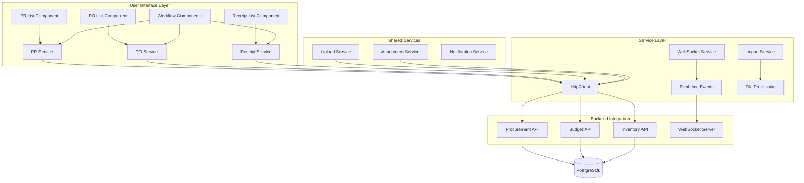
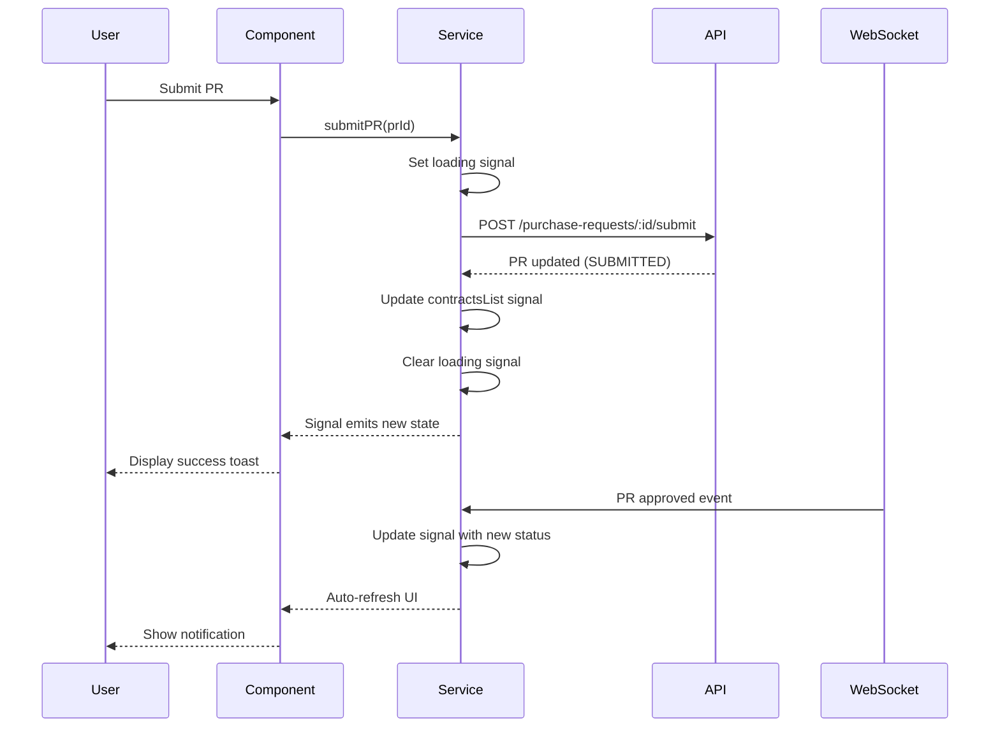

# Design Document - Procurement UI

## Overview

The Procurement UI is an Angular 18+ frontend application that provides a complete user interface for procurement workflow management. It consists of 8 core modules (Purchase Requests, Purchase Orders, Receipts, Receipt Inspectors, Approval Documents, Payment Documents, and supporting modules) built using AegisX-UI components and Angular Material design system.

**System Integration**: The UI integrates with the Procurement API backend (documented in procurement-api spec) and supports real-time collaboration via WebSocket, Excel/CSV import for bulk data entry, and complex multi-step approval workflows.

**Technology Stack**:

- **Framework**: Angular 18+ standalone components
- **State Management**: Angular Signals (not NgRx)
- **UI Library**: AegisX-UI components + Angular Material
- **HTTP Client**: Angular HttpClient with RxJS
- **Real-time**: WebSocket integration
- **Forms**: Reactive Forms with TypeScript validation

## Steering Document Alignment

### Technical Standards (tech.md)

The design follows project technical standards:

- **Component Architecture**: Standalone components with lazy loading
- **State Management**: Angular Signals for reactive state (matching existing contracts module pattern)
- **API Integration**: HttpClient service layer with signal-based state
- **Routing**: Angular Router with lazy-loaded routes
- **Styling**: TailwindCSS + Angular Material theme
- **TypeScript**: Strict mode with full type safety

### Project Structure (structure.md)

Implementation follows established project organization:

```
apps/web/src/app/features/inventory/modules/
├── purchase-requests/          # PR module
│   ├── components/
│   │   ├── purchase-requests-list.component.ts
│   │   ├── purchase-requests-create.dialog.ts
│   │   ├── purchase-requests-edit.dialog.ts
│   │   ├── purchase-requests-view.dialog.ts
│   │   ├── purchase-requests-form.component.ts
│   │   ├── purchase-requests-workflow.component.ts  # NEW: Workflow actions
│   │   └── purchase-requests-items-table.component.ts
│   ├── services/
│   │   └── purchase-requests.service.ts
│   ├── types/
│   │   └── purchase-requests.types.ts
│   └── purchase-requests.routes.ts
├── purchase-orders/            # PO module
├── receipts/                   # Receipt module
├── receipt-inspectors/         # Inspector module
├── approval-documents/         # Approval docs
└── payment-documents/          # Payment docs
```

## Code Reuse Analysis

### Existing Components to Leverage

- **ContractService Pattern**: Use Signal-based state management pattern from `apps/web/src/app/features/inventory/modules/contracts/services/contracts.service.ts`
- **List Component Pattern**: Follow structure from `contracts-list.component.ts` (ax-table, filters, dialogs)
- **Form Component Pattern**: Reuse reactive form patterns from `contracts-form.component.ts`
- **Upload Service**: Use existing `apps/web/src/app/shared/services/upload.service.ts` for file uploads
- **Attachment Service**: Leverage `apps/web/src/app/shared/services/attachment.service.ts` for approval documents
- **File Manager Service**: Use `apps/web/src/app/shared/services/file-manager.service.ts` for Excel/CSV import

### Integration Points

- **Procurement API**: Backend REST API at `/inventory/procurement/*` endpoints (from procurement-api spec)
- **Budget API**: External Budget Management API for availability checks and reservations
- **WebSocket**: Real-time updates via WebSocket connection for status changes
- **Inventory API**: Read inventory stock levels for receipt pages
- **Master Data**: Shared endpoints for drugs, departments, vendors, locations

## Architecture

The Procurement UI follows a modular, component-based architecture with clear separation of concerns:

### Modular Design Principles

- **Single File Responsibility**: Each component handles one specific UI concern (list view, create form, workflow actions)
- **Component Isolation**: Small, focused components with well-defined inputs/outputs
- **Service Layer Separation**: Services handle all HTTP communication and state management
- **Utility Modularity**: Shared utilities for validation, formatting, date handling

### System Architecture



### Data Flow Architecture



## Components and Interfaces

### 1. PurchaseRequestsListComponent

- **Purpose:** Display paginated table of all purchase requests with filters and actions
- **Interfaces:**
  - Inputs: None (uses service signals)
  - Outputs: None (uses dialogs for actions)
- **Dependencies:**
  - `PurchaseRequestsService` (for data and state)
  - `ax-table` (AegisX table component)
  - `ax-badge` (for status display)
  - `ax-dialog` (for create/edit/view dialogs)
- **Reuses:**
  - Follows pattern from `ContractsListComponent`
  - Uses shared `DateRangeFilterComponent`

### 2. PurchaseRequestsFormComponent

- **Purpose:** Reusable reactive form for creating/editing purchase requests
- **Interfaces:**
  - Inputs: `initialData: PurchaseRequest | null`, `mode: 'create' | 'edit'`
  - Outputs: `onSave: EventEmitter<CreatePurchaseRequestRequest>`, `onCancel: EventEmitter<void>`
- **Dependencies:**
  - `ReactiveFormsModule`
  - `ax-form` components
  - `ax-autocomplete` (drug selection)
  - `BudgetService` (budget availability check)
- **Reuses:**
  - Reactive form validation utilities
  - AegisX form components
  - Shared autocomplete patterns

### 3. PurchaseRequestsWorkflowComponent

- **Purpose:** Workflow action buttons for PR submission, approval, rejection
- **Interfaces:**
  - Inputs: `purchaseRequest: PurchaseRequest`, `userPermissions: string[]`
  - Outputs: `onAction: EventEmitter<WorkflowAction>`
- **Dependencies:**
  - `PurchaseRequestsService`
  - `ax-button`
  - `ax-dialog` (confirmation dialogs)
- **Reuses:**
  - Shared confirmation dialog patterns

### 4. PurchaseRequestsItemsTableComponent

- **Purpose:** Display and manage PR line items (drugs, quantities, prices)
- **Interfaces:**
  - Inputs: `items: PurchaseRequestItem[]`, `editable: boolean`
  - Outputs: `onItemChange: EventEmitter<PurchaseRequestItem[]>`, `onAddItem: EventEmitter<void>`, `onRemoveItem: EventEmitter<number>`
- **Dependencies:**
  - `ax-table`
  - `ax-autocomplete` (drug search)
  - `DrugsService` (drug catalog)
- **Reuses:**
  - Similar to `ContractItemsTableComponent`

### 5. PurchaseOrdersListComponent

- **Purpose:** Display paginated table of purchase orders with vendor and status filters
- **Interfaces:**
  - Inputs: None
  - Outputs: None
- **Dependencies:**
  - `PurchaseOrdersService`
  - `ax-table`
  - `ax-badge`
- **Reuses:**
  - Same list pattern as PR list

### 6. PurchaseOrdersWorkflowComponent

- **Purpose:** PO-specific workflow (approve, send, cancel)
- **Interfaces:**
  - Inputs: `purchaseOrder: PurchaseOrder`, `userPermissions: string[]`
  - Outputs: `onAction: EventEmitter<WorkflowAction>`
- **Dependencies:**
  - `PurchaseOrdersService`
  - `ApprovalDocumentsService` (validate documents for PO > 100K)
- **Reuses:**
  - Workflow confirmation dialogs

### 7. ReceiptsListComponent

- **Purpose:** Display receipts with PO references and posting status
- **Interfaces:**
  - Inputs: None
  - Outputs: None
- **Dependencies:**
  - `ReceiptsService`
  - `ax-table`
- **Reuses:**
  - Standard list pattern

### 8. ReceiptsFormComponent

- **Purpose:** Form for creating/editing receipts with lot information
- **Interfaces:**
  - Inputs: `initialData: Receipt | null`, `poId: number | null`
  - Outputs: `onSave: EventEmitter<CreateReceiptRequest>`
- **Dependencies:**
  - `ReactiveFormsModule`
  - `ReceiptsService`
  - `PurchaseOrdersService` (load PO items)
  - `InventoryService` (display current stock)
- **Reuses:**
  - Form validation utilities
  - Lot number/expiry date validators

### 9. ReceiptInspectorsComponent

- **Purpose:** Multi-select component for assigning inspector committee (minimum 3)
- **Interfaces:**
  - Inputs: `selectedInspectors: Employee[]`, `receiptId: number | null`
  - Outputs: `onInspectorsChange: EventEmitter<Employee[]>`
- **Dependencies:**
  - `ax-multi-select`
  - `EmployeesService`
- **Reuses:**
  - Shared multi-select patterns

### 10. ApprovalDocumentsUploadComponent

- **Purpose:** File upload widget for approval documents (PO > 100K)
- **Interfaces:**
  - Inputs: `poId: number`, `existingDocuments: ApprovalDocument[]`
  - Outputs: `onUploadComplete: EventEmitter<ApprovalDocument>`
- **Dependencies:**
  - `UploadService` (shared)
  - `ApprovalDocumentsService`
  - `ax-upload`
- **Reuses:**
  - Existing `UploadService` from shared services

### 11. PaymentDocumentsListComponent

- **Purpose:** Display payment documents with receipt references
- **Interfaces:**
  - Inputs: None
  - Outputs: None
- **Dependencies:**
  - `PaymentDocumentsService`
  - `ax-table`
- **Reuses:**
  - Standard list pattern

### 12. ExcelImportDialogComponent

- **Purpose:** Dialog for importing PR items from Excel/CSV files
- **Interfaces:**
  - Inputs: `prId: number | null`
  - Outputs: `onImportComplete: EventEmitter<PurchaseRequestItem[]>`
- **Dependencies:**
  - `FileManagerService` (shared)
  - `ImportService`
  - `ax-dialog`
- **Reuses:**
  - Existing `FileManagerService` for file parsing

## Data Models

### PurchaseRequest

```typescript
interface PurchaseRequest {
  id: number;
  pr_code: string;
  fiscal_year: number;
  quarter: number;
  budget_type_id: number;
  department_id: number;
  request_date: Date;
  required_date: Date;
  status: 'DRAFT' | 'SUBMITTED' | 'APPROVED' | 'REJECTED' | 'CONVERTED';
  grand_total: number;
  requester_id: number;
  approver_id?: number;
  approved_at?: Date;
  rejection_reason?: string;
  items: PurchaseRequestItem[];
}
```

### PurchaseOrder

```typescript
interface PurchaseOrder {
  id: number;
  po_code: string;
  pr_id: number;
  vendor_id: number;
  po_date: Date;
  delivery_date: Date;
  status: 'DRAFT' | 'PENDING' | 'APPROVED' | 'SENT' | 'PARTIAL' | 'COMPLETED' | 'CANCELLED';
  grand_total: number;
  approval_document_id?: number;
  items: PurchaseOrderItem[];
}
```

### Receipt

```typescript
interface Receipt {
  id: number;
  receipt_code: string;
  po_id: number;
  location_id: number;
  receipt_date: Date;
  received_by: number;
  status: 'DRAFT' | 'INSPECTING' | 'ACCEPTED' | 'POSTED';
  posted_by?: number;
  posted_at?: Date;
  items: ReceiptItem[];
  inspectors: Employee[];
}
```

### ReceiptItem

```typescript
interface ReceiptItem {
  id: number;
  receipt_id: number;
  po_item_id: number;
  generic_id: number;
  quantity_ordered: number;
  quantity_received: number;
  quantity_accepted: number;
  lot_number: string;
  manufacture_date: Date;
  expiry_date: Date;
  unit_price: number;
}
```

### WorkflowAction

```typescript
type WorkflowAction = { type: 'submit'; prId: number } | { type: 'approve'; prId: number } | { type: 'reject'; prId: number; reason: string } | { type: 'approve_po'; poId: number } | { type: 'send_po'; poId: number } | { type: 'cancel_po'; poId: number; reason: string } | { type: 'post_receipt'; receiptId: number };
```

## Service Layer Architecture

### PurchaseRequestsService

```typescript
@Injectable({ providedIn: 'root' })
export class PurchaseRequestsService {
  private http = inject(HttpClient);
  private baseUrl = '/inventory/procurement/purchase-requests';

  // ===== SIGNALS FOR STATE MANAGEMENT =====
  private purchaseRequestsListSignal = signal<PurchaseRequest[]>([]);
  private loadingSignal = signal<boolean>(false);
  private errorSignal = signal<string | null>(null);
  private selectedPurchaseRequestSignal = signal<PurchaseRequest | null>(null);

  // ===== PUBLIC READONLY SIGNALS =====
  readonly purchaseRequestsList = this.purchaseRequestsListSignal.asReadonly();
  readonly loading = this.loadingSignal.asReadonly();
  readonly error = this.errorSignal.asReadonly();

  // ===== CRUD METHODS =====
  loadList(query: ListPurchaseRequestQuery): Observable<PaginatedResponse<PurchaseRequest>>;
  getById(id: number): Observable<PurchaseRequest>;
  create(data: CreatePurchaseRequestRequest): Observable<PurchaseRequest>;
  update(id: number, data: UpdatePurchaseRequestRequest): Observable<PurchaseRequest>;
  delete(id: number): Observable<void>;

  // ===== WORKFLOW METHODS =====
  submit(id: number): Observable<PurchaseRequest>;
  approve(id: number): Observable<PurchaseRequest>;
  reject(id: number, reason: string): Observable<PurchaseRequest>;
}
```

### WebSocketService

```typescript
@Injectable({ providedIn: 'root' })
export class WebSocketService {
  private socket: WebSocket | null = null;
  private eventsSubject = new Subject<WebSocketEvent>();

  // Connect to WebSocket server
  connect(url: string): void;

  // Subscribe to specific event type
  on<T>(eventType: string): Observable<T>;

  // Send event to server
  emit(eventType: string, data: any): void;

  // Disconnect
  disconnect(): void;
}
```

### BudgetService

```typescript
@Injectable({ providedIn: 'root' })
export class BudgetService {
  private http = inject(HttpClient);
  private budgetApiUrl = environment.budgetApiUrl;

  // Check budget availability
  checkAvailability(params: BudgetCheckParams): Observable<BudgetAvailability>;

  // Get budget allocation details
  getAllocation(allocationId: number): Observable<BudgetAllocation>;
}
```

### ImportService

```typescript
@Injectable({ providedIn: 'root' })
export class ImportService {
  private fileManager = inject(FileManagerService);

  // Parse Excel/CSV file
  parseFile(file: File): Observable<any[]>;

  // Validate import data against template
  validate(data: any[], template: ImportTemplate): ValidationResult;

  // Download import template
  downloadTemplate(templateName: string): void;
}
```

## Error Handling

### Error Scenarios

1. **Budget Insufficient Error**
   - **Handling:** Catch 400 error from POST /submit, extract budget shortage details
   - **User Impact:** Display ax-alert with "Budget insufficient: ฿X available, ฿Y needed, shortage ฿Z"

2. **Approval Document Missing (PO > 100K)**
   - **Handling:** Validate before approve, check if approval_document_id exists
   - **User Impact:** Disable "Approve" button, display warning "Upload approval document required for PO > 100,000"

3. **Receipt Inspector Validation Error**
   - **Handling:** Catch 400 error from POST /post, check if < 3 inspectors
   - **User Impact:** Display ax-alert list with all validation errors (inspectors, lot info, etc.)

4. **PO Cancellation with Receipts**
   - **Handling:** Catch 400 error from POST /cancel, detect "receipts exist" error
   - **User Impact:** Display ax-dialog "Cannot cancel PO with existing receipts. Receipt codes: REC-2025-001"

5. **WebSocket Connection Lost**
   - **Handling:** Detect disconnect event, attempt reconnect with exponential backoff
   - **User Impact:** Display ax-toast warning "Real-time updates disconnected. Reconnecting..."

6. **Excel Import Validation Error**
   - **Handling:** Validate each row, collect all errors (invalid drug codes, negative quantities)
   - **User Impact:** Display ax-table with row numbers and error messages, allow user to fix and retry

7. **Permission Denied (403)**
   - **Handling:** Catch 403 error, set permissionError signal
   - **User Impact:** Hide action buttons, display "You don't have permission to perform this action"

## Testing Strategy

### Unit Testing

- **Component Testing:**
  - Test component rendering with mock data
  - Test user interactions (button clicks, form submissions)
  - Test signal updates and computed values
  - Test error state display

- **Service Testing:**
  - Test HTTP calls with HttpClientTestingModule
  - Test signal state management
  - Test error handling and retry logic
  - Test WebSocket event subscription

- **Utilities Testing:**
  - Test form validators (lot number, expiry date)
  - Test date formatters and calculations
  - Test Excel/CSV parsing logic

### Integration Testing

- **Service Integration:**
  - Test service calling real backend endpoints (test environment)
  - Test WebSocket connection and event handling
  - Test budget API integration
  - Test file upload flow

- **Component Integration:**
  - Test parent-child component communication
  - Test dialog open/close and data passing
  - Test form submission to service
  - Test table filtering and pagination

### End-to-End Testing

**Test Scenario 1: Complete PR Workflow**

1. User creates new PR with 3 items
2. User submits PR (budget reserved)
3. Manager approves PR
4. WebSocket updates PR status in real-time
5. Verify PR status = APPROVED

**Test Scenario 2: PO Creation and Sending**

1. User creates PO from approved PR
2. User uploads approval document (PO > 100K)
3. Manager approves PO
4. User sends PO to vendor
5. Verify budget committed, PR converted

**Test Scenario 3: Receipt Posting**

1. User creates receipt from sent PO
2. User adds 3 inspectors
3. User enters lot information for all items
4. User posts receipt to inventory
5. Verify inventory updated, PO status = COMPLETED

**Test Scenario 4: Excel Import**

1. User downloads PR import template
2. User fills Excel with 50 items
3. User imports file
4. Verify all items added to PR form
5. User submits PR successfully

## Performance Optimization

### Lazy Loading

- All modules lazy-loaded via Angular Router
- Components loaded on-demand when routes activate
- Reduces initial bundle size

### Change Detection Optimization

- Use OnPush change detection strategy for all components
- Signals automatically optimize change detection
- Immutable data updates

### API Caching

- Cache master data (drugs, departments, vendors) in service signals
- Cache TTL: 5 minutes
- Invalidate on create/update/delete operations

### Virtual Scrolling

- Use CDK Virtual Scroll for large tables (> 100 rows)
- Render only visible rows
- Improves performance for large datasets

### WebSocket Optimization

- Subscribe only to relevant channels (specific PR/PO/Receipt)
- Unsubscribe when leaving component
- Debounce rapid updates (300ms)
