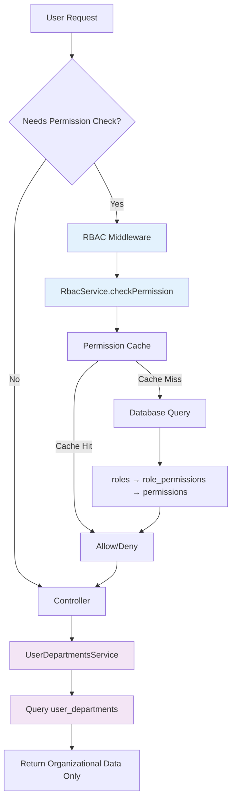

# Design Document - RBAC Permission Consolidation

## Overview

This design consolidates all permission management into the existing RBAC (Role-Based Access Control) system by removing redundant permission flags from the `user_departments` table. The refactoring establishes RBAC as the single source of truth for permissions while preserving departments as organizational units for membership and structure.

**Key Changes:**

- Remove 5 permission boolean columns from `user_departments` table
- Update `UserDepartmentsService` to focus solely on organizational membership
- Map existing department permission flags to equivalent RBAC permissions
- Update all code that checks department flags to use RBAC instead
- Provide safe migration path with rollback capability

## Steering Document Alignment

### Technical Standards (tech.md)

Not applicable - no steering documents currently exist. This design follows existing project patterns:

- Uses Knex.js migrations for database changes (reversible up/down)
- Follows TypeBox schema patterns for API contracts
- Leverages existing RBAC infrastructure (RbacService, PermissionCacheInvalidationService)
- Maintains separation of concerns (services, repositories, controllers)

### Project Structure (structure.md)

Not applicable - no steering documents. Design follows existing structure:

- Backend: `apps/api/src/database/migrations/` for schema changes
- Services: `apps/api/src/layers/platform/users/` for UserDepartmentsService updates
- Schemas: TypeBox definitions in `*.schemas.ts` files
- Frontend: Components in `apps/web/src/app/` hierarchy

## Code Reuse Analysis

### Existing Components to Leverage

- **RbacService** (`apps/api/src/layers/platform/rbac/rbac.service.ts`): Use for permission checking logic
- **PermissionCacheInvalidationService** (`apps/api/src/layers/core/auth/services/permission-cache-invalidation.service.ts`): Use for cache management during migration
- **UserDepartmentsRepository** (`apps/api/src/layers/platform/users/user-departments.repository.ts`): Update to remove permission-related queries
- **Knex Migration Pattern**: Follow existing migration structure from `20251213074350_create_user_departments.ts`

### Integration Points

- **RBAC System**: All permission checks will route through existing RBAC infrastructure
- **Permission Cache**: Leverage existing Redis-based permission cache (no changes needed)
- **Auth Middleware**: Existing JWT authentication continues to work (no changes)
- **Database**: Migration will modify `user_departments` table structure

## Architecture

This refactoring implements a **separation of concerns** architectural pattern:

**Before (Redundant):**

```
user_departments table
├── Organizational data (user_id, department_id, is_primary)
├── Permission flags (can_create_requests, can_edit_requests, ...)  ← REMOVE
└── Assignment metadata (valid_from, valid_until, assigned_by)

RBAC System (parallel)
└── roles → role_permissions → permissions
```

**After (Consolidated):**

```
user_departments table
├── Organizational data (user_id, department_id, is_primary)
└── Assignment metadata (valid_from, valid_until, assigned_by)

RBAC System (single source of truth)
└── roles → role_permissions → permissions
    └── All permission logic flows through here
```

### Modular Design Principles

- **Single Responsibility**: UserDepartmentsService manages only organizational membership
- **Separation of Concerns**: Permissions handled by RBAC, departments handled by UserDepartmentsService
- **Existing Infrastructure**: Reuse RbacService for all permission operations
- **Cache Strategy**: Leverage existing PermissionCacheInvalidationService



## Components and Interfaces

### Component 1: Database Migration

**File**: `apps/api/src/database/migrations/[timestamp]_remove_user_departments_permissions.ts`

**Purpose**: Remove permission flag columns from `user_departments` table

**Interface**:

```typescript
export async function up(knex: Knex): Promise<void> {
  // Drop permission columns
  await knex.schema.alterTable('user_departments', (table) => {
    table.dropColumn('can_create_requests');
    table.dropColumn('can_edit_requests');
    table.dropColumn('can_submit_requests');
    table.dropColumn('can_approve_requests');
    table.dropColumn('can_view_reports');
  });
}

export async function down(knex: Knex): Promise<void> {
  // Restore columns for rollback
  await knex.schema.alterTable('user_departments', (table) => {
    table.boolean('can_create_requests').notNullable().defaultTo(true);
    table.boolean('can_edit_requests').notNullable().defaultTo(true);
    table.boolean('can_submit_requests').notNullable().defaultTo(true);
    table.boolean('can_approve_requests').notNullable().defaultTo(false);
    table.boolean('can_view_reports').notNullable().defaultTo(true);
  });
}
```

**Dependencies**: Knex.js migration runner

**Reuses**: Existing migration infrastructure

---

### Component 2: UserDepartmentsRepository

**File**: `apps/api/src/layers/platform/users/user-departments.repository.ts`

**Purpose**: Remove permission-related queries and return only organizational data

**Changes**:

```typescript
// REMOVE these methods:
- setDepartmentPermissions()
- getDepartmentPermissions()
- hasPermissionInDepartment()

// UPDATE these methods to remove permission fields:
- getActiveDepartments() → Remove permission fields from SELECT
- getUserDepartments() → Remove permission fields from SELECT
- assignUserToDepartment() → Remove permission parameters
```

**Example Updated Method**:

```typescript
async getActiveDepartments(userId: string): Promise<UserDepartment[]> {
  return this.db('user_departments as ud')
    .select(
      'ud.id',
      'ud.user_id',
      'ud.department_id',
      'ud.is_primary',
      'ud.assigned_role',
      'ud.valid_from',
      'ud.valid_until',
      'ud.assigned_at',
      'd.dept_code',
      'd.dept_name'
      // ❌ REMOVED: permission flag fields
    )
    .join('inventory.departments as d', 'ud.department_id', 'd.id')
    .where('ud.user_id', userId)
    .where(function() {
      this.whereNull('ud.valid_until')
        .orWhere('ud.valid_until', '>', this.db.fn.now());
    });
}
```

**Dependencies**: Knex.js

**Reuses**: Existing repository pattern

---

### Component 3: UserDepartmentsService

**File**: `apps/api/src/layers/platform/users/user-departments.service.ts`

**Purpose**: Simplify to handle only organizational membership (no permission logic)

**Changes**:

```typescript
// REMOVE these methods:
- updateDepartmentPermissions()
- checkDepartmentPermission()
- getAllPermissionsForDepartment()

// UPDATE these methods:
- assignUserToDepartment() → Remove permission parameters
- getUserDepartments() → Return data without permissions
- getUserPrimaryDepartment() → Return data without permissions

// SIMPLIFY validation:
- Remove findById() calls that fetch roles (causing current error)
- Use simple existence checks instead
```

**Example Updated Method**:

```typescript
async assignUserToDepartment(
  userId: string,
  departmentId: number,
  options: {
    isPrimary?: boolean;
    assignedRole?: string;
    validFrom?: Date;
    validUntil?: Date;
    // ❌ REMOVED: permission flags
  }
): Promise<UserDepartment> {
  // Simple validation without role fetching
  const userExists = await this.db('users')
    .where('id', userId)
    .whereNull('deleted_at')
    .first();

  if (!userExists) {
    throw new AppError('User not found', 404);
  }

  return this.userDepartmentsRepository.assignUserToDepartment(
    userId,
    departmentId,
    options
  );
}
```

**Dependencies**: UserDepartmentsRepository, Knex

**Reuses**: Existing service pattern, simplified validation

---

### Component 4: TypeBox Schemas

**File**: `apps/api/src/layers/platform/users/user-departments.schemas.ts`

**Purpose**: Update API contracts to remove permission fields

**Changes**:

```typescript
// DepartmentDetailSchema - REMOVE permission fields:
export const DepartmentDetailSchema = Type.Object({
  id: Type.String({ format: 'uuid' }),
  userId: Type.String({ format: 'uuid' }),
  departmentId: Type.Number(),
  departmentCode: Type.String(),
  departmentName: Type.String(),
  isPrimary: Type.Boolean(),
  assignedRole: Type.Union([Type.String(), Type.Null()]),
  // ❌ REMOVED: can_create_requests
  // ❌ REMOVED: can_edit_requests
  // ❌ REMOVED: can_submit_requests
  // ❌ REMOVED: can_approve_requests
  // ❌ REMOVED: can_view_reports
  validFrom: Type.Union([Type.String({ format: 'date-time' }), Type.Null()]),
  validUntil: Type.Union([Type.String({ format: 'date-time' }), Type.Null()]),
  assignedAt: Type.String({ format: 'date-time' }),
});

// AssignDepartmentRequest - REMOVE permission parameters:
export const AssignDepartmentRequestSchema = Type.Object({
  departmentId: Type.Number(),
  isPrimary: Type.Optional(Type.Boolean()),
  assignedRole: Type.Optional(Type.String()),
  validFrom: Type.Optional(Type.String({ format: 'date-time' })),
  validUntil: Type.Optional(Type.String({ format: 'date-time' })),
  // ❌ REMOVED: permission fields
});
```

**Dependencies**: @sinclair/typebox

**Reuses**: Existing schema patterns

---

### Component 5: Permission Mapping Script

**File**: `apps/api/src/database/scripts/map-department-permissions-to-rbac.ts`

**Purpose**: One-time script to assign RBAC permissions based on old department flags

**Interface**:

```typescript
/**
 * Maps old department permission flags to RBAC permissions
 * Run BEFORE applying the migration
 */
export async function mapDepartmentPermissionsToRBAC(knex: Knex): Promise<void> {
  const permissionMap = {
    can_create_requests: 'budget-requests:create',
    can_edit_requests: 'budget-requests:update',
    can_submit_requests: 'budget-requests:submit',
    can_approve_requests: 'budget-requests:approve',
    can_view_reports: 'reports:read',
  };

  // 1. Get all users with department assignments
  const userDepartments = await knex('user_departments').select('user_id', ...Object.keys(permissionMap));

  // 2. For each user, determine which permissions they need
  for (const record of userDepartments) {
    const permissionsNeeded = [];

    for (const [flagName, permission] of Object.entries(permissionMap)) {
      if (record[flagName]) {
        permissionsNeeded.push(permission);
      }
    }

    // 3. Assign appropriate role(s) or permissions to user
    // Logic: If user has all permissions → assign "admin" role
    //        If user has approval permission → assign "supervisor" role
    //        Otherwise → assign "staff" role
  }

  console.log(`Mapped permissions for ${userDepartments.length} user-department records`);
}
```

**Usage**: Run before migration: `npx knex seed:run --specific=map-department-permissions-to-rbac.ts`

**Dependencies**: Knex, RbacService

**Reuses**: Existing RBAC infrastructure

---

### Component 6: Frontend Updates

**Files**:

- `apps/web/src/app/core/users/services/user-departments.service.ts`
- Any components that display/edit department permissions

**Purpose**: Remove UI elements and code that read/write permission flags

**Changes**:

```typescript
// UserDepartmentsService - UPDATE interface:
interface DepartmentDetail {
  id: string;
  userId: string;
  departmentId: number;
  departmentCode: string;
  departmentName: string;
  isPrimary: boolean;
  assignedRole: string | null;
  // ❌ REMOVED: permission fields
  validFrom: string | null;
  validUntil: string | null;
  assignedAt: string;
}

// Components - REPLACE permission checks:
// Old code:
if (department.can_approve_requests) {
  // Show approve button
}

// New code:
if (this.authService.hasPermission('budget-requests:approve')) {
  // Show approve button
}
```

**Dependencies**: Angular HttpClient, AuthService (for RBAC checks)

**Reuses**: Existing RBAC permission guards/directives

## Data Models

### Updated user_departments Table Schema

```sql
CREATE TABLE user_departments (
  -- Primary Key
  id UUID PRIMARY KEY DEFAULT gen_random_uuid(),

  -- Foreign Keys
  user_id UUID NOT NULL REFERENCES users(id) ON DELETE CASCADE,
  department_id INTEGER NOT NULL REFERENCES inventory.departments(id) ON DELETE CASCADE,
  hospital_id INTEGER NULL REFERENCES inventory.hospitals(id) ON DELETE CASCADE,

  -- Assignment Metadata
  is_primary BOOLEAN NOT NULL DEFAULT false,
  assigned_role VARCHAR(50) NULL,

  -- ❌ REMOVED: Permission flags
  -- can_create_requests BOOLEAN
  -- can_edit_requests BOOLEAN
  -- can_submit_requests BOOLEAN
  -- can_approve_requests BOOLEAN
  -- can_view_reports BOOLEAN

  -- Temporal Validity
  valid_from DATE NULL,
  valid_until DATE NULL,

  -- Audit Trail
  assigned_by UUID NULL REFERENCES users(id) ON DELETE SET NULL,
  assigned_at TIMESTAMP WITH TIME ZONE NOT NULL DEFAULT NOW(),
  notes TEXT NULL,

  -- Standard Audit
  created_at TIMESTAMP WITH TIME ZONE NOT NULL DEFAULT NOW(),
  updated_at TIMESTAMP WITH TIME ZONE NOT NULL DEFAULT NOW(),
  created_by UUID NULL REFERENCES users(id) ON DELETE SET NULL,
  updated_by UUID NULL REFERENCES users(id) ON DELETE SET NULL,

  -- Constraints
  CONSTRAINT unique_user_department_hospital UNIQUE (user_id, department_id, hospital_id)
);
```

### Permission Mapping Table

This is a **reference mapping** (not a database table), documenting how old flags map to RBAC permissions:

| Old Department Flag  | RBAC Permission Resource:Action | Default Role Assignment  |
| -------------------- | ------------------------------- | ------------------------ |
| can_create_requests  | budget-requests:create          | staff, supervisor, admin |
| can_edit_requests    | budget-requests:update          | staff, supervisor, admin |
| can_submit_requests  | budget-requests:submit          | staff, supervisor, admin |
| can_approve_requests | budget-requests:approve         | supervisor, admin        |
| can_view_reports     | reports:read                    | staff, supervisor, admin |

**Role Assignment Strategy**:

- **admin role**: All permissions
- **supervisor role**: All permissions including approve
- **staff role**: Create, edit, submit, view (no approve)

## Error Handling

### Error Scenario 1: Migration Fails Midway

**Description**: Database migration encounters an error while dropping columns

**Handling**:

```typescript
export async function up(knex: Knex): Promise<void> {
  // Wrap in transaction for atomicity
  await knex.transaction(async (trx) => {
    await trx.schema.alterTable('user_departments', (table) => {
      table.dropColumn('can_create_requests');
      table.dropColumn('can_edit_requests');
      table.dropColumn('can_submit_requests');
      table.dropColumn('can_approve_requests');
      table.dropColumn('can_view_reports');
    });
  });
  // If error occurs, entire transaction rolls back automatically
}
```

**User Impact**:

- Migration fails cleanly with error message
- Database remains in original state (no partial changes)
- Admin can investigate and retry

### Error Scenario 2: Code Still Checks Removed Permission Flags

**Description**: Some code path still tries to access `department.can_create_requests` after migration

**Handling**:

- **Prevention**: Comprehensive grep search before deployment:
  ```bash
  grep -r "can_create_requests\|can_edit_requests\|can_submit_requests\|can_approve_requests\|can_view_reports" apps/
  ```
- **Detection**: TypeScript compiler will catch undefined properties in typed code
- **Runtime**: If untyped code accesses removed field, it returns `undefined` (fails safe)

**User Impact**:

- Permission checks fail (deny access) rather than fail open
- User sees "Access Denied" message
- Admin can identify and fix the code path

### Error Scenario 3: User Loses Access After Migration

**Description**: User had department permission flag but doesn't have equivalent RBAC permission

**Handling**:

```typescript
// Pre-migration check script
async function verifyPermissionMapping(knex: Knex): Promise<void> {
  const issues = [];

  // Find users with department permissions but no matching RBAC permissions
  const query = `
    SELECT DISTINCT ud.user_id, u.email
    FROM user_departments ud
    JOIN users u ON ud.user_id = u.id
    WHERE (
      ud.can_create_requests = true OR
      ud.can_edit_requests = true OR
      ud.can_submit_requests = true OR
      ud.can_approve_requests = true OR
      ud.can_view_reports = true
    )
    AND NOT EXISTS (
      SELECT 1 FROM user_roles ur
      JOIN roles r ON ur.role_id = r.id
      WHERE ur.user_id = ud.user_id
    )
  `;

  const usersAtRisk = await knex.raw(query);

  if (usersAtRisk.rows.length > 0) {
    console.error(`⚠️  ${usersAtRisk.rows.length} users will lose access!`);
    console.error('Assign roles before migration:', usersAtRisk.rows);
    process.exit(1);
  }
}
```

**User Impact**:

- Pre-migration check prevents this scenario
- If it occurs anyway, user gets "Access Denied"
- Admin uses audit logs to identify and fix (assign correct role)

### Error Scenario 4: Rollback Required

**Description**: Need to restore permission flags after migration

**Handling**:

```bash
# Run down migration
npx knex migrate:down

# Restore data from backup table (if created)
npx knex seed:run --specific=restore-department-permissions-backup.ts
```

**User Impact**:

- System briefly unavailable during rollback (under 1 minute)
- All permissions restored to pre-migration state
- Users can continue working normally

## Testing Strategy

### Unit Testing

**Test Files to Update**:

- `user-departments.repository.spec.ts`: Remove permission-related tests
- `user-departments.service.spec.ts`: Remove permission logic tests
- Add tests for simplified validation

**Key Tests**:

```typescript
describe('UserDepartmentsService', () => {
  describe('assignUserToDepartment', () => {
    it('should assign user without permission parameters', async () => {
      const result = await service.assignUserToDepartment(userId, deptId, {
        isPrimary: true,
        assignedRole: 'staff',
      });

      expect(result).toBeDefined();
      expect(result.isPrimary).toBe(true);
      // ❌ No longer testing permission fields
    });

    it('should not call findById with role joins', async () => {
      const spy = jest.spyOn(usersRepository, 'findById');

      await service.assignUserToDepartment(userId, deptId, {});

      expect(spy).not.toHaveBeenCalled(); // Uses simpler validation
    });
  });

  describe('getUserDepartments', () => {
    it('should return departments without permission fields', async () => {
      const result = await service.getUserDepartments(userId);

      expect(result[0]).not.toHaveProperty('can_create_requests');
      expect(result[0]).toHaveProperty('departmentCode');
      expect(result[0]).toHaveProperty('isPrimary');
    });
  });
});
```

### Integration Testing

**Test Scenarios**:

1. **Migration Test**: Apply up/down migrations in test database
2. **API Contract Test**: Verify department endpoints return correct schema
3. **RBAC Integration**: Verify permission checks use RBAC not department flags

**Example Test**:

```typescript
describe('Department API Integration', () => {
  beforeAll(async () => {
    // Apply migration
    await runMigrations();
  });

  it('GET /users/me/departments should not include permission flags', async () => {
    const response = await request(app).get('/api/v1/platform/users/me/departments').set('Authorization', `Bearer ${token}`);

    expect(response.status).toBe(200);
    expect(response.body.data.departments[0]).not.toHaveProperty('can_create_requests');
  });

  it('POST /departments/:id/users should work without permission parameters', async () => {
    const response = await request(app).post('/api/v1/platform/departments/123/users').set('Authorization', `Bearer ${token}`).send({
      userId: 'user-uuid',
      isPrimary: true,
      // ❌ No permission fields
    });

    expect(response.status).toBe(201);
  });
});
```

### End-to-End Testing

**User Scenarios**:

**Scenario 1: Admin Assigns User to Department**

1. Admin logs in
2. Navigates to user management
3. Assigns user to department (without setting permission flags)
4. User receives department assignment
5. User's permissions come from their RBAC role, not department

**Scenario 2: User Attempts to Approve Budget Request**

1. User logs in (has "supervisor" role via RBAC)
2. Navigates to budget requests
3. Sees "Approve" button (RBAC check: `hasPermission('budget-requests:approve')`)
4. Clicks approve
5. Backend verifies permission via RBAC middleware
6. Request approved successfully

**Scenario 3: Migration and Rollback**

1. Admin runs pre-migration check script (verifies all users have roles)
2. Admin applies migration (permission columns dropped)
3. Admin tests system (all permissions work via RBAC)
4. Issue discovered → Admin rolls back migration
5. Permission flags restored from down migration
6. System returns to previous state

## Migration Execution Plan

### Phase 1: Pre-Migration (Week 1)

1. **Audit Current State**:

   ```bash
   # Count users with department permissions
   SELECT COUNT(DISTINCT user_id) FROM user_departments
   WHERE can_create_requests = true
      OR can_edit_requests = true
      OR can_submit_requests = true
      OR can_approve_requests = true
      OR can_view_reports = true;
   ```

2. **Run Permission Mapping Script**:

   ```bash
   npx ts-node apps/api/src/database/scripts/map-department-permissions-to-rbac.ts
   ```

3. **Verify RBAC Assignments**:
   ```bash
   # Check all users have appropriate roles
   SELECT u.id, u.email, COALESCE(COUNT(ur.role_id), 0) as role_count
   FROM users u
   LEFT JOIN user_roles ur ON u.id = ur.user_id
   GROUP BY u.id, u.email
   HAVING COUNT(ur.role_id) = 0;
   ```

### Phase 2: Code Updates (Week 1-2)

1. Update UserDepartmentsRepository (remove permission queries)
2. Update UserDepartmentsService (remove permission logic)
3. Update TypeBox schemas (remove permission fields)
4. Update frontend components (remove permission UI elements)
5. Replace all permission checks with RBAC calls
6. Update tests

### Phase 3: Migration Execution (Week 2)

1. **Staging Environment**:

   ```bash
   # Apply migration in staging
   npx knex migrate:up

   # Test thoroughly
   npm run test:e2e

   # Monitor for errors
   ```

2. **Production Deployment**:

   ```bash
   # Backup database
   pg_dump aegisx_db > backup_before_migration.sql

   # Apply migration
   npx knex migrate:up

   # Monitor logs
   tail -f logs/api.log
   ```

3. **Post-Migration Verification**:

   ```bash
   # Verify columns dropped
   psql -d aegisx_db -c "\d user_departments"

   # Verify no errors in logs
   grep -i "can_create_requests\|can_edit_requests" logs/api.log
   ```

### Phase 4: Monitoring (Week 2-3)

1. Monitor error logs for undefined property access
2. Track permission denied errors (should not increase)
3. Verify no performance regression (cache working)
4. Collect user feedback

### Rollback Plan

If issues arise:

```bash
# Step 1: Roll back migration
npx knex migrate:down

# Step 2: Restore data (if backup table was created)
psql -d aegisx_db < backup_before_migration.sql

# Step 3: Revert code changes
git revert COMMIT_HASH

# Step 4: Redeploy previous version
npm run deploy:rollback
```

## Performance Considerations

**No Performance Impact Expected**:

- Removing unused columns may slightly improve query performance
- RBAC permission cache already exists (no new cache needed)
- Permission checks use existing cached queries
- Database indexes on `user_departments` unchanged (except removed permission column indexes)

**Potential Improvement**:

- Smaller `user_departments` table = faster scans
- Fewer columns = less network overhead
- Simpler queries = easier for PostgreSQL query planner to optimize
