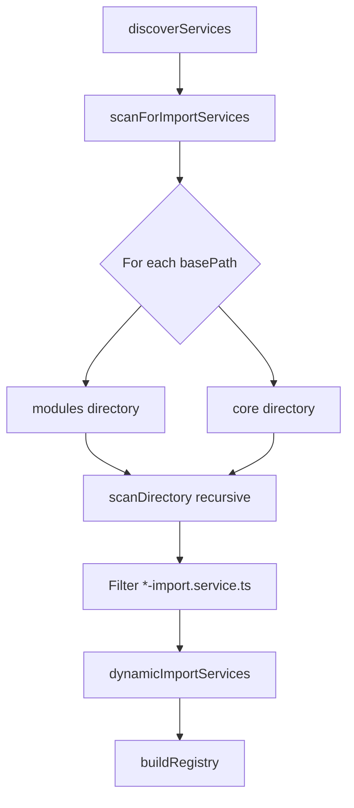

# Design Document: System Init Core Discovery

## Overview

ปรับปรุง `ImportDiscoveryService` ให้สามารถ scan หา import services จากหลาย directories โดยเพิ่ม `apps/api/src/core` เป็น scan path เพิ่มเติมจาก `apps/api/src/modules` ที่มีอยู่เดิม

**การเปลี่ยนแปลงนี้:**

- เป็น minimal change (~10 lines)
- ไม่กระทบ existing functionality
- ไม่เปลี่ยน public API

## Code Reuse Analysis

### Existing Components to Leverage

- **ImportDiscoveryService**: ใช้ `scanDirectory()` method ที่มีอยู่แล้ว - ไม่ต้องแก้ไข
- **DepartmentsImportService**: มี implementation พร้อมใช้งานอยู่แล้วใน `apps/api/src/core/departments/`
- **@ImportService decorator**: ใช้งานได้ทันที - ไม่ต้องแก้ไข

### Integration Points

- **File System Scanning**: ใช้ existing `scanDirectory()` recursive method
- **Import Registry**: ใช้ existing registration flow ผ่าน decorator
- **Database Persistence**: ใช้ existing `persistRegistry()` method

## Architecture

การเปลี่ยนแปลงอยู่ใน method เดียว: `scanForImportServices()`



### Current Implementation (Before)

```typescript
private scanForImportServices(): string[] {
  const files: string[] = [];
  const basePath = path.join(process.cwd(), 'apps/api/src/modules');
  // Single path only
  this.scanDirectory(basePath, files);
  // ...
}
```

### New Implementation (After)

```typescript
private scanForImportServices(): string[] {
  const files: string[] = [];
  const basePaths = [
    path.join(process.cwd(), 'apps/api/src/modules'),
    path.join(process.cwd(), 'apps/api/src/core'),
  ];

  for (const basePath of basePaths) {
    if (fs.existsSync(basePath)) {
      this.scanDirectory(basePath, files);
    }
  }
  // ... rest unchanged
}
```

## Components and Interfaces

### ImportDiscoveryService (Modified)

- **Purpose:** Auto-discover import services from filesystem
- **Change:** `scanForImportServices()` method to support multiple base paths
- **Dependencies:** fs, path (existing)
- **Reuses:** Existing `scanDirectory()` method unchanged

### DepartmentsImportService (No Change)

- **Purpose:** Handle bulk import of departments
- **Location:** `apps/api/src/core/departments/departments-import.service.ts`
- **Status:** Already implements all required interfaces
- **Metadata:** domain="core", priority=1, supportsRollback=true

## Data Models

ไม่มีการเปลี่ยนแปลง data models - ใช้ existing types ทั้งหมด:

- `ImportServiceMetadata` - unchanged
- `RegisteredImportService` - unchanged
- `IImportService` - unchanged

## Error Handling

### Error Scenarios

1. **Core directory doesn't exist**
   - **Handling:** `fs.existsSync()` check ก่อน scan
   - **User Impact:** ไม่มี - system ทำงานต่อได้ปกติ

2. **Permission denied on directory**
   - **Handling:** Existing try-catch ใน `scanDirectory()`
   - **User Impact:** Warning log แต่ไม่ fail

3. **No import services in core**
   - **Handling:** Empty array merged กับ modules results
   - **User Impact:** ไม่มี - system ทำงานปกติ

## Testing Strategy

### Manual Verification

1. Start API server
2. Check logs for `[ImportDiscovery] Registered: departments`
3. Call `GET /api/system-init/modules` - verify departments appears
4. Download template: `GET /api/system-init/templates/departments`
5. Test import with sample CSV

### Expected Results

```json
{
  "modules": [
    {
      "module": "departments",
      "domain": "core",
      "displayName": "Departments (แผนก)",
      "priority": 1
    }
    // ... other modules
  ]
}
```

## File Changes Summary

| File                                                             | Lines Changed | Type   |
| ---------------------------------------------------------------- | ------------- | ------ |
| `apps/api/src/core/import/discovery/import-discovery.service.ts` | ~10           | Modify |

## Risk Assessment

- **Risk Level:** Low
- **Backward Compatibility:** 100% - modules directory scanned first
- **Breaking Changes:** None
- **Rollback:** Simple revert of ~10 lines
