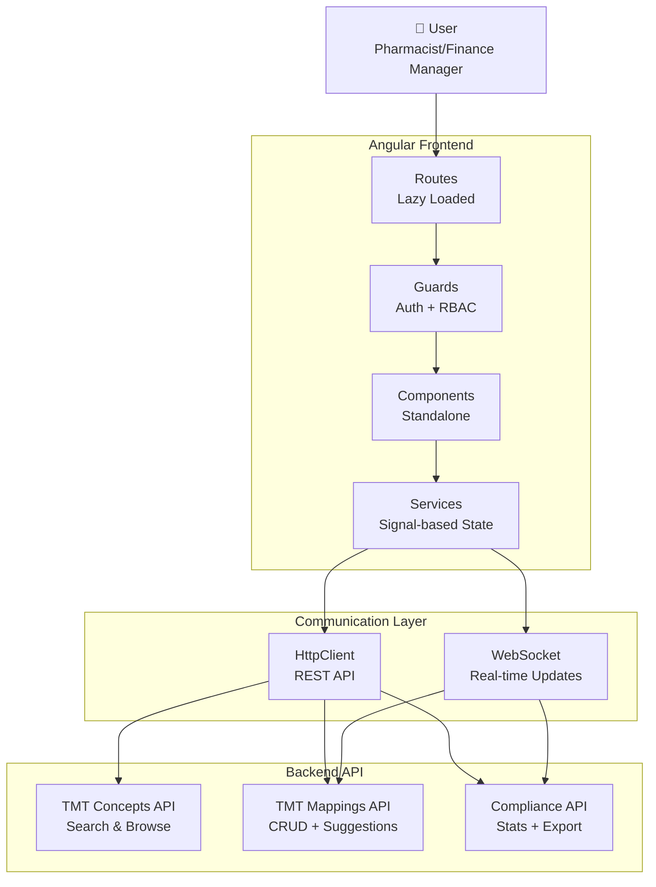
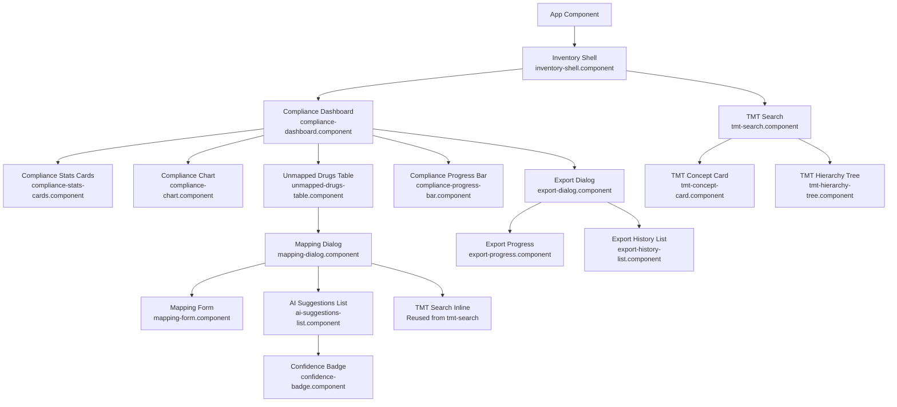
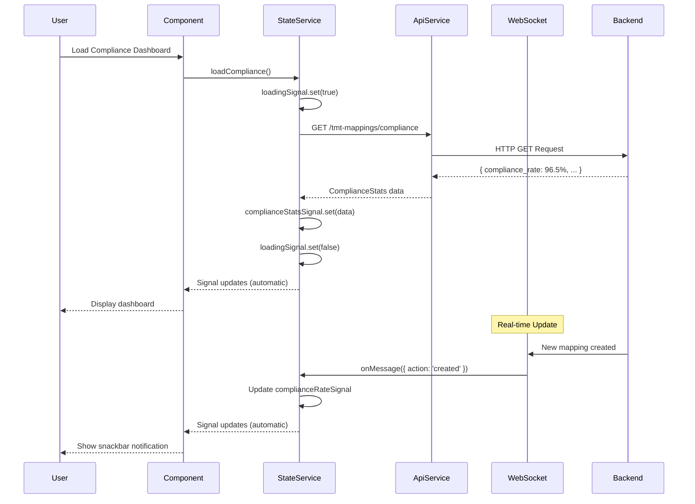

# Design Document: TMT Frontend UI

## Overview

The TMT Frontend UI is a modern Angular 18+ application designed to provide an intuitive interface for managing Thai Medical Terminology (TMT) integration in hospital inventory systems. This application follows established AegisX platform patterns and leverages:

1. **TMT Mapping Interface** - Pharmacist-focused UI with AI-assisted drug-to-TMT mapping workflow
2. **Compliance Dashboard** - Real-time monitoring dashboard with charts, statistics, and priority drug lists
3. **Ministry Export Tools** - One-click report generation in multiple formats (CSV, Excel, JSON)
4. **Real-time Updates** - WebSocket integration for instant compliance rate updates and mapping notifications

**Design Philosophy:**

- **Signal-First Architecture**: Angular Signals for reactive state management (no NgRx complexity)
- **Standalone Components**: Tree-shakable, lazy-loaded feature modules
- **AegisX UI Integration**: Consistent design system using established component library
- **Performance-Optimized**: Virtual scrolling, pagination, debounced search, route-level code splitting
- **Accessibility**: WCAG 2.1 Level AA compliance with ARIA labels and keyboard navigation

**Technology Stack:**

- **Framework**: Angular 18+ (standalone components, Signals, defer blocks)
- **UI Components**: AegisX UI (`@aegisx/ui`) + Angular Material 18+
- **Styling**: TailwindCSS 3.4+ utilities
- **State Management**: Angular Signals (built-in reactive primitives)
- **HTTP Client**: Angular HttpClient with interceptors
- **Real-time**: Socket.io-client for WebSocket notifications
- **Forms**: Reactive Forms with custom validators
- **Charts**: Chart.js (via `ng2-charts`) for compliance trend visualization
- **Export**: Custom export service (CSV/Excel/JSON generation)

## Steering Document Alignment

### Technical Standards (tech.md)

**Following Established Frontend Patterns:**

1. **Standalone Component Pattern** (from `drugs-list.component.ts`)
   - No NgModules, all components standalone
   - Direct imports in component metadata
   - Lazy-loaded routes via `loadComponent()`
   - Tree-shakable bundle with optimized imports

2. **Signal-Based State Management** (from `drugs.service.ts`)

   ```typescript
   // State signals (private, writable)
   private drugsListSignal = signal<Drug[]>([]);
   private loadingSignal = signal<boolean>(false);
   private errorSignal = signal<string | null>(null);

   // Public readonly signals
   readonly drugsList = this.drugsListSignal.asReadonly();
   readonly loading = this.loadingSignal.asReadonly();

   // Computed signals for derived state
   readonly totalPages = computed(() =>
     Math.ceil(this.totalSignal() / this.pageSizeSignal())
   );
   ```

3. **Service Layer Pattern** (from `drugs.service.ts`)
   - HttpClient for API calls (`/inventory/master-data/drugs`)
   - Signal-based state management
   - Error handling with specific status codes (400, 403, 404, 500)
   - Pagination and filtering via HttpParams
   - Export functionality with custom service

4. **WebSocket Integration** (from `websocket.service.ts`)
   - Socket.io-client for real-time updates
   - Signal-based connection status
   - Feature-based message routing
   - Auto-reconnect with exponential backoff
   - Type-safe message interfaces

5. **Component Architecture** (from `drugs-list.component.ts`)
   - OnPush change detection strategy
   - Mat-Table for data display with sorting + pagination
   - Selection model for bulk operations
   - Dialog-based CRUD forms (Material Dialog)
   - Snackbar notifications for user feedback
   - Signals for search/filter state (separate input vs active signals)

### Project Structure (structure.md)

**Following Feature Module Organization:**

```
apps/web/src/app/
├── features/
│   └── inventory/
│       └── modules/
│           └── tmt/                          # NEW: TMT Integration feature
│               ├── components/
│               │   ├── tmt-search/
│               │   │   ├── tmt-search.component.ts
│               │   │   ├── tmt-search.component.html
│               │   │   ├── tmt-search.component.scss
│               │   │   ├── tmt-concept-card.component.ts     # Reusable concept card
│               │   │   └── tmt-hierarchy-tree.component.ts   # Hierarchy tree view
│               │   ├── tmt-mapping/
│               │   │   ├── mapping-dialog.component.ts        # Main mapping modal
│               │   │   ├── mapping-dialog.component.html
│               │   │   ├── mapping-dialog.component.scss
│               │   │   ├── ai-suggestions-list.component.ts   # AI suggestions panel
│               │   │   ├── confidence-badge.component.ts      # Confidence indicator
│               │   │   └── mapping-form.component.ts          # Mapping form
│               │   ├── compliance/
│               │   │   ├── compliance-dashboard.component.ts  # Main dashboard page
│               │   │   ├── compliance-dashboard.component.html
│               │   │   ├── compliance-dashboard.component.scss
│               │   │   ├── compliance-stats-cards.component.ts
│               │   │   ├── compliance-chart.component.ts      # Trend line chart
│               │   │   ├── unmapped-drugs-table.component.ts  # Priority drugs table
│               │   │   └── compliance-progress-bar.component.ts
│               │   └── export/
│               │       ├── export-dialog.component.ts         # Export configuration
│               │       ├── export-dialog.component.html
│               │       ├── export-progress.component.ts       # Progress indicator
│               │       └── export-history-list.component.ts   # Past exports
│               ├── services/
│               │   ├── tmt-api.service.ts                    # HTTP client for TMT API
│               │   ├── tmt-websocket.service.ts              # WebSocket for real-time
│               │   ├── tmt-state.service.ts                  # Signal-based state
│               │   ├── export.service.ts                     # File download utilities
│               │   └── confidence-calculator.service.ts      # Client-side confidence calc
│               ├── models/
│               │   ├── tmt-concept.model.ts
│               │   ├── tmt-mapping.model.ts
│               │   ├── compliance-stats.model.ts
│               │   ├── ai-suggestion.model.ts
│               │   └── export-request.model.ts
│               ├── validators/
│               │   └── mapping.validators.ts                 # Form validators
│               ├── tmt.routes.ts                             # Lazy-loaded routes
│               └── index.ts                                  # Public API
├── shared/
│   └── ui/
│       └── components/
│           └── tmt/                          # Reusable TMT components (if shared)
│               └── tmt-concept-selector/     # Standalone TMT selector
└── core/
    └── services/
        └── (existing services: auth, api-config, etc.)
```

**Routing Structure:**

```typescript
// apps/web/src/app/features/inventory/inventory.routes.ts
{
  path: 'tmt',
  loadChildren: () => import('./modules/tmt/tmt.routes').then(m => m.TMT_ROUTES)
}

// apps/web/src/app/features/inventory/modules/tmt/tmt.routes.ts
export const TMT_ROUTES: Routes = [
  {
    path: '',
    redirectTo: 'compliance',
    pathMatch: 'full'
  },
  {
    path: 'compliance',
    loadComponent: () => import('./components/compliance/compliance-dashboard.component')
      .then(m => m.ComplianceDashboardComponent),
    data: { title: 'TMT Compliance Dashboard' }
  },
  {
    path: 'search',
    loadComponent: () => import('./components/tmt-search/tmt-search.component')
      .then(m => m.TmtSearchComponent),
    data: { title: 'Search TMT Concepts' }
  }
];
```

## Code Reuse Analysis

### Existing Components to Leverage

**From AegisX UI Library (`@aegisx/ui`):**

- **AxCardComponent**: Container cards for dashboard statistics, unmapped drugs table
  - Usage: `<ax-card title="Compliance Rate" [loading]="loading()">`

- **AxTableComponent**: Advanced data table with sorting, pagination, selection (alternative to Mat-Table)
  - Usage: `<ax-table [data]="unmappedDrugs()" [columns]="columns" [pageSize]="25">`

- **AxEmptyStateComponent**: Empty state when no TMT concepts found
  - Usage: `<ax-empty-state message="ไม่พบข้อมูล TMT" icon="search_off">`

- **AxErrorStateComponent**: Error state for API failures
  - Usage: `<ax-error-state [error]="error()" (retry)="loadData()">`

- **AxDialogService**: Confirmation dialogs (delete mapping, export warnings)
  - Usage: `axDialog.confirm('ยืนยันการลบ mapping?').subscribe(confirmed => ...)`

- **AxBadgeComponent**: TMT level badges (VTM, GP, GPU, TP, TPU), confidence levels (HIGH, MEDIUM, LOW)
  - Usage: `<ax-badge [color]="getConfidenceColor(score)" [text]="level">`

- **AxChartComponent**: Compliance trend line chart
  - Usage: `<ax-chart type="line" [data]="complianceTrendData()" [options]="chartOptions">`

- **BreadcrumbComponent**: Navigation breadcrumbs
  - Usage: `<aegisx-breadcrumb [items]="breadcrumbItems">`

**From Angular Material:**

- **MatDialog**: Modal dialogs for mapping form, export configuration
  - Usage: `dialog.open(MappingDialogComponent, { width: '800px', data: { drug } })`

- **MatSnackBar**: Toast notifications for success/error messages
  - Usage: `snackBar.open('✅ บันทึก mapping สำเร็จ', 'Close', { duration: 3000 })`

- **MatPaginator** + **MatSort**: Table pagination and sorting
  - Usage: Integrated with MatTableDataSource

- **MatTooltip**: Confidence score explanations, icon tooltips
  - Usage: `<button matTooltip="ค้นหา TMT concepts">`

- **MatCheckbox**: Pharmacist verification checkbox
  - Usage: `<mat-checkbox [(ngModel)]="verified">`

- **MatProgressBar** / **MatProgressSpinner**: Loading indicators
  - Usage: `<mat-progress-bar mode="indeterminate" *ngIf="loading()">`

- **MatDatepicker**: Date range picker for export filters
  - Usage: `<mat-date-range-input>`

**From Existing Inventory Modules:**

- **SharedExportComponent** (from `drugs-list.component.ts`):
  - Reusable export dialog with format selection (CSV, Excel, JSON)
  - Usage: `<app-shared-export [service]="exportServiceAdapter" [fields]="availableExportFields">`

- **WebSocketService** (from `shared/business/services/websocket.service.ts`):
  - Existing WebSocket service for real-time updates
  - Extend for TMT-specific message handling

- **Drugs CRUD Pattern**:
  - List component with search/filter/pagination
  - Dialog-based create/edit/view forms
  - Bulk operations (delete, export)
  - Signal-based state management

### Integration Points

**Backend API Integration (tmt-backend-api spec):**

All endpoints from `tmt-backend-api` spec will be consumed via `TmtApiService`:

```typescript
// API Endpoints to integrate
GET    /inventory/master-data/tmt-concepts          # Search TMT concepts
GET    /inventory/master-data/tmt-concepts/:id      # Get concept details
GET    /inventory/operations/tmt-mappings           # List mappings
POST   /inventory/operations/tmt-mappings           # Create mapping
PUT    /inventory/operations/tmt-mappings/:id       # Update mapping
DELETE /inventory/operations/tmt-mappings/:id       # Delete mapping
POST   /inventory/operations/tmt-mappings/suggestions/:drugId  # AI suggestions
GET    /inventory/operations/tmt-mappings/compliance          # Compliance stats
POST   /inventory/operations/tmt-mappings/ministry-export     # Generate report
```

**WebSocket Events:**

```typescript
// Real-time message structure
interface TMTWebSocketMessage {
  feature: 'tmt';
  entity: 'mapping' | 'compliance';
  action: 'created' | 'updated' | 'deleted' | 'rate_changed';
  data: {
    mapping?: TMTMapping;
    complianceRate?: number;
    userId?: string;
    userName?: string;
  };
  meta: { timestamp: string; userId: string };
}
```

**Authentication & Authorization:**

- Use existing JWT authentication from `AuthService`
- RBAC via route guards:
  ```typescript
  // tmt.routes.ts
  {
    path: 'compliance',
    canActivate: [AuthGuard, RoleGuard],
    data: {
      roles: ['Finance Manager', 'Pharmacist', 'Department Head', 'Nurse']
    }
  }
  ```

## Architecture

### System Architecture



### Component Hierarchy



### State Management Flow



## Components and Interfaces

### Component 1: ComplianceDashboardComponent

**Purpose:** Main dashboard page showing real-time TMT mapping compliance rate, statistics, unmapped drugs, and trend chart.

**File:** `apps/web/src/app/features/inventory/modules/tmt/components/compliance/compliance-dashboard.component.ts`

**Interfaces:**

```typescript
@Component({
  selector: 'app-compliance-dashboard',
  standalone: true,
  imports: [CommonModule, MatCardModule, MatButtonModule, MatIconModule, BreadcrumbComponent, AxCardComponent, AxChartComponent, ComplianceStatsCardsComponent, ComplianceChartComponent, UnmappedDrugsTableComponent, ComplianceProgressBarComponent, ExportDialogComponent],
  templateUrl: './compliance-dashboard.component.html',
  styleUrl: './compliance-dashboard.component.scss',
  changeDetection: ChangeDetectionStrategy.OnPush,
})
export class ComplianceDashboardComponent {
  // Injected services
  private tmtState = inject(TmtStateService);
  private dialog = inject(MatDialog);
  private snackBar = inject(MatSnackBar);
  private wsService = inject(TmtWebSocketService);

  // Readonly signals from state service
  readonly complianceStats = this.tmtState.complianceStats;
  readonly loading = this.tmtState.loading;
  readonly error = this.tmtState.error;

  // Computed signals
  readonly isCompliant = computed(() => (this.complianceStats()?.compliance_rate ?? 0) >= 95);

  // Methods
  ngOnInit() {
    this.tmtState.loadCompliance();
    this.wsService.subscribeToCompliance((msg) => this.handleRealtimeUpdate(msg));
  }

  openExportDialog() {
    /* ... */
  }
  handleRealtimeUpdate(msg: TMTWebSocketMessage) {
    /* ... */
  }
}
```

**Dependencies:**

- `TmtStateService` (state management)
- `TmtWebSocketService` (real-time updates)
- `MatDialog` (export dialog)

**Reuses:**

- `AxCardComponent` (AegisX UI)
- `AxChartComponent` (AegisX UI)
- `BreadcrumbComponent` (AegisX UI)
- `SharedExportComponent` (existing)

---

### Component 2: MappingDialogComponent

**Purpose:** Modal dialog for creating/editing drug-to-TMT mappings with AI suggestions and manual search.

**File:** `apps/web/src/app/features/inventory/modules/tmt/components/tmt-mapping/mapping-dialog.component.ts`

**Interfaces:**

```typescript
export interface MappingDialogData {
  drug: Drug;
  existingMapping?: TMTMapping;
  mode: 'create' | 'edit';
}

@Component({
  selector: 'app-mapping-dialog',
  standalone: true,
  imports: [CommonModule, ReactiveFormsModule, MatDialogModule, MatFormFieldModule, MatInputModule, MatCheckboxModule, MatButtonModule, MatProgressSpinnerModule, MatSnackBarModule, AiSuggestionsListComponent, TmtSearchComponent, MappingFormComponent, AxBadgeComponent],
  templateUrl: './mapping-dialog.component.html',
  styleUrl: './mapping-dialog.component.scss',
  changeDetection: ChangeDetectionStrategy.OnPush,
})
export class MappingDialogComponent {
  private dialogRef = inject(MatDialogRef<MappingDialogComponent>);
  private data: MappingDialogData = inject(MAT_DIALOG_DATA);
  private tmtApi = inject(TmtApiService);
  private fb = inject(FormBuilder);

  // Signals
  aiSuggestions = signal<AISuggestion[]>([]);
  loadingSuggestions = signal(false);
  selectedTMT = signal<TMTConcept | null>(null);

  // Form
  mappingForm = this.fb.group({
    tmt_concept_id: ['', [Validators.required]],
    verified: [false, [Validators.requiredTrue]],
    notes: [''],
  });

  ngOnInit() {
    this.loadAISuggestions();
  }

  async loadAISuggestions() {
    this.loadingSuggestions.set(true);
    const suggestions = await this.tmtApi.getMappingSuggestions(this.data.drug.id);
    this.aiSuggestions.set(suggestions);
    this.loadingSuggestions.set(false);
  }

  onSuggestionSelected(suggestion: AISuggestion) {
    this.selectedTMT.set(suggestion.tmt_concept);
    this.mappingForm.patchValue({ tmt_concept_id: suggestion.tmt_concept.id });
  }

  async saveMapping() {
    if (this.mappingForm.invalid) return;

    const mappingData = this.mappingForm.value;
    const result = await this.tmtApi.createMapping(this.data.drug.id, mappingData);
    this.dialogRef.close(result);
  }
}
```

**Dependencies:**

- `TmtApiService` (API calls)
- `MatDialog`, `MatDialogRef`, `MAT_DIALOG_DATA` (dialog utilities)
- `FormBuilder`, `Validators` (reactive forms)

**Reuses:**

- `TmtSearchComponent` (inline TMT search)
- `AiSuggestionsListComponent` (child component)
- `AxBadgeComponent` (TMT level badges)

---

### Component 3: UnmappedDrugsTableComponent

**Purpose:** Data table showing unmapped drugs sorted by usage count with quick mapping action buttons.

**File:** `apps/web/src/app/features/inventory/modules/tmt/components/compliance/unmapped-drugs-table.component.ts`

**Interfaces:**

```typescript
@Component({
  selector: 'app-unmapped-drugs-table',
  standalone: true,
  imports: [CommonModule, MatTableModule, MatSortModule, MatPaginatorModule, MatButtonModule, MatIconModule, MatTooltipModule, AxBadgeComponent, AxEmptyStateComponent],
  templateUrl: './unmapped-drugs-table.component.html',
  styleUrl: './unmapped-drugs-table.component.scss',
  changeDetection: ChangeDetectionStrategy.OnPush,
})
export class UnmappedDrugsTableComponent {
  private dialog = inject(MatDialog);

  @Input() unmappedDrugs = signal<Drug[]>([]);
  @Input() loading = signal(false);
  @Output() mapClicked = new EventEmitter<Drug>();

  displayedColumns = ['drug_code', 'trade_name', 'usage_count', 'days_unmapped', 'actions'];
  dataSource = new MatTableDataSource<Drug>([]);

  @ViewChild(MatPaginator) paginator!: MatPaginator;
  @ViewChild(MatSort) sort!: MatSort;

  ngOnInit() {
    effect(() => {
      this.dataSource.data = this.unmappedDrugs();
    });
  }

  ngAfterViewInit() {
    this.dataSource.paginator = this.paginator;
    this.dataSource.sort = this.sort;
  }

  openMappingDialog(drug: Drug) {
    const dialogRef = this.dialog.open(MappingDialogComponent, {
      width: '800px',
      data: { drug, mode: 'create' } as MappingDialogData,
    });

    dialogRef.afterClosed().subscribe((result) => {
      if (result) {
        this.mapClicked.emit(drug);
      }
    });
  }

  isPriorityDrug(drug: Drug): boolean {
    const daysUnmapped = this.calculateDaysUnmapped(drug.created_at);
    return daysUnmapped > 7 || (drug as any).usage_count > 1000;
  }

  calculateDaysUnmapped(createdAt: string): number {
    const now = new Date();
    const created = new Date(createdAt);
    return Math.floor((now.getTime() - created.getTime()) / (1000 * 60 * 60 * 24));
  }
}
```

**Dependencies:**

- `MatDialog` (open mapping dialog)
- `MatTableDataSource`, `MatPaginator`, `MatSort` (table utilities)

**Reuses:**

- `MappingDialogComponent` (child dialog)
- `AxBadgeComponent` (priority badges)
- `AxEmptyStateComponent` (empty state)

---

### Component 4: AiSuggestionsListComponent

**Purpose:** Display AI-suggested TMT matches with confidence scores and match breakdown.

**File:** `apps/web/src/app/features/inventory/modules/tmt/components/tmt-mapping/ai-suggestions-list.component.ts`

**Interfaces:**

```typescript
@Component({
  selector: 'app-ai-suggestions-list',
  standalone: true,
  imports: [CommonModule, MatListModule, MatButtonModule, MatIconModule, MatTooltipModule, AxCardComponent, AxBadgeComponent, AxEmptyStateComponent, ConfidenceBadgeComponent],
  templateUrl: './ai-suggestions-list.component.html',
  styleUrl: './ai-suggestions-list.component.scss',
  changeDetection: ChangeDetectionStrategy.OnPush,
})
export class AiSuggestionsListComponent {
  @Input() suggestions = signal<AISuggestion[]>([]);
  @Input() loading = signal(false);
  @Output() suggestionSelected = new EventEmitter<AISuggestion>();

  selectSuggestion(suggestion: AISuggestion) {
    this.suggestionSelected.emit(suggestion);
  }

  getConfidenceLevel(score: number): 'HIGH' | 'MEDIUM' | 'LOW' {
    if (score >= 90) return 'HIGH';
    if (score >= 70) return 'MEDIUM';
    return 'LOW';
  }

  getConfidenceColor(level: string): string {
    switch (level) {
      case 'HIGH':
        return 'success';
      case 'MEDIUM':
        return 'warning';
      case 'LOW':
        return 'error';
      default:
        return 'default';
    }
  }

  getMatchBreakdown(suggestion: AISuggestion): string[] {
    const breakdown: string[] = [];
    if (suggestion.matched_fields.includes('name')) breakdown.push('✓ Name matched');
    if (suggestion.matched_fields.includes('strength')) breakdown.push('✓ Strength matched');
    if (suggestion.matched_fields.includes('form')) breakdown.push('✓ Form matched');
    return breakdown;
  }
}
```

**Dependencies:** None (pure presentation component)

**Reuses:**

- `AxCardComponent` (suggestion cards)
- `AxBadgeComponent` (confidence level badges)
- `ConfidenceBadgeComponent` (child component)

---

### Component 5: TmtSearchComponent

**Purpose:** Searchable TMT concepts browser with filters, hierarchy view, and pagination.

**File:** `apps/web/src/app/features/inventory/modules/tmt/components/tmt-search/tmt-search.component.ts`

**Interfaces:**

```typescript
@Component({
  selector: 'app-tmt-search',
  standalone: true,
  imports: [CommonModule, FormsModule, MatInputModule, MatSelectModule, MatButtonModule, MatIconModule, MatProgressSpinnerModule, CdkVirtualScrollViewport, AxCardComponent, AxEmptyStateComponent, TmtConceptCardComponent, TmtHierarchyTreeComponent],
  templateUrl: './tmt-search.component.html',
  styleUrl: './tmt-search.component.scss',
  changeDetection: ChangeDetectionStrategy.OnPush,
})
export class TmtSearchComponent {
  private tmtApi = inject(TmtApiService);

  // Signals
  searchTerm = signal('');
  selectedLevels = signal<TMTLevel[]>([]);
  searchResults = signal<TMTConcept[]>([]);
  loading = signal(false);
  selectedConcept = signal<TMTConcept | null>(null);

  // Debounced search
  private searchSubject = new Subject<string>();

  ngOnInit() {
    this.searchSubject.pipe(debounceTime(300), distinctUntilChanged()).subscribe((term) => this.performSearch(term));
  }

  onSearchInput(term: string) {
    this.searchTerm.set(term);
    this.searchSubject.next(term);
  }

  async performSearch(term: string) {
    if (!term.trim()) {
      this.searchResults.set([]);
      return;
    }

    this.loading.set(true);
    const results = await this.tmtApi.searchConcepts({
      search: term,
      levels: this.selectedLevels(),
      limit: 50,
    });
    this.searchResults.set(results);
    this.loading.set(false);
  }

  onConceptClicked(concept: TMTConcept) {
    this.selectedConcept.set(concept);
  }

  onLevelFilterChanged(levels: TMTLevel[]) {
    this.selectedLevels.set(levels);
    this.performSearch(this.searchTerm());
  }
}
```

**Dependencies:**

- `TmtApiService` (search API)
- `Subject`, `debounceTime`, `distinctUntilChanged` (RxJS operators)

**Reuses:**

- `AxCardComponent` (search container)
- `AxEmptyStateComponent` (no results state)
- `TmtConceptCardComponent` (child component)
- `TmtHierarchyTreeComponent` (child component)

---

### Component 6: ComplianceChartComponent

**Purpose:** Line chart displaying compliance rate trend over the last 6 months.

**File:** `apps/web/src/app/features/inventory/modules/tmt/components/compliance/compliance-chart.component.ts`

**Interfaces:**

```typescript
@Component({
  selector: 'app-compliance-chart',
  standalone: true,
  imports: [CommonModule, AxChartComponent, AxCardComponent, MatProgressSpinnerModule],
  templateUrl: './compliance-chart.component.html',
  styleUrl: './compliance-chart.component.scss',
  changeDetection: ChangeDetectionStrategy.OnPush,
})
export class ComplianceChartComponent {
  @Input() trendData = signal<ComplianceTrendData[]>([]);
  @Input() loading = signal(false);

  chartData = computed(() => ({
    labels: this.trendData().map((d) => d.month),
    datasets: [
      {
        label: 'Compliance Rate (%)',
        data: this.trendData().map((d) => d.compliance_rate),
        borderColor: '#4CAF50',
        backgroundColor: 'rgba(76, 175, 80, 0.1)',
        fill: true,
        tension: 0.4,
      },
      {
        label: 'Target (95%)',
        data: Array(this.trendData().length).fill(95),
        borderColor: '#FF9800',
        borderDash: [5, 5],
        fill: false,
      },
    ],
  }));

  chartOptions = {
    responsive: true,
    maintainAspectRatio: false,
    scales: {
      y: {
        beginAtZero: false,
        min: 80,
        max: 100,
        ticks: {
          callback: (value: number) => `${value}%`,
        },
      },
    },
    plugins: {
      legend: {
        display: true,
        position: 'bottom',
      },
      tooltip: {
        callbacks: {
          label: (context: any) => `${context.dataset.label}: ${context.parsed.y}%`,
        },
      },
    },
  };
}
```

**Dependencies:** None (pure presentation component)

**Reuses:**

- `AxChartComponent` (AegisX UI chart wrapper)
- `AxCardComponent` (chart container)

---

### Component 7: ExportDialogComponent

**Purpose:** Modal dialog for configuring ministry report export (format, filters, preview).

**File:** `apps/web/src/app/features/inventory/modules/tmt/components/export/export-dialog.component.ts`

**Interfaces:**

```typescript
export interface ExportDialogData {
  complianceRate: number;
}

@Component({
  selector: 'app-export-dialog',
  standalone: true,
  imports: [CommonModule, ReactiveFormsModule, MatDialogModule, MatFormFieldModule, MatSelectModule, MatDatepickerModule, MatButtonModule, MatProgressBarModule, MatSnackBarModule, ExportProgressComponent],
  templateUrl: './export-dialog.component.html',
  styleUrl: './export-dialog.component.scss',
  changeDetection: ChangeDetectionStrategy.OnPush,
})
export class ExportDialogComponent {
  private dialogRef = inject(MatDialogRef<ExportDialogComponent>);
  private data: ExportDialogData = inject(MAT_DIALOG_DATA);
  private exportService = inject(ExportService);
  private snackBar = inject(MatSnackBar);

  // Signals
  exporting = signal(false);
  exportProgress = signal(0);

  // Form
  exportForm = this.fb.group({
    format: ['csv', Validators.required],
    startDate: [null],
    endDate: [null],
  });

  async startExport() {
    if (this.exportForm.invalid) return;

    // Warn if non-compliant
    if (this.data.complianceRate < 95) {
      const proceed = await this.confirmNonCompliantExport();
      if (!proceed) return;
    }

    this.exporting.set(true);

    try {
      const options = this.exportForm.value;
      const result = await this.exportService.exportMinistryReport(options, (progress) => {
        this.exportProgress.set(progress);
      });

      this.snackBar.open('✅ ดาวน์โหลดรายงาน TMT เรียบร้อย', 'Close', { duration: 3000 });
      this.dialogRef.close(result);
    } catch (error) {
      this.snackBar.open('❌ เกิดข้อผิดพลาดในการสร้างรายงาน', 'Close', { duration: 5000 });
    } finally {
      this.exporting.set(false);
    }
  }

  async confirmNonCompliantExport(): Promise<boolean> {
    return new Promise((resolve) => {
      // Show warning dialog
      const dialogRef = this.dialog.open(ConfirmDialogComponent, {
        data: {
          title: 'คำเตือน',
          message: '⚠️ อัตราการแม็พต่ำกว่า 95% รายงานจะมีหมายเหตุแจ้งเตือน',
          confirmText: 'ดำเนินการต่อ',
          cancelText: 'ยกเลิก',
        },
      });

      dialogRef.afterClosed().subscribe((result) => resolve(!!result));
    });
  }
}
```

**Dependencies:**

- `ExportService` (file generation)
- `MatDialog` (confirmation dialogs)
- `MatSnackBar` (notifications)

**Reuses:**

- `ExportProgressComponent` (child component)
- `ConfirmDialogComponent` (existing shared component)

## Data Models

### TMTConcept Model

```typescript
// apps/web/src/app/features/inventory/modules/tmt/models/tmt-concept.model.ts

export enum TMTLevel {
  VTM = 'VTM', // Virtual Therapeutic Moiety
  GP = 'GP', // Generic Product
  GPU = 'GPU', // Generic Product with Unit
  TP = 'TP', // Trade Product
  TPU = 'TPU', // Trade Product with Unit
}

export interface TMTConcept {
  id: string; // UUID
  tmt_id: string; // TMT unique ID (e.g., "100250001")
  concept_code: string; // Concept code
  level: TMTLevel; // Hierarchy level
  preferred_term: string; // Preferred term (Thai)
  fsn: string; // Fully Specified Name
  parent_id: string | null; // Parent concept UUID
  is_active: boolean;

  // Extended fields (from API)
  parent?: TMTConcept; // Parent concept (for hierarchy)
  children?: TMTConcept[]; // Child concepts
  children_count?: number;
  mapping_count?: number; // Number of drugs mapped to this concept

  created_at: string;
  updated_at: string;
}
```

---

### TMTMapping Model

```typescript
// apps/web/src/app/features/inventory/modules/tmt/models/tmt-mapping.model.ts

export interface TMTMapping {
  id: string; // UUID
  drug_id: number; // Foreign key to drugs table
  tmt_concept_id: string; // Foreign key to tmt_concepts (UUID)
  verified: boolean;
  verified_by: string | null; // User ID who verified
  verified_at: string | null;
  notes: string | null;
  is_active: boolean;

  // Extended fields (from API)
  drug?: Drug;
  tmt_concept?: TMTConcept;

  created_at: string;
  updated_at: string;
  created_by: string;
  updated_by: string | null;
}

export interface CreateMappingRequest {
  drug_id: number;
  tmt_concept_id: string;
  verified: boolean;
  notes?: string;
}

export interface UpdateMappingRequest {
  tmt_concept_id?: string;
  verified?: boolean;
  notes?: string;
}
```

---

### ComplianceStats Model

```typescript
// apps/web/src/app/features/inventory/modules/tmt/models/compliance-stats.model.ts

export interface ComplianceStats {
  total_drugs: number;
  mapped_drugs: number;
  unmapped_drugs: number;
  compliance_rate: number; // Percentage (0-100)
  status: 'COMPLIANT' | 'NON_COMPLIANT';

  // Breakdown by confidence level
  high_confidence: number;
  medium_confidence: number;
  low_confidence: number;

  // Breakdown by TMT level
  level_breakdown: {
    VTM: number;
    GP: number;
    GPU: number;
    TP: number;
    TPU: number;
  };

  // Priority metrics
  overdue_mappings: number; // Unmapped > 7 days
  high_usage_unmapped: number; // High usage drugs without mapping
}

export interface ComplianceTrendData {
  month: string; // e.g., "Jul 24"
  compliance_rate: number; // Percentage
  mapped_count: number;
  total_count: number;
}
```

---

### AISuggestion Model

```typescript
// apps/web/src/app/features/inventory/modules/tmt/models/ai-suggestion.model.ts

export interface AISuggestion {
  tmt_concept: TMTConcept;
  confidence_score: number; // 0-100
  confidence_level: 'HIGH' | 'MEDIUM' | 'LOW';
  matched_fields: ('name' | 'strength' | 'form')[];
  score_breakdown: {
    name_similarity: number; // 0-50
    strength_match: number; // 0-30
    dosage_form_match: number; // 0-20
  };
}

export interface MappingSuggestionsResponse {
  drug_id: number;
  suggestions: AISuggestion[];
  suggested_at: string;
}
```

---

### ExportRequest Model

```typescript
// apps/web/src/app/features/inventory/modules/tmt/models/export-request.model.ts

export type ExportFormat = 'csv' | 'excel' | 'json';

export interface ExportRequest {
  format: ExportFormat;
  start_date?: string; // ISO date string
  end_date?: string;
  include_unmapped?: boolean; // Default: true
}

export interface ExportResponse {
  file_url: string;
  filename: string;
  format: ExportFormat;
  total_records: number;
  compliance_rate: number;
  generated_at: string;
}

export interface ExportHistory {
  id: string;
  format: ExportFormat;
  compliance_rate: number;
  total_records: number;
  generated_by: string;
  generated_at: string;
  file_url: string;
}
```

## Services

### Service 1: TmtApiService

**Purpose:** HTTP client for all TMT Backend API endpoints with signal-based error handling.

**File:** `apps/web/src/app/features/inventory/modules/tmt/services/tmt-api.service.ts`

**Key Methods:**

```typescript
@Injectable({ providedIn: 'root' })
export class TmtApiService {
  private http = inject(HttpClient);
  private baseUrl = '/inventory';

  // ===== TMT CONCEPTS =====

  async searchConcepts(params: SearchConceptsQuery): Promise<TMTConcept[]> {
    const httpParams = new HttpParams().set('search', params.search || '').set('limit', params.limit?.toString() || '50');

    if (params.levels?.length) {
      params.levels.forEach((level) => {
        httpParams = httpParams.append('levels', level);
      });
    }

    const response = await firstValueFrom(this.http.get<PaginatedResponse<TMTConcept>>(`${this.baseUrl}/master-data/tmt-concepts`, { params: httpParams }));

    return response.data;
  }

  async getConceptById(id: string): Promise<TMTConcept> {
    return firstValueFrom(this.http.get<ApiResponse<TMTConcept>>(`${this.baseUrl}/master-data/tmt-concepts/${id}`)).then((res) => res.data);
  }

  // ===== TMT MAPPINGS =====

  async getMappings(params: ListMappingsQuery): Promise<PaginatedResponse<TMTMapping>> {
    const httpParams = this.buildHttpParams(params);

    return firstValueFrom(this.http.get<PaginatedResponse<TMTMapping>>(`${this.baseUrl}/operations/tmt-mappings`, { params: httpParams }));
  }

  async createMapping(drugId: number, data: CreateMappingRequest): Promise<TMTMapping> {
    return firstValueFrom(this.http.post<ApiResponse<TMTMapping>>(`${this.baseUrl}/operations/tmt-mappings`, { ...data, drug_id: drugId })).then((res) => res.data);
  }

  async updateMapping(id: string, data: UpdateMappingRequest): Promise<TMTMapping> {
    return firstValueFrom(this.http.put<ApiResponse<TMTMapping>>(`${this.baseUrl}/operations/tmt-mappings/${id}`, data)).then((res) => res.data);
  }

  async deleteMapping(id: string): Promise<void> {
    await firstValueFrom(this.http.delete(`${this.baseUrl}/operations/tmt-mappings/${id}`));
  }

  // ===== AI SUGGESTIONS =====

  async getMappingSuggestions(drugId: number): Promise<AISuggestion[]> {
    return firstValueFrom(this.http.post<ApiResponse<AISuggestion[]>>(`${this.baseUrl}/operations/tmt-mappings/suggestions/${drugId}`, {})).then((res) => res.data);
  }

  // ===== COMPLIANCE =====

  async getComplianceStats(): Promise<ComplianceStats> {
    return firstValueFrom(this.http.get<ApiResponse<ComplianceStats>>(`${this.baseUrl}/operations/tmt-mappings/compliance`)).then((res) => res.data);
  }

  async getUnmappedDrugs(params?: ListDrugQuery): Promise<Drug[]> {
    const httpParams = this.buildHttpParams(params || {});

    return firstValueFrom(this.http.get<PaginatedResponse<Drug>>(`${this.baseUrl}/operations/tmt-mappings/unmapped-drugs`, { params: httpParams })).then((res) => res.data);
  }

  // ===== MINISTRY EXPORT =====

  async exportMinistryReport(request: ExportRequest): Promise<ExportResponse> {
    return firstValueFrom(this.http.post<ApiResponse<ExportResponse>>(`${this.baseUrl}/operations/tmt-mappings/ministry-export`, request)).then((res) => res.data);
  }

  // Helper method
  private buildHttpParams(params: Record<string, any>): HttpParams {
    let httpParams = new HttpParams();
    Object.keys(params).forEach((key) => {
      if (params[key] !== undefined && params[key] !== null) {
        if (Array.isArray(params[key])) {
          params[key].forEach((val: any) => {
            httpParams = httpParams.append(key, val);
          });
        } else {
          httpParams = httpParams.set(key, params[key]);
        }
      }
    });
    return httpParams;
  }
}
```

---

### Service 2: TmtStateService

**Purpose:** Signal-based state management for TMT module (compliance stats, mappings, concepts).

**File:** `apps/web/src/app/features/inventory/modules/tmt/services/tmt-state.service.ts`

**Key Methods:**

```typescript
@Injectable({ providedIn: 'root' })
export class TmtStateService {
  private tmtApi = inject(TmtApiService);

  // ===== PRIVATE SIGNALS (writable) =====

  private complianceStatsSignal = signal<ComplianceStats | null>(null);
  private unmappedDrugsSignal = signal<Drug[]>([]);
  private complianceTrendSignal = signal<ComplianceTrendData[]>([]);
  private loadingSignal = signal(false);
  private errorSignal = signal<string | null>(null);

  // ===== PUBLIC READONLY SIGNALS =====

  readonly complianceStats = this.complianceStatsSignal.asReadonly();
  readonly unmappedDrugs = this.unmappedDrugsSignal.asReadonly();
  readonly complianceTrend = this.complianceTrendSignal.asReadonly();
  readonly loading = this.loadingSignal.asReadonly();
  readonly error = this.errorSignal.asReadonly();

  // ===== COMPUTED SIGNALS =====

  readonly isCompliant = computed(() => {
    const stats = this.complianceStatsSignal();
    return stats ? stats.compliance_rate >= 95 : false;
  });

  readonly complianceRate = computed(() => {
    return this.complianceStatsSignal()?.compliance_rate ?? 0;
  });

  readonly unmappedCount = computed(() => {
    return this.complianceStatsSignal()?.unmapped_drugs ?? 0;
  });

  // ===== ACTIONS =====

  async loadCompliance(): Promise<void> {
    this.loadingSignal.set(true);
    this.errorSignal.set(null);

    try {
      const stats = await this.tmtApi.getComplianceStats();
      this.complianceStatsSignal.set(stats);

      // Load unmapped drugs
      const unmapped = await this.tmtApi.getUnmappedDrugs({ limit: 100 });
      this.unmappedDrugsSignal.set(unmapped);
    } catch (error: any) {
      this.errorSignal.set(error.message || 'Failed to load compliance data');
    } finally {
      this.loadingSignal.set(false);
    }
  }

  async loadComplianceTrend(): Promise<void> {
    try {
      // TODO: Call backend API for trend data (last 6 months)
      // const trend = await this.tmtApi.getComplianceTrend({ months: 6 });
      // this.complianceTrendSignal.set(trend);
    } catch (error) {
      console.error('Failed to load compliance trend:', error);
    }
  }

  updateComplianceRate(newRate: number): void {
    const current = this.complianceStatsSignal();
    if (current) {
      this.complianceStatsSignal.set({
        ...current,
        compliance_rate: newRate,
        status: newRate >= 95 ? 'COMPLIANT' : 'NON_COMPLIANT',
      });
    }
  }

  clearError(): void {
    this.errorSignal.set(null);
  }
}
```

---

### Service 3: TmtWebSocketService

**Purpose:** WebSocket client for real-time TMT mapping updates and compliance rate changes.

**File:** `apps/web/src/app/features/inventory/modules/tmt/services/tmt-websocket.service.ts`

**Key Methods:**

```typescript
@Injectable({ providedIn: 'root' })
export class TmtWebSocketService {
  private wsService = inject(WebSocketService);
  private tmtState = inject(TmtStateService);
  private snackBar = inject(MatSnackBar);

  private subscriptions: any[] = [];

  /**
   * Subscribe to TMT mapping events
   */
  subscribeToMappings(callback: (msg: TMTWebSocketMessage) => void): void {
    const sub = this.wsService.subscribeToFeature('tmt', 'mapping').subscribe((msg: WebSocketMessage) => {
      const tmtMsg = msg as TMTWebSocketMessage;
      callback(tmtMsg);

      // Handle different actions
      switch (tmtMsg.action) {
        case 'created':
          this.handleMappingCreated(tmtMsg);
          break;
        case 'updated':
          this.handleMappingUpdated(tmtMsg);
          break;
        case 'deleted':
          this.handleMappingDeleted(tmtMsg);
          break;
      }
    });

    this.subscriptions.push(sub);
  }

  /**
   * Subscribe to compliance rate changes
   */
  subscribeToCompliance(callback: (msg: TMTWebSocketMessage) => void): void {
    const sub = this.wsService.subscribeToFeature('tmt', 'compliance').subscribe((msg: WebSocketMessage) => {
      const tmtMsg = msg as TMTWebSocketMessage;
      callback(tmtMsg);

      if (tmtMsg.action === 'rate_changed') {
        this.handleComplianceRateChanged(tmtMsg);
      }
    });

    this.subscriptions.push(sub);
  }

  private handleMappingCreated(msg: TMTWebSocketMessage): void {
    const userName = msg.data.userName || 'ผู้ใช้';
    this.snackBar.open(`ℹ️ มีการแม็พยาใหม่ 1 รายการ (โดย: ${userName})`, 'Close', { duration: 5000 });

    // Reload compliance data
    this.tmtState.loadCompliance();
  }

  private handleMappingUpdated(msg: TMTWebSocketMessage): void {
    // Optionally reload data
  }

  private handleMappingDeleted(msg: TMTWebSocketMessage): void {
    // Reload compliance data
    this.tmtState.loadCompliance();
  }

  private handleComplianceRateChanged(msg: TMTWebSocketMessage): void {
    const newRate = msg.data.complianceRate;

    if (newRate >= 95) {
      // Celebration toast
      this.snackBar.open('🎉 ยินดีด้วย! ผ่านเกณฑ์ กระทรวงแล้ว (95%)', 'Close', { duration: 10000, panelClass: ['success-snackbar'] });
    }

    // Update state
    this.tmtState.updateComplianceRate(newRate);
  }

  /**
   * Unsubscribe from all WebSocket events
   */
  disconnect(): void {
    this.subscriptions.forEach((sub) => sub.unsubscribe());
    this.subscriptions = [];
  }
}
```

---

### Service 4: ExportService

**Purpose:** Generate and download ministry reports in multiple formats (CSV, Excel, JSON).

**File:** `apps/web/src/app/features/inventory/modules/tmt/services/export.service.ts`

**Key Methods:**

```typescript
@Injectable({ providedIn: 'root' })
export class ExportService {
  private tmtApi = inject(TmtApiService);

  async exportMinistryReport(request: ExportRequest, onProgress?: (progress: number) => void): Promise<ExportResponse> {
    // Call backend export API
    const response = await this.tmtApi.exportMinistryReport(request);

    // Download file
    await this.downloadFile(response.file_url, response.filename, onProgress);

    return response;
  }

  private async downloadFile(url: string, filename: string, onProgress?: (progress: number) => void): Promise<void> {
    return new Promise((resolve, reject) => {
      const xhr = new XMLHttpRequest();

      xhr.open('GET', url, true);
      xhr.responseType = 'blob';

      xhr.onprogress = (event) => {
        if (event.lengthComputable && onProgress) {
          const progress = Math.round((event.loaded / event.total) * 100);
          onProgress(progress);
        }
      };

      xhr.onload = () => {
        if (xhr.status === 200) {
          const blob = xhr.response;
          const link = document.createElement('a');
          link.href = window.URL.createObjectURL(blob);
          link.download = filename;
          link.click();
          window.URL.revokeObjectURL(link.href);
          resolve();
        } else {
          reject(new Error(`Download failed with status ${xhr.status}`));
        }
      };

      xhr.onerror = () => reject(new Error('Download failed'));
      xhr.send();
    });
  }
}
```

## Error Handling

### Error Scenarios

**1. API Call Failures**

- **Scenario**: Backend API returns 500 Internal Server Error
- **Handling**:
  - `TmtApiService` throws error
  - `TmtStateService` catches error and sets `errorSignal`
  - Component displays `AxErrorStateComponent` with retry button
- **User Impact**: Full-page error state with "กรุณาลองใหม่อีกครั้ง" message

**2. Permission Denied (403)**

- **Scenario**: User attempts to create mapping without permission
- **Handling**:
  - HTTP interceptor catches 403 error
  - Service sets `permissionErrorSignal`
  - Component shows error snackbar: "คุณไม่มีสิทธิ์ทำการนี้"
- **User Impact**: Snackbar notification, no data corruption

**3. Validation Errors (400)**

- **Scenario**: Pharmacist forgets to check verification checkbox
- **Handling**:
  - Backend returns 400 with error message
  - Component catches error and displays validation message
  - Form shows specific field error
- **User Impact**: Red error text below form field

**4. WebSocket Connection Lost**

- **Scenario**: Network interruption disconnects WebSocket
- **Handling**:
  - `WebSocketService` detects disconnection
  - Auto-retry connection every 5 seconds (max 10 attempts)
  - Show warning banner: "⚠️ การเชื่อมต่อขาดหาย กำลังเชื่อมต่อใหม่..."
- **User Impact**: Banner at top of page, fallback to polling for updates

**5. Search Returns No Results**

- **Scenario**: User searches for non-existent TMT concept
- **Handling**:
  - API returns empty array
  - Component displays `AxEmptyStateComponent`
- **User Impact**: Friendly empty state: "ไม่พบข้อมูล TMT ที่ตรงกับคำค้นหา"

**6. Export Failure**

- **Scenario**: Export file generation times out
- **Handling**:
  - Backend returns 504 Gateway Timeout
  - Component catches error in export dialog
  - Show error snackbar with specific message
- **User Impact**: Error snackbar, dialog stays open for retry

## Testing Strategy

### Unit Testing

**Tools:** Jest (for services), Jasmine (for components)

**Coverage Target:** ≥ 70%

**Key Test Cases:**

1. **TmtStateService**
   - Test signal updates when `loadCompliance()` is called
   - Test computed signals (`isCompliant`, `complianceRate`)
   - Test error handling when API fails

2. **TmtApiService**
   - Mock HttpClient responses
   - Test correct URL construction with query params
   - Test error propagation

3. **ComplianceDashboardComponent**
   - Test initial data loading
   - Test WebSocket message handling
   - Test navigation to mapping dialog

4. **AiSuggestionsListComponent**
   - Test confidence level calculation (HIGH/MEDIUM/LOW)
   - Test suggestion selection event emission
   - Test match breakdown rendering

**Example Unit Test:**

```typescript
// tmt-state.service.spec.ts
describe('TmtStateService', () => {
  let service: TmtStateService;
  let tmtApi: jasmine.SpyObj<TmtApiService>;

  beforeEach(() => {
    const apiSpy = jasmine.createSpyObj('TmtApiService', ['getComplianceStats', 'getUnmappedDrugs']);

    TestBed.configureTestingModule({
      providers: [TmtStateService, { provide: TmtApiService, useValue: apiSpy }],
    });

    service = TestBed.inject(TmtStateService);
    tmtApi = TestBed.inject(TmtApiService) as jasmine.SpyObj<TmtApiService>;
  });

  it('should update compliance stats signal on successful load', async () => {
    const mockStats: ComplianceStats = {
      total_drugs: 1000,
      mapped_drugs: 960,
      unmapped_drugs: 40,
      compliance_rate: 96.0,
      status: 'COMPLIANT',
      // ...
    };

    tmtApi.getComplianceStats.and.returnValue(Promise.resolve(mockStats));
    tmtApi.getUnmappedDrugs.and.returnValue(Promise.resolve([]));

    await service.loadCompliance();

    expect(service.complianceStats()).toEqual(mockStats);
    expect(service.isCompliant()).toBe(true);
  });

  it('should set error signal on API failure', async () => {
    tmtApi.getComplianceStats.and.returnValue(Promise.reject(new Error('Network error')));

    await service.loadCompliance();

    expect(service.error()).toContain('Network error');
    expect(service.complianceStats()).toBeNull();
  });
});
```

### Integration Testing

**Tools:** Angular TestBed, HttpClientTestingModule

**Key Flows:**

1. **Mapping Workflow**
   - User opens unmapped drugs table
   - Clicks [Map] button
   - Mapping dialog opens with AI suggestions
   - User selects suggestion
   - Form is pre-filled
   - User checks verification checkbox
   - Saves mapping
   - Dialog closes, table refreshes

2. **Export Workflow**
   - User clicks "Generate Ministry Report"
   - Export dialog opens
   - User selects CSV format
   - Clicks "Export"
   - Progress bar shows 0-100%
   - File downloads automatically
   - Success snackbar appears

**Example Integration Test:**

```typescript
// compliance-dashboard.component.spec.ts (integration)
describe('ComplianceDashboardComponent Integration', () => {
  let component: ComplianceDashboardComponent;
  let fixture: ComponentFixture<ComplianceDashboardComponent>;
  let httpMock: HttpTestingController;

  beforeEach(async () => {
    await TestBed.configureTestingModule({
      imports: [ComplianceDashboardComponent, HttpClientTestingModule, NoopAnimationsModule],
      providers: [TmtStateService, TmtApiService],
    }).compileComponents();

    fixture = TestBed.createComponent(ComplianceDashboardComponent);
    component = fixture.componentInstance;
    httpMock = TestBed.inject(HttpTestingController);
  });

  it('should load compliance data on init', () => {
    fixture.detectChanges(); // ngOnInit

    const req = httpMock.expectOne('/inventory/operations/tmt-mappings/compliance');
    expect(req.request.method).toBe('GET');

    req.flush({
      data: {
        total_drugs: 1000,
        mapped_drugs: 960,
        compliance_rate: 96.0,
        status: 'COMPLIANT',
      },
    });

    fixture.detectChanges();

    expect(component.complianceStats()?.compliance_rate).toBe(96.0);
  });
});
```

### End-to-End Testing

**Tools:** Playwright

**User Scenarios:**

1. **Pharmacist Maps Drug to TMT**

   ```typescript
   test('pharmacist can map drug to TMT concept', async ({ page }) => {
     await page.goto('/inventory/tmt/compliance');

     // Wait for unmapped drugs table to load
     await page.waitForSelector('table');

     // Click [Map] button on first drug
     await page.click('button:has-text("Map")');

     // Mapping dialog should open
     await expect(page.locator('mat-dialog-container')).toBeVisible();

     // AI suggestions should load
     await expect(page.locator('.ai-suggestion')).toBeVisible();

     // Click "Use This Suggestion" on first suggestion
     await page.click('.ai-suggestion:first-child button:has-text("Use")');

     // Check verification checkbox
     await page.check('[formControlName="verified"]');

     // Click Save
     await page.click('button:has-text("Save Mapping")');

     // Dialog should close
     await expect(page.locator('mat-dialog-container')).not.toBeVisible();

     // Success snackbar should appear
     await expect(page.locator('.mat-snack-bar-container')).toContainText('บันทึก mapping สำเร็จ');
   });
   ```

2. **Finance Manager Exports Ministry Report**

   ```typescript
   test('finance manager can export ministry report', async ({ page }) => {
     await page.goto('/inventory/tmt/compliance');

     // Click "Generate Ministry Report" button
     await page.click('button:has-text("Generate Ministry Report")');

     // Export dialog should open
     await expect(page.locator('mat-dialog-container')).toBeVisible();

     // Select Excel format
     await page.selectOption('[formControlName="format"]', 'excel');

     // Click "Export" button
     const downloadPromise = page.waitForEvent('download');
     await page.click('button:has-text("Export")');

     // Wait for download to start
     const download = await downloadPromise;

     // Verify filename pattern
     expect(download.suggestedFilename()).toMatch(/DRUGLIST_TMT_\d{8}_\d{6}\.xlsx/);

     // Success snackbar should appear
     await expect(page.locator('.mat-snack-bar-container')).toContainText('ดาวน์โหลดรายงาน');
   });
   ```

3. **Real-time Compliance Update**

   ```typescript
   test('compliance rate updates in real-time when new mapping created', async ({ page }) => {
     await page.goto('/inventory/tmt/compliance');

     // Initial compliance rate
     const initialRate = await page.locator('[data-testid="compliance-rate"]').textContent();

     // Simulate WebSocket message (via backend action or mock)
     // In real E2E, another user creates a mapping via API

     // Wait for compliance rate to update
     await page.waitForFunction((initial) => {
       const current = document.querySelector('[data-testid="compliance-rate"]')?.textContent;
       return current !== initial;
     }, initialRate);

     // Notification snackbar should appear
     await expect(page.locator('.mat-snack-bar-container')).toContainText('มีการแม็พยาใหม่');
   });
   ```

## Performance Optimizations

**1. Lazy Loading**

- TMT feature module loaded only when user navigates to `/inventory/tmt`
- Reduces initial bundle size by ~150KB

**2. Virtual Scrolling**

- Use `cdk-virtual-scroll-viewport` for TMT search results (>100 concepts)
- Render only visible items in viewport

**3. Debounced Search**

- 300ms debounce on search input to reduce API calls
- Cancel pending requests on new input

**4. OnPush Change Detection**

- All components use `ChangeDetectionStrategy.OnPush`
- Change detection triggered only when signals update

**5. Computed Signals**

- Derived state (e.g., `isCompliant`) calculated via computed signals
- Automatic memoization, no manual caching needed

**6. HTTP Caching**

- Cache TMT concepts in service (1-hour TTL)
- Invalidate cache on new mapping creation

**7. Bundle Splitting**

- Separate chunks for Chart.js (only load on dashboard)
- Tree-shake unused Angular Material components

**8. Image Optimization**

- Use WebP format for icons/logos
- Lazy load images below the fold

---

## Accessibility (WCAG 2.1 Level AA)

**1. ARIA Labels**

- All buttons: `aria-label="ค้นหา TMT concepts"`
- All form fields: `aria-labelledby="field-label-id"`
- Live regions for real-time updates: `<div role="status" aria-live="polite">`

**2. Keyboard Navigation**

- Tab order follows visual flow
- Escape key closes dialogs
- Enter key submits forms
- Arrow keys navigate tables

**3. Color Contrast**

- Text: ≥ 4.5:1 contrast ratio
- Icons: ≥ 3:1 contrast ratio
- Confidence badges: Color + text label (not color-only)

**4. Screen Reader Support**

- Chart data available as table (hidden visually)
- Loading spinners: `<mat-spinner aria-label="กำลังโหลดข้อมูล">`
- Empty states: Descriptive text read by screen readers

**5. Focus Indicators**

- Visible focus outline on all interactive elements
- Custom focus styles for AegisX UI components

---

This design document provides a comprehensive blueprint for implementing the TMT Frontend UI with Angular 18+, following established AegisX platform patterns and ensuring performance, accessibility, and maintainability.
