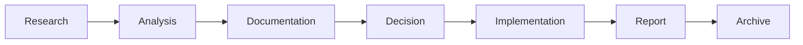

# Analysis

Technical analysis, research documents, and architectural evaluations.

## 📊 Current Analysis Documents

### 🔄 Migration Analysis

**[Migration](./migration/)**

- [Knex to Drizzle Migration](./migration/knex-to-drizzle-migration.md) - ORM migration analysis
- [Files to Migrate](./migration/files-to-migrate.md) - Migration inventory

### 🏗️ Platform Analysis

**[Platform](./platform/)**

- [Platform Gap Analysis](./platform/platform-gap-analysis.md) - Feature gap assessment
- [Fuse Integration Summary](./platform/fuse-integration-summary.md) - UI framework evaluation

## 📝 Document Types

Analysis documents fall into these categories:

### 1. **Migration Analysis**

Evaluating technology migrations and upgrade paths.

**Format:**

- Current state assessment
- Proposed solution evaluation
- Risk analysis
- Migration strategy
- Timeline estimation

### 2. **Platform Evaluations**

Assessing third-party libraries, frameworks, or services.

**Format:**

- Requirements and goals
- Options comparison
- Pros and cons analysis
- Recommendation
- Integration plan

### 3. **Gap Analysis**

Identifying missing features or capabilities.

**Format:**

- Current capabilities
- Required capabilities
- Gap identification
- Priority assessment
- Implementation roadmap

### 4. **Performance Analysis**

System performance evaluations and optimization opportunities.

**Format:**

- Performance baseline
- Bottleneck identification
- Optimization strategies
- Expected improvements
- Implementation plan

## 🎯 Analysis Lifecycle



1. **Research** - Gather data and evaluate options
2. **Analysis** - Document in `docs/analysis/`
3. **Decision** - Team review and approval
4. **Implementation** - Execute based on analysis
5. **Report** - Document results in `docs/reports/`
6. **Archive** - Move to `docs/archive/` when complete

## 📖 Creating Analysis Documents

### Template Structure

```markdown
---
title: Analysis Title
description: Brief description
category: analysis
tags: [analysis, migration, performance, etc.]
status: draft | review | approved | implemented
---

# Analysis Title

## Executive Summary

[1-2 paragraph summary]

## Background

[Context and motivation]

## Current State

[As-is assessment]

## Options Analysis

[Evaluate alternatives]

## Recommendation

[Proposed solution]

## Implementation Plan

[High-level roadmap]

## Risks and Mitigation

[Risk assessment]

## Next Steps

[Action items]
```

### Best Practices

- **Be objective** - Present data, not opinions
- **Compare options** - Show multiple alternatives
- **Quantify impact** - Use metrics where possible
- **Consider risks** - Address potential issues
- **Provide timeline** - Estimate effort required

## 🔗 Related Documentation

- **[Reports](../reports/README.md)** - Implementation results and audits
- **[Architecture](../architecture/README.md)** - Architectural decisions
- **[Archive](../archive/README.md)** - Historical analysis documents

---

Analysis documents inform decisions. Once implemented, results go to [Reports](../reports/README.md).
