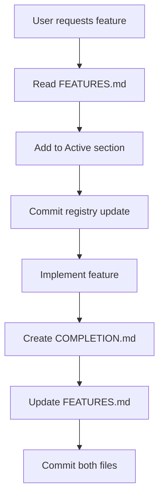

# Feature Tracking System

> **🎯 Lightweight system สำหรับติดตาม features โดย Claude Code**
>
> **Last Updated**: 2025-12-20
> **Status**: ✅ Active

---

## 🎯 Problem Statement

เมื่อ Claude ทำ feature ต่างๆ บางทีทำไปเยอะ และอาจลืมว่าทำอะไรไปบ้าง ต้องการระบบที่:

1. ✅ **ไม่ให้ลืม** feature ที่ทำไปแล้ว
2. ✅ **สรุปได้ง่าย** ว่าทำอะไรไปบ้าง
3. ✅ **เบา** ไม่ซับซ้อนเกินไป
4. ✅ **ใช้งานจริงได้** ไม่ใช่แค่ทฤษฎี

---

## 📋 Solution: 3-Level Documentation System

### Level 1: Feature Registry (MANDATORY)

**File**: `docs/features/FEATURES.md`
**Update**: ทุกครั้งที่เริ่มหรือเสร็จ feature
**Size**: 1 file เท่านั้น

### Level 2: Feature Completion Report (MANDATORY)

**File**: `docs/features/[feature-name]/COMPLETION.md`
**Update**: เมื่อทำเสร็จแต่ละ milestone/feature
**Size**: 1 file ต่อ feature

### Level 3: Detailed Docs (OPTIONAL)

**Files**: API contracts, architecture, etc.
**Update**: ตามความจำเป็น
**Size**: ตามต้องการ

---

## 🗂️ Level 1: Feature Registry

### File Structure

```
docs/features/FEATURES.md  ← Single source of truth
```

### Content Format

```markdown
# Feature Registry

> Last Updated: 2025-12-20 13:30

## 🟢 Active (In Progress)

| Feature                  | Started    | Status | Files Changed | Notes                              |
| ------------------------ | ---------- | ------ | ------------- | ---------------------------------- |
| Budget Variance Analysis | 2025-12-18 | 60%    | 12 files      | Backend done, frontend in progress |

## ✅ Completed (Last 30 Days)

| Feature                 | Completed  | Commit   | Files   | Summary                    |
| ----------------------- | ---------- | -------- | ------- | -------------------------- |
| Inventory Item Settings | 2025-12-19 | 1789d19e | 8 files | Modal with reactive fields |
| Budget Control Settings | 2025-12-18 | bf6c517  | 5 files | Detail page settings       |

## 📋 Planned (Backlog)

| Feature      | Priority | Complexity | Dependencies     |
| ------------ | -------- | ---------- | ---------------- |
| Stock Alerts | High     | Medium     | Inventory module |
```

### Rules for Claude

**When starting a feature:**

```markdown
1. Read docs/features/FEATURES.md
2. Add to "Active" section
3. Commit the update
```

**When completing a feature:**

```markdown
1. Move from "Active" to "Completed"
2. Add commit hash, file count, summary
3. Create COMPLETION.md (see Level 2)
4. Commit both files
```

---

## 📝 Level 2: Feature Completion Report

### File Structure

```
docs/features/[feature-name]/
├── COMPLETION.md          ← Feature summary (MANDATORY)
└── [other docs]           ← Optional detailed docs
```

### COMPLETION.md Template

```markdown
# [Feature Name] - Completion Report

**Completed**: 2025-12-20
**Commit**: abc123def
**Developer**: Claude Sonnet 4.5
**Time Spent**: ~4 hours

---

## 📊 Summary

[2-3 sentences describing what was implemented]

---

## 🎯 What Was Implemented

### Backend

- ✅ API endpoint: `GET /api/inventory/items/:id/settings`
- ✅ TypeBox schema: ItemSettingsSchema
- ✅ Repository method: `getItemSettings()`

### Frontend

- ✅ Component: `ItemSettingsModal`
- ✅ Service: `inventoryItemsService.getSettings()`
- ✅ Signals: `settingsSignal`, `loadingSignal`

### Database

- ✅ Migration: 20251219_add_item_settings.ts
- ✅ Table: item_settings

---

## 📁 Files Changed

### Created (5 files)
```

apps/api/src/layers/domains/inventory/items/settings.route.ts
apps/api/src/database/migrations/20251219_add_item_settings.ts
apps/web/src/app/features/inventory/modals/item-settings.modal.ts

```

### Modified (3 files)
```

apps/api/src/layers/domains/inventory/items/index.ts
apps/web/src/app/features/inventory/item-list.component.ts

```

---

## 🧪 Testing

- ✅ Manual testing: Item settings modal opens and saves
- ✅ API testing: curl commands verified
- ✅ Build: pnpm run build passed
- ⚠️ Unit tests: TODO (not critical for this feature)

---

## 📚 Documentation

- ✅ API Contract: docs/features/inventory/api-contracts.md updated
- ✅ This completion report
- ❌ User guide: Not needed (internal feature)

---

## 🔗 Related

- **Depends on**: Inventory module, Item CRUD
- **Blocks**: Stock alerts feature
- **Related commits**:
  - 1789d19e - Main implementation
  - 512471e2 - Modal retry mechanism

---

## 📝 Notes

- Modal uses retry mechanism for reliability
- Settings are cached in frontend
- Future: Add validation for min/max stock levels
```

---

## 🔄 Workflow for Claude

### When User Says: "สร้าง feature X"



### Step-by-Step Commands

```bash
# 1. Start feature
# - Read docs/features/FEATURES.md
# - Add feature to "Active" section
# - Git commit

# 2. Implement feature
# - Write code
# - Test
# - Build

# 3. Complete feature
# - Create docs/features/[name]/COMPLETION.md
# - Update docs/features/FEATURES.md (move to Completed)
# - Git commit both files

# 4. Summary to user
# - Show COMPLETION.md summary
# - Highlight files changed
# - Note any blockers/dependencies
```

---

## ✅ Why This System Works

### 1. Single Source of Truth

- ✅ `FEATURES.md` = รู้ทันทีว่ากำลังทำอะไร
- ✅ ไม่ต้องค้นหาว่า feature ไหนทำค้างไว้

### 2. Lightweight Documentation

- ✅ COMPLETION.md = สรุปทุกอย่างในที่เดียว
- ✅ ไม่ต้องเขียน 8 ไฟล์ (ซับซ้อนเกินไป)
- ✅ เขียนครั้งเดียว อ้างอิงได้ตลอด

### 3. Git-Friendly

- ✅ ทุก update มี commit hash
- ✅ Track ได้ว่าเปลี่ยนอะไรไปบ้าง
- ✅ Revert ได้ถ้าจำเป็น

### 4. Search-Friendly

- ✅ grep "GET /api/inventory" → หา API endpoint
- ✅ grep "ItemSettingsModal" → หา component
- ✅ grep "Completed: 2025-12" → หา feature เดือนนี้

---

## 📊 Example: Real Feature

### FEATURES.md (Registry)

```markdown
## ✅ Completed (Last 30 Days)

| Feature                       | Completed  | Commit   | Files | Summary                             |
| ----------------------------- | ---------- | -------- | ----- | ----------------------------------- |
| Inventory Item Settings Modal | 2025-12-19 | 1789d19e | 8     | Reactive modal with variance fields |
| Budget Control Settings       | 2025-12-18 | bf6c517a | 5     | Detail page settings panel          |
| CRUD Generator Docs Update    | 2025-12-20 | 24dc1b3a | 16    | Architecture docs alignment         |
```

### inventory/COMPLETION.md

```markdown
# Inventory Item Settings Modal - Completion Report

**Completed**: 2025-12-19
**Commit**: 1789d19e
**Developer**: Claude Sonnet 4.5

## 📊 Summary

Implemented item settings modal with reactive variance fields. Modal includes
retry mechanism for reliability and uses Angular Signals for state management.

## 🎯 What Was Implemented

### Backend

- ✅ Route: `apps/api/src/layers/domains/inventory/items/settings.route.ts`
- ✅ Schema: ItemSettingsSchema with TypeBox validation
- ✅ Endpoint: GET /api/inventory/items/:id/settings

### Frontend

- ✅ Component: ItemSettingsModal (Standalone)
- ✅ Service: inventoryItemsService.getSettings()
- ✅ Signals: settingsSignal, loadingSignal, errorSignal

## 📁 Files Changed

Created: 3 files
Modified: 5 files

## 🧪 Testing

- ✅ Manual: Modal opens, loads, saves successfully
- ✅ Build: Passed
- ✅ API: curl tested

## 📝 Notes

- Uses retry mechanism (up to 3 attempts)
- Settings cached in frontend
- Future: Add stock level validation
```

---

## 🎯 Implementation Plan

### Phase 1: Setup (Now)

1. ✅ Create this document (FEATURE_TRACKING_SYSTEM.md)
2. ⬜ Create FEATURES.md with current features
3. ⬜ Create COMPLETION.md template
4. ⬜ Add to `.claude/rules/` for automatic reference

### Phase 2: Backfill (Optional)

1. Create COMPLETION.md for recent features (last 7 days)
2. Update FEATURES.md with completed features

### Phase 3: Future (Ongoing)

1. Every feature follows this workflow
2. Weekly review of FEATURES.md
3. Archive old features (> 90 days) to archive/

---

## 📚 Comparison: Old vs New System

| Aspect              | Old System (8-File)     | New System (3-Level)            |
| ------------------- | ----------------------- | ------------------------------- |
| **Mandatory Files** | 8 files per feature     | 2 files (registry + completion) |
| **Time Required**   | 8-12 hours              | 15-30 minutes                   |
| **Maintenance**     | High (outdated quickly) | Low (update on complete)        |
| **Discoverability** | Poor (scattered)        | Excellent (single registry)     |
| **Actual Usage**    | ~5% adoption            | Designed for 100% adoption      |
| **Claude Memory**   | Can't remember          | Easy to track                   |
| **User Visibility** | Hard to find            | One file to check               |

---

## 🔧 Tools & Automation

### 1. Git Hook (Future)

```bash
# On commit, remind Claude to update FEATURES.md
# .git/hooks/pre-commit
```

### 2. CLI Command (Future)

```bash
# Quick feature summary
pnpm run feature:summary

# List active features
pnpm run feature:list
```

### 3. Claude Skill (Future)

```bash
# In .claude/skills/
/feature-start [name]    # Start tracking new feature
/feature-done [name]     # Complete and create COMPLETION.md
/feature-list            # Show FEATURES.md
```

---

## ❓ FAQ

### Q: ต้องเขียน docs ทุกครั้งหรือ?

A: **MANDATORY**: FEATURES.md + COMPLETION.md (2 files เท่านั้น)
**OPTIONAL**: API contracts, architecture (ถ้าซับซ้อน)

### Q: Feature เล็กๆ ต้องเขียนไหม?

A: ถ้าเปลี่ยน > 3 files หรือใช้เวลา > 1 hour → ต้องเขียน
Bug fix เล็กๆ → ไม่ต้อง (แค่ commit message ดีๆ)

### Q: Feature ค้างไว้ครึ่งทำยังไง?

A: อยู่ใน "Active" section ของ FEATURES.md
เมื่อกลับมาทำต่อ อ่าน FEATURES.md จะรู้ว่าค้างอะไรไว้

### Q: ถ้าลืม update FEATURES.md?

A: ใช้ git log ย้อนดูว่าทำอะไรไปบ้าง
แล้ว backfill ใน FEATURES.md

### Q: Archive ยังไง?

A: Features > 90 days → ย้ายไป `docs/features/archive/YYYY-QX/`

---

## ✅ Next Steps

**User**: อ่าน document นี้และอนุมัติ
**Claude**: สร้าง FEATURES.md และเริ่มใช้งานทันที
**Team**: Review FEATURES.md ทุกสัปดาห์

---

## 📞 Contact

Questions? → Update this document
Changes needed? → PR to this file
Not working? → Tell Claude to improve it
