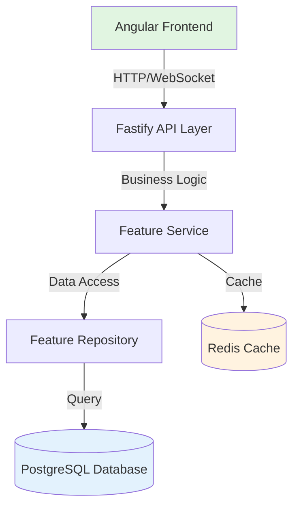
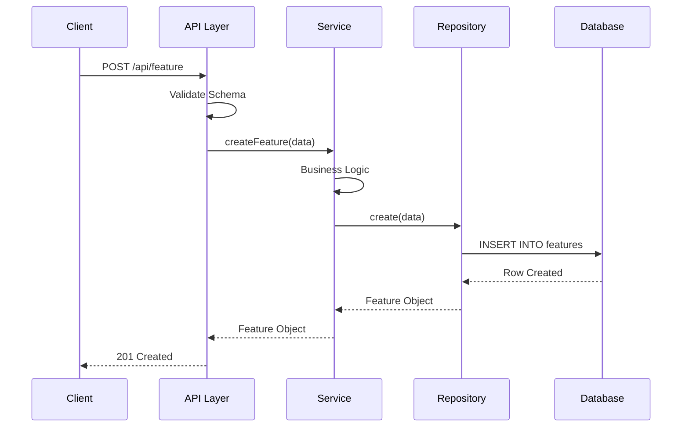

# [Feature Name] Architecture

Technical architecture and design decisions for the [Feature Name] feature.

## 🏗️ Overview

[High-level architectural overview paragraph]

### Design Goals

- **Goal 1**: Description
- **Goal 2**: Description
- **Goal 3**: Description

### Key Principles

1. **Principle 1** - Explanation
2. **Principle 2** - Explanation
3. **Principle 3** - Explanation

## 📐 System Architecture



## 🔧 Component Architecture

### Backend Components

#### 1. Feature Plugin (`feature.plugin.ts`)

**Purpose**: Fastify plugin registration and route setup

```typescript
export const FeaturePlugin: FastifyPluginAsync = async (fastify) => {
  // Register routes
  await fastify.register(FeatureRoutes, { prefix: '/feature' });

  // Register hooks
  fastify.addHook('preValidation', authHook);
};
```

#### 2. Feature Controller (`feature.controller.ts`)

**Purpose**: HTTP request handling and validation

```typescript
export class FeatureController extends BaseController {
  constructor(private featureService: FeatureService) {}

  async list(request: FastifyRequest, reply: FastifyReply) {
    const result = await this.featureService.findAll(request.query);
    return reply.success(result);
  }
}
```

#### 3. Feature Service (`feature.service.ts`)

**Purpose**: Business logic and orchestration

```typescript
export class FeatureService extends BaseService {
  constructor(private repo: FeatureRepository) {}

  async findAll(filters: FilterOptions) {
    // Business logic here
    return this.repo.findMany(filters);
  }
}
```

#### 4. Feature Repository (`feature.repository.ts`)

**Purpose**: Database access and queries

```typescript
export class FeatureRepository extends BaseRepository<Feature> {
  constructor(db: Database) {
    super(db, 'features');
  }

  async findMany(filters: FilterOptions) {
    return this.db.select().from(this.table).where(filters);
  }
}
```

### Frontend Components

#### 1. Feature List Component

```typescript
@Component({
  selector: 'app-feature-list',
  standalone: true,
  imports: [CommonModule, AegisXUI],
})
export class FeatureListComponent {
  private featureService = inject(FeatureService);
  items = signal<Feature[]>([]);

  ngOnInit() {
    this.loadItems();
  }
}
```

#### 2. Feature Service (Frontend)

```typescript
@Injectable({ providedIn: 'root' })
export class FeatureService {
  private http = inject(HttpClient);

  getAll() {
    return this.http.get<ApiResponse<Feature[]>>('/api/feature');
  }
}
```

## 🗄️ Data Model

### Database Schema

```typescript
export const featuresTable = pgTable('features', {
  id: uuid('id').primaryKey().defaultRandom(),
  name: varchar('name', { length: 255 }).notNull(),
  description: text('description'),
  status: varchar('status', { length: 50 }).default('active'),
  metadata: jsonb('metadata'),
  createdAt: timestamp('created_at').defaultNow(),
  updatedAt: timestamp('updated_at').defaultNow(),
});
```

### Type Definitions

```typescript
export interface Feature {
  id: string;
  name: string;
  description?: string;
  status: 'active' | 'inactive';
  metadata?: Record<string, any>;
  createdAt: Date;
  updatedAt: Date;
}
```

## 🔄 Data Flow

### Create Feature Flow



## 🔐 Security Architecture

### Authentication

- JWT tokens required for all endpoints
- Token validation at API gateway level
- User context injected into request

### Authorization

```typescript
// RBAC check example
@RequirePermissions('feature:read')
async list(request, reply) {
  // Handler logic
}
```

### Data Validation

- TypeBox schemas for runtime validation
- Drizzle ORM for type-safe queries
- Input sanitization at controller level

## ⚡ Performance Considerations

### Caching Strategy

```typescript
// Redis caching example
async findById(id: string) {
  const cached = await this.cache.get(`feature:${id}`);
  if (cached) return cached;

  const feature = await this.repo.findById(id);
  await this.cache.set(`feature:${id}`, feature, 3600);
  return feature;
}
```

### Database Optimization

- Indexes on frequently queried columns
- Pagination for large datasets
- Eager loading for related data

## 🧪 Testing Architecture

```
tests/
├── unit/
│   ├── feature.service.spec.ts
│   └── feature.repository.spec.ts
├── integration/
│   └── feature.api.spec.ts
└── e2e/
    └── feature.e2e.spec.ts
```

## 🔗 Integration Points

### External Services

- **Service A**: Purpose and how it's used
- **Service B**: Purpose and how it's used

### Internal Features

- **Related Feature 1**: Integration description
- **Related Feature 2**: Integration description

## 📊 Monitoring & Observability

### Metrics

- Request rate and latency
- Error rates by endpoint
- Cache hit ratio

### Logging

```typescript
logger.info('Feature created', {
  featureId: feature.id,
  userId: request.user.id,
});
```

## 🔗 Related Documentation

- [Feature Overview](./README.md)
- [API Reference](./api-reference.md)
- [Developer Guide](./developer-guide.md)
- [Backend Architecture](../../architecture/backend/README.md)
- [Frontend Architecture](../../architecture/frontend/README.md)

---

For implementation details, see the [Developer Guide](./developer-guide.md).
