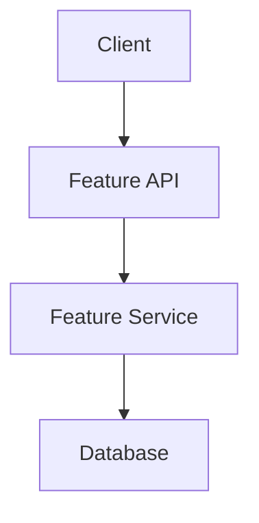

# [Feature Name]

[Brief introduction paragraph explaining what this feature is and why it exists]

## 📋 Overview

**Key Capabilities:**

- Capability 1
- Capability 2
- Capability 3

**Use Cases:**

- Use case 1
- Use case 2

## 🚀 Quick Start

### Prerequisites

- Prerequisite 1
- Prerequisite 2

### Installation

```bash
# Installation command if needed
pnpm install
```

### Basic Usage

```typescript
// Code example showing basic usage
import { FeatureName } from '@aegisx/feature';

const example = new FeatureName();
example.doSomething();
```

## 📖 Documentation

### Available Documentation

- **[API Reference](./api-reference.md)** - API endpoints and schemas
- **[Architecture](./architecture.md)** - Design and technical architecture
- **[Developer Guide](./developer-guide.md)** - Implementation guide for developers
- **[User Guide](./user-guide.md)** - End-user documentation
- **[Troubleshooting](./troubleshooting.md)** - Common issues and solutions
- **[Deployment Guide](./deployment-guide.md)** - Deployment instructions

## 🔌 Integration

### Backend Integration

```typescript
// Example backend integration
import { FeaturePlugin } from './feature.plugin';

fastify.register(FeaturePlugin);
```

### Frontend Integration

```typescript
// Example frontend integration
import { FeatureComponent } from '@aegisx/ui';

@Component({
  selector: 'app-feature',
  standalone: true,
  imports: [FeatureComponent],
})
export class AppComponent {}
```

## ⚙️ Configuration

### Environment Variables

```bash
# Required environment variables
FEATURE_API_KEY=your_api_key
FEATURE_ENABLED=true
```

### Configuration File

```typescript
// feature.config.ts
export const config = {
  enabled: true,
  option1: 'value1',
  option2: 'value2',
};
```

## 🧪 Testing

```bash
# Run feature tests
pnpm test feature-name

# Run integration tests
pnpm test:integration feature-name
```

## 📊 Architecture Diagram



## 🔗 Related Features

- [Related Feature 1](../feature-1/README.md)
- [Related Feature 2](../feature-2/README.md)

## 📚 Additional Resources

- [Feature Development Standard](../../guides/development/feature-development-standard.md)
- [API Standards](../../reference/api/README.md)
- [Architecture Overview](../../architecture/overview.md)

## 🆘 Need Help?

- Check [Troubleshooting Guide](./troubleshooting.md)
- Review [FAQ](#faq) below
- Open an [Issue](https://github.com/aegisx-platform/aegisx-starter-1/issues)

## FAQ

### Question 1?

Answer 1.

### Question 2?

Answer 2.

---

**Next Steps:** Review the [Developer Guide](./developer-guide.md) to learn how to extend this feature.
