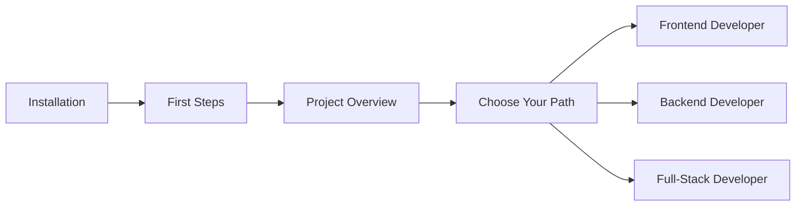

# Getting Started

Welcome to AegisX Platform! This section will help you get up and running quickly.

## 📋 Prerequisites

- Node.js 20+
- pnpm 8+
- Docker & Docker Compose
- PostgreSQL 15+ (or use Docker)
- Git

## 🚀 Quick Start

1. **[Installation](./installation.md)** - Install dependencies and set up your environment
2. **[First Steps](./first-steps.md)** - Run your first AegisX application
3. **[Project Overview](./project-overview.md)** - Understand the monorepo structure

## 📚 Learning Path

Follow this recommended path for new developers:

### Frontend Developers

- Start with [Angular Architecture](../architecture/frontend/README.md)
- Learn [UI Components](../reference/ui/README.md)
- Read [Development Guides](../guides/development/README.md)

### Backend Developers

- Start with [Fastify Architecture](../architecture/backend/README.md)
- Learn [API Standards](../reference/api/README.md)
- Read [Database Guides](../guides/database/README.md)

### Full-Stack Developers

- Start with [Architecture Overview](../architecture/overview.md)
- Learn [Feature Development Standard](../guides/development/feature-development-standard.md)
- Build your [First Feature](../guides/development/README.md)

## 🎯 Next Steps

After completing the getting started guides:

- **Develop Features** - [Feature Development Standard](../guides/development/feature-development-standard.md)
- **Deploy Applications** - [CI/CD Guide](../guides/infrastructure/ci-cd/README.md)
- **Understand Architecture** - [Architecture Overview](../architecture/overview.md)

## 📖 Documentation Structure

- `getting-started/` - You are here!
- `guides/` - Task-oriented how-to guides
- `reference/` - Technical reference documentation
- `architecture/` - System design and patterns
- `features/` - Feature-specific documentation

## 🆘 Need Help?

- Check the [FAQ](./faq.md) for common questions
- Review [Troubleshooting Guide](./troubleshooting.md)
- Open an [Issue](https://github.com/aegisx-platform/aegisx-starter-1/issues)

---

Ready to begin? Start with **[Installation →](./installation.md)**
