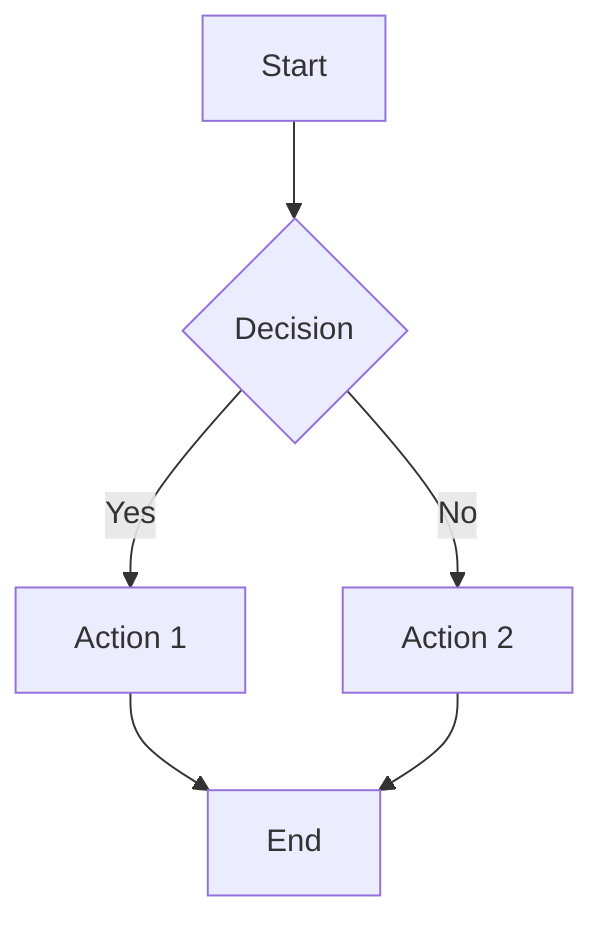

# Contributing to AegisX Platform Documentation

Thank you for contributing to the AegisX Platform documentation! This guide will help you understand our documentation structure, standards, and workflow.

## Quick Start

1. **Read First:** Familiarize yourself with the [documentation structure](#documentation-structure)
2. **Follow Standards:** Use our [metadata schema](#frontmatter-metadata) and [writing guidelines](#writing-guidelines)
3. **Test Locally:** Build and preview docs before submitting
4. **Submit PR:** Follow our [contribution workflow](#contribution-workflow)

## Documentation Structure

Our documentation follows the **Diátaxis Framework** with a 5-layer information architecture:

```
docs/
├── getting-started/     # Installation, setup, first steps
├── guides/              # How-to guides, workflows, best practices
│   ├── development/     # Development guides
│   ├── infrastructure/  # DevOps and deployment
│   └── testing/         # Testing strategies
├── reference/           # API docs, CLI commands, standards
│   ├── api/             # API reference
│   ├── cli/             # CLI reference
│   └── ui/              # UI standards
├── architecture/        # System design, patterns, concepts
│   ├── concepts/        # Core concepts
│   ├── patterns/        # Design patterns
│   ├── domains/         # Domain architecture
│   ├── frontend/        # Frontend architecture
│   └── backend/         # Backend architecture
├── development/         # Advanced development topics
├── infrastructure/      # CI/CD and deployment
├── analysis/            # Technical analysis and research
├── business/            # Business strategy and roadmaps
├── components/          # Component specifications
├── database/            # Database guides
└── testing/             # Testing documentation
```

### Excluded Directories

These directories are intentionally excluded from the web documentation build:

- `archive/` - Historical content (for reference only)
- `sessions/` - Session notes and templates
- `features/` - Feature specs with Handlebars templates
- `styling/` - Styling guides (HTML parsing conflicts)
- `README.md` files - Not rendered as web pages

## Frontmatter Metadata

All documentation should include YAML frontmatter for better organization and searchability.

### Minimal Frontmatter (Required)

```yaml
---
title: 'Your Page Title'
description: 'Brief description for search and social sharing (max 160 characters)'
---
```

### Complete Frontmatter (Recommended)

```yaml
---
title: 'Feature Development Standard'
description: 'Complete guide to developing features following AegisX standards'
category: 'guides'
subcategory: 'development'
tags: [development, workflow, standards, best-practices]
order: 10
lastUpdated: 2025-12-15
author: 'Development Team'
difficulty: 'intermediate'
---
```

### Frontmatter Fields

| Field         | Type   | Required | Description                                                      |
| ------------- | ------ | -------- | ---------------------------------------------------------------- |
| `title`       | string | ✅ Yes   | Page title (appears in nav and SEO)                              |
| `description` | string | ✅ Yes   | Brief summary (max 160 chars for SEO)                            |
| `category`    | string | No       | Main category (getting-started, guides, reference, architecture) |
| `subcategory` | string | No       | Section within category (development, infrastructure, api, etc.) |
| `tags`        | array  | No       | Keywords for search and filtering                                |
| `order`       | number | No       | Sort order within section (lower = first)                        |
| `lastUpdated` | date   | No       | Last update date (YYYY-MM-DD)                                    |
| `author`      | string | No       | Author or team name                                              |
| `difficulty`  | string | No       | beginner, intermediate, advanced                                 |

## Writing Guidelines

### File Naming

- Use **kebab-case** for all filenames: `feature-development-standard.md`
- Match directory structure: Category determines folder location
- Avoid special characters, spaces, or uppercase in filenames

### Content Structure

1. **Title (H1)** - One per page, matches frontmatter title
2. **Introduction** - Brief overview of the content
3. **Sections (H2)** - Main content sections
4. **Subsections (H3-H4)** - Detailed breakdowns
5. **Examples** - Code snippets with syntax highlighting
6. **Links** - Related documentation references

### Code Blocks

Use fenced code blocks with language identifiers:

````markdown
```typescript
// TypeScript example
interface User {
  id: string;
  name: string;
}
```

```bash
# Shell commands
pnpm install
pnpm run dev
```

```sql
-- SQL queries
SELECT * FROM users WHERE active = true;
```
````

Supported languages: typescript, javascript, bash, sql, yaml, json, html, css, and 20+ more.

### Links

Use relative links for internal documentation:

```markdown
<!-- Correct -->

[Feature Development](../guides/development/feature-development-standard.md)
[API Standards](../../reference/api/api-response-standard.md)

<!-- Avoid absolute paths -->

[Getting Started](/getting-started/getting-started)
```

### Formatting

- **Bold** for emphasis: `**important text**`
- _Italic_ for technical terms: `*variable name*`
- `Code` for inline code: `` `functionName()` ``
- Lists for sequential steps or bullet points
- Tables for structured data
- Admonitions for notes, warnings, tips

## Contribution Workflow

### 1. Set Up Environment

```bash
# Clone repository
git clone https://github.com/aegisx-platform/aegisx-starter-1.git
cd aegisx-starter-1

# Install dependencies
pnpm install

# Start documentation dev server
pnpm run docs:dev
# Opens at http://localhost:5173
```

### 2. Make Changes

```bash
# Create a feature branch
git checkout -b docs/your-feature-name

# Edit documentation in docs/ directory
# Follow the structure and standards above
```

### 3. Test Locally

```bash
# Build documentation
pnpm run docs:build
# Should complete in <75s with 0 errors

# Preview production build
pnpm run docs:preview
# Verify pages render correctly
```

### 4. Submit Pull Request

```bash
# Commit changes
git add docs/path/to/your-changes.md
git commit -m "docs: add feature X documentation

- Added comprehensive guide for feature X
- Included code examples and diagrams
- Updated navigation in relevant sections"

# Push to your fork
git push origin docs/your-feature-name

# Create PR on GitHub
# Title: "docs: add feature X documentation"
# Description: Explain what you added/changed and why
```

### PR Checklist

Before submitting your PR, ensure:

- [ ] Frontmatter metadata is complete
- [ ] Code examples are tested and working
- [ ] Links to other docs are correct
- [ ] Build completes successfully (`pnpm run docs:build`)
- [ ] Pages render correctly in preview
- [ ] No broken links introduced
- [ ] Follows writing guidelines and style
- [ ] Commit messages follow convention

## Documentation Standards

### VitePress Configuration

Documentation is built with VitePress v1.6.4. Configuration is in `docs/.vitepress/config.mts`.

**Current Build Performance:**

- Build time: ~74s (166 pages)
- Search index: 9.1k
- 0 broken internal links

**Features:**

- Local search (client-side, no server needed)
- Mermaid diagrams support
- Code syntax highlighting (20+ languages)
- Dark mode theme
- Mobile-responsive design
- Clean URLs (no .html extensions)

### Mermaid Diagrams

Use Mermaid for diagrams and flowcharts:

````markdown

````

Supported diagram types:

- Flowchart
- Sequence diagram
- Class diagram
- State diagram
- Entity Relationship diagram
- Gantt chart
- Git graph

### Navigation

Navigation is manually configured in `docs/.vitepress/config.mts`. To add a page to sidebar:

1. Add your markdown file to appropriate directory
2. Update sidebar configuration in `config.mts`
3. Ensure link path is correct (no .md extension in config)

Example:

```typescript
sidebar: {
  '/guides/': [
    {
      text: 'Development',
      items: [
        {
          text: 'Your New Guide',
          link: '/guides/development/your-new-guide',
        },
      ],
    },
  ],
}
```

## Types of Documentation

### 1. Tutorials (Getting Started)

- **Goal:** Help new users get started
- **Format:** Step-by-step instructions
- **Location:** `docs/getting-started/`
- **Example:** Installation guide, first project setup

### 2. How-To Guides (Guides)

- **Goal:** Solve specific problems
- **Format:** Goal-oriented, practical steps
- **Location:** `docs/guides/`
- **Example:** "How to deploy to production", "How to set up CI/CD"

### 3. Reference (Reference)

- **Goal:** Provide technical specifications
- **Format:** Structured, comprehensive, factual
- **Location:** `docs/reference/`
- **Example:** API endpoints, CLI commands, configuration options

### 4. Explanation (Architecture)

- **Goal:** Explain concepts and design decisions
- **Format:** Discussion-oriented, conceptual
- **Location:** `docs/architecture/`
- **Example:** System architecture, design patterns, domain models

## Common Tasks

### Adding a New Guide

```bash
# 1. Create markdown file
touch docs/guides/development/my-new-guide.md

# 2. Add frontmatter
cat > docs/guides/development/my-new-guide.md << 'EOF'
---
title: 'My New Development Guide'
description: 'Learn how to do X in AegisX Platform'
category: 'guides'
subcategory: 'development'
tags: [development, guide]
---

# My New Development Guide

Introduction to your guide...
EOF

# 3. Add to sidebar in docs/.vitepress/config.mts

# 4. Test build
pnpm run docs:build
```

### Updating Existing Documentation

```bash
# 1. Find the file
find docs -name "*keyword*"

# 2. Edit the file
# Add your changes

# 3. Update lastUpdated in frontmatter
# lastUpdated: 2025-12-15

# 4. Test build
pnpm run docs:build

# 5. Preview changes
pnpm run docs:preview
```

### Adding Code Examples

Best practices for code examples:

1. **Test all code** - Ensure examples actually work
2. **Use comments** - Explain non-obvious parts
3. **Show imports** - Include necessary imports
4. **Provide context** - Explain when to use the code
5. **Keep it simple** - Focus on the concept being taught

Example:

```typescript
// src/services/user.service.ts
import { Injectable } from '@angular/core';
import { HttpClient } from '@angular/common/http';
import { Observable } from 'rxjs';

@Injectable({ providedIn: 'root' })
export class UserService {
  private apiUrl = '/api/users';

  constructor(private http: HttpClient) {}

  getUsers(): Observable<User[]> {
    return this.http.get<User[]>(this.apiUrl);
  }
}
```

## Troubleshooting

### Build Fails

```bash
# Check for syntax errors
pnpm run docs:build 2>&1 | grep "error"

# Common issues:
# - Missing frontmatter closing (---)
# - Broken links to non-existent files
# - Invalid YAML in frontmatter
# - Unclosed code blocks
```

### Links Not Working

```bash
# Verify file exists
ls -la docs/path/to/file.md

# Check link syntax (should be relative)
# Correct: ../guides/development/feature.md
# Wrong: /guides/development/feature.md
```

### Page Not Appearing in Sidebar

1. Check file is not in excluded directory
2. Verify sidebar configuration in `config.mts`
3. Ensure link path matches file location (no .md extension)
4. Rebuild: `pnpm run docs:build`

## Getting Help

- **Documentation Issues:** [GitHub Issues](https://github.com/aegisx-platform/aegisx-starter-1/issues)
- **Questions:** Create a discussion on GitHub
- **Style Guide:** This document and existing docs
- **Technical Questions:** See [Getting Started Guide](./getting-started.md)

## Additional Resources

- [VitePress Documentation](https://vitepress.dev/)
- [Markdown Guide](https://www.markdownguide.org/)
- [Mermaid Diagram Syntax](https://mermaid.js.org/)
- [Diátaxis Framework](https://diataxis.fr/)

---

**Thank you for contributing to AegisX Platform documentation!** 🎉

Your contributions help developers build better applications faster.
