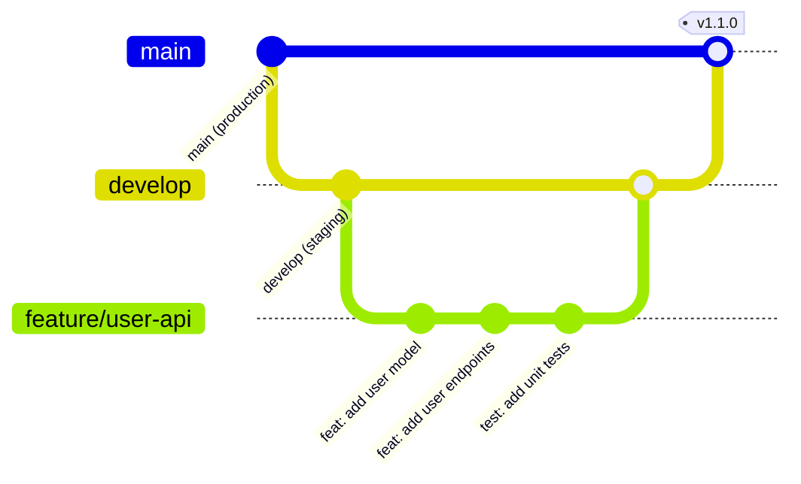

# 🚀 Getting Started

> **Complete installation guide and first steps** for AegisX Platform development.

## Prerequisites

Before you begin, ensure you have the following installed:

- **Node.js:** 22+ (required)
- **pnpm:** 10+ (package manager)
- **PostgreSQL:** 15+ (database)
- **Redis:** 7+ (optional, for caching)
- **Git:** Latest version

### Verify Your Environment

```bash
node --version    # Should be 22+
pnpm --version    # Should be 10+
psql --version    # Should be 15+
redis-cli --version  # Should be 7+
```

## Installation

### 1. Clone the Repository

```bash
git clone https://github.com/aegisx-platform/aegisx-starter-1.git
cd aegisx-starter-1
```

### 2. Install Dependencies

```bash
# Install all dependencies
pnpm install
```

### 3. Set Up Environment

```bash
# Copy environment template
cp .env.example .env.local

# Edit .env.local with your database credentials
# Required variables:
# - DB_HOST=localhost
# - DB_PORT=5432
# - DB_USER=your_username
# - DB_PASSWORD=your_password
# - DB_NAME=aegisx_dev
# - JWT_SECRET=your_secret_key
```

### 4. Database Setup

```bash
# Run migrations
pnpm run db:migrate

# Seed database with demo data
pnpm run db:seed
```

### 5. Start Development Servers

```bash
# Start all services (API + Web + Docs)
pnpm run dev
```

After running `pnpm run dev`, the following servers will start:

- **API Server:** http://localhost:3383
- **Web App:** http://localhost:4249
- **Documentation:** http://localhost:5173

### Default Credentials

```
Email: admin@aegisx.local
Password: Admin123!@#
```

---

## 📋 Development Guidelines

### 1️⃣ **Git Workflow ที่เราใช้**

```bash
main     → Production (ห้าม push ตรง!)
develop  → Staging/Integration
feature/* → Development (ที่คุณจะทำงาน)
```

### 2️⃣ **กฎสำคัญ**

- ❌ **ห้าม** commit ตรงเข้า `main` หรือ `develop`
- ✅ **ต้อง** สร้าง feature branch ทุกครั้ง
- ✅ **ต้อง** ใช้ conventional commits format
- ✅ **ต้อง** create PR เพื่อ merge

## 🏃 Quick Start in 5 Minutes

### Step 1: Clone & Setup

```bash
# Clone project
git clone <repo-url>
cd aegisx-starter

# Install dependencies (⚠️ USE PNPM!)
pnpm install

# One-command setup (recommended)
pnpm setup

# OR manual setup:
# cp .env.example .env
# pnpm run setup:env        # Generate instance config
# pnpm run docker:up        # Start services
# pnpm run db:migrate       # Run migrations
# pnpm run db:seed          # Seed database
```

### Step 2: เริ่มงาน Feature ใหม่

```bash
# 1. Update develop branch
git checkout develop
git pull origin develop

# 2. สร้าง feature branch
git checkout -b feature/your-feature-name

# 3. Start development
nx serve api    # Backend: http://localhost:3333
nx serve web    # Frontend: http://localhost:4200
```

### Step 3: Commit Code

```bash
# Add changes
git add .

# Commit with proper format
git commit -m "feat: add user management"
# หรือ
git commit -m "fix: resolve login issue"
```

### Step 4: Push & Create PR

```bash
# Push to GitHub
git push -u origin feature/your-feature-name

# ไปที่ GitHub → Create Pull Request → Review → Merge
```

## 📝 Commit Message Format

| Type       | Version Change        | ใช้เมื่อ        | ตัวอย่าง                        |
| ---------- | --------------------- | --------------- | ------------------------------- |
| `feat`     | Minor (1.0.0 → 1.1.0) | Feature ใหม่    | `feat: add payment API`         |
| `fix`      | Patch (1.0.0 → 1.0.1) | แก้ bug         | `fix: resolve login error`      |
| `docs`     | No change             | Update เอกสาร   | `docs: update README`           |
| `style`    | No change             | Code formatting | `style: format code`            |
| `refactor` | No change             | ปรับ code       | `refactor: improve performance` |
| `test`     | No change             | เพิ่ม test      | `test: add unit tests`          |
| `chore`    | No change             | งาน maintenance | `chore: update dependencies`    |

**Breaking Change**: เพิ่ม `!` → Major version

```bash
feat!: change API structure  # 1.0.0 → 2.0.0
```

## 🔄 Development Workflow

### 📊 Workflow Chart



### 🌿 Branch Types & Purpose

| Branch Type | From    | Merge To       | Purpose      | Example                 |
| ----------- | ------- | -------------- | ------------ | ----------------------- |
| `feature/*` | develop | develop        | New features | `feature/payment-api`   |
| `fix/*`     | develop | develop        | Bug fixes    | `fix/login-error`       |
| `hotfix/*`  | main    | main + develop | Urgent fixes | `hotfix/security-patch` |
| `release/*` | develop | main + develop | Release prep | `release/1.2.0`         |

### 🔄 Standard Flow (Feature Development)

```
1. Create Feature Branch
   develop ──┬──> feature/xxx
             │
2. Development & Commits
             ├──> commit: "feat: add API"
             ├──> commit: "test: add tests"
             ├──> commit: "docs: update"
             │
3. Push & Create PR
             ├──> Push to GitHub
             ├──> Create Pull Request
             ├──> Code Review
             │
4. Merge to Develop
   develop <─┴── Merge PR
             │
5. Deploy to Staging
             └──> Auto deploy (CI/CD)

6. Release to Production
   develop ──> main ──> v1.1.0
                  └──> Auto deploy
```

### 🚨 Hotfix Flow (Emergency)

```
1. Critical Bug Found!
   main ──┬──> hotfix/security-fix
          │
2. Fix & Test
          ├──> commit: "fix: patch vulnerability"
          │
3. Merge to main (Production)
   main <─┤
          │
4. Merge to develop
develop <─┴── Keep in sync
```

📖 **อ่านเพิ่มเติม**: [Git Flow & Release Strategy Guide](./GIT-FLOW-RELEASE-GUIDE.md) - คู่มือ Git Flow แบบละเอียด

### ตัวอย่าง Daily Workflow

```bash
# เช้า - Update code
git checkout develop
git pull origin develop
git checkout feature/my-feature
git merge develop  # หรือ git rebase develop

# กลางวัน - Commit งาน
git add .
git commit -m "feat: implement user CRUD"
git push

# เย็น - Push งานวัน
git push origin feature/my-feature
```

## 🚫 ข้อห้าม & ⚠️ ข้อควรระวัง

### ❌ Don't

```bash
# ห้าม push ตรงเข้า main
git checkout main
git commit -m "..."  # ❌ ห้าม!
git push origin main # ❌ ห้าม!

# ห้าม force push
git push -f  # ❌ ห้าม! (ยกเว้นใน feature branch ตัวเอง)

# ห้าม merge conflict แบบมั่วๆ
```

### ✅ Do

```bash
# สร้าง branch ก่อนทำงานเสมอ
git checkout -b feature/new-feature

# Pull ก่อน push เสมอ
git pull origin develop

# เขียน commit message ที่มีความหมาย
git commit -m "feat: add user authentication with JWT"
```

## 🚀 CI/CD Pipeline

### อะไรเกิดขึ้นเมื่อคุณ Push Code?

1. **Push to feature branch** → รัน tests อัตโนมัติ
2. **Merge to develop** → Deploy to staging
3. **Merge to main** →
   - Auto version (1.0.0 → 1.1.0)
   - Auto CHANGELOG.md
   - Auto Docker build & push
   - Auto GitHub release

### ไม่ต้อง Setup อะไร!

- ✅ GitHub Actions พร้อมใช้งาน
- ✅ GITHUB_TOKEN มีให้อัตโนมัติ
- ✅ Docker images จะอยู่ที่ `ghcr.io`

## 📚 เอกสารที่ควรอ่านต่อ

1. **[Git Flow & Release Guide](./GIT-FLOW-RELEASE-GUIDE.md)** - 🔥 **อ่านต่อจากนี้!** วิธี branch, merge, release
2. **[API-First Workflow](./04a-api-first-workflow.md)** - วิธีพัฒนา feature แบบ API-First
3. **[Quick Commands](./02-quick-commands.md)** - คำสั่งที่ใช้บ่อย
4. **[Project Setup](./03-project-setup.md)** - ถ้าต้อง setup ใหม่
5. **[Architecture Overview](./05-architecture.md)** - เข้าใจโครงสร้าง project

## 💡 Tips สำหรับมือใหม่

1. **ติดปัญหา Git?**

   ```bash
   git status  # ดู status ปัจจุบัน
   git log --oneline -10  # ดู commits ล่าสุด
   git diff  # ดูการเปลี่ยนแปลง
   ```

2. **ลืม format commit message?**

   ```bash
   git commit --amend  # แก้ message ล่าสุด
   ```

3. **อยู่ branch ไหนไม่รู้?**
   ```bash
   git branch  # ดู branch ปัจจุบัน (มี * ข้างหน้า)
   ```

## 🆘 ติดปัญหา?

- **Slack**: #dev-support
- **Documentation**: `/docs` folder
- **Ask Team**: อย่าเกรงใจถาม!

---

**✅ พร้อมเริ่มงานแล้ว?** ไปที่ Step 2 ด้านบนและเริ่ม coding ได้เลย! 🚀
