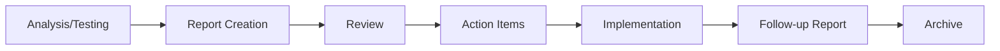

# Reports

Audit reports, reviews, and assessments documenting implementation results and system health.

## 📊 Current Reports

### 🔒 Security Audits

- [JWT Security Audit](./jwt-security-audit.md) - Authentication security review
- [Phase 3 Performance & Security Audit](./phase3-performance-security-audit.md) - Comprehensive audit

### ⚡ Performance Reports

- [Performance Report](./performance-report.md) - System performance metrics
- [API Endpoint Audit Report](./api-endpoint-audit-report.md) - API performance and standards

### 🎨 UI/UX Reports

- [UI Test Report](./ui-test-report.md) - Frontend testing results
- [Font System Review (2025-10-31)](./font-system-review-2025-10-31.md) - Typography audit
- [PDF Feature Review (2025-10-31)](./pdf-feature-review-2025-10-31.md) - PDF system evaluation

### 🏗️ Infrastructure Reports

- [Redis Caching Guide](./redis-caching-guide.md) - Caching implementation report

## 📝 Report Types

### 1. **Security Audits**

Regular security assessments and penetration test results.

**Format:**

- Security posture summary
- Vulnerabilities identified
- Risk levels (Critical/High/Medium/Low)
- Remediation recommendations
- Implementation status

### 2. **Performance Reports**

System performance analysis and optimization results.

**Format:**

- Performance metrics (response time, throughput, resource usage)
- Bottleneck analysis
- Optimization recommendations
- Before/after comparisons
- Benchmarks

### 3. **Compliance Reports**

Standards compliance and best practices adherence.

**Format:**

- Standards evaluated (WCAG, OWASP, etc.)
- Compliance status
- Non-compliance items
- Action items
- Timeline

### 4. **Feature Reviews**

Post-implementation feature evaluations.

**Format:**

- Feature scope and objectives
- Implementation assessment
- Quality metrics
- Issues discovered
- Lessons learned

## 🎯 Report Lifecycle



1. **Analysis/Testing** - Conduct audit or assessment
2. **Report Creation** - Document findings
3. **Review** - Team review and prioritization
4. **Action Items** - Create tasks based on findings
5. **Implementation** - Address issues
6. **Follow-up Report** - Verify resolution
7. **Archive** - Move to historical records

## 📖 Creating Reports

### Template Structure

```markdown
---
title: Report Title
description: Brief description
category: reports
tags: [audit, security, performance, etc.]
lastUpdated: 'YYYY-MM-DD'
status: published | in-progress
---

# Report Title

## Executive Summary

[High-level findings and recommendations]

## Methodology

[How the audit/test was conducted]

## Findings

[Detailed findings with severity levels]

## Recommendations

[Prioritized action items]

## Metrics

[Quantitative data and comparisons]

## Next Steps

[Follow-up actions and timeline]
```

### Best Practices

- **Be specific** - Include exact locations, line numbers, URLs
- **Quantify impact** - Use metrics and measurements
- **Prioritize findings** - Critical → High → Medium → Low
- **Provide evidence** - Screenshots, logs, benchmarks
- **Suggest solutions** - Not just problems, but fixes
- **Track progress** - Update reports with implementation status

## 🔍 Finding Reports

### By Type

- **Security**: JWT, Authentication, Authorization
- **Performance**: API, Database, Frontend
- **UI/UX**: Accessibility, Typography, Component testing
- **Infrastructure**: Caching, Deployment, Monitoring

### By Date

Reports are named with ISO dates (YYYY-MM-DD) for chronological sorting.

## 🔗 Related Documentation

- **[Analysis](../analysis/README.md)** - Pre-implementation analysis
- **[Architecture](../architecture/README.md)** - Architecture decisions
- **[Archive](../archive/README.md)** - Historical reports

---

Reports document **actual results**. Analysis documents plan **future work**.
